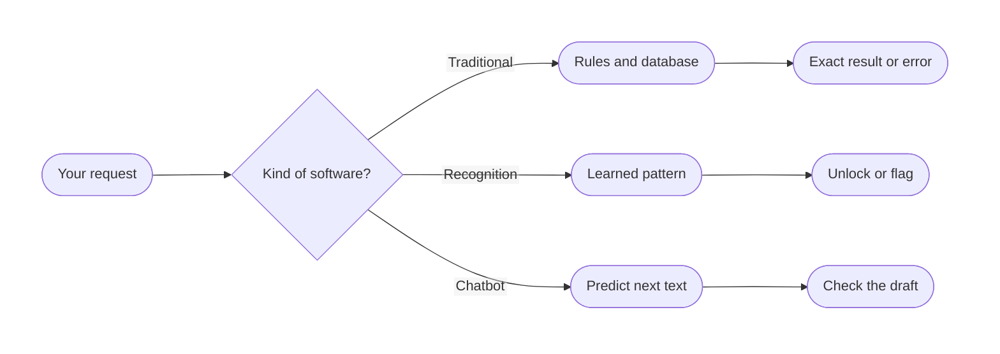
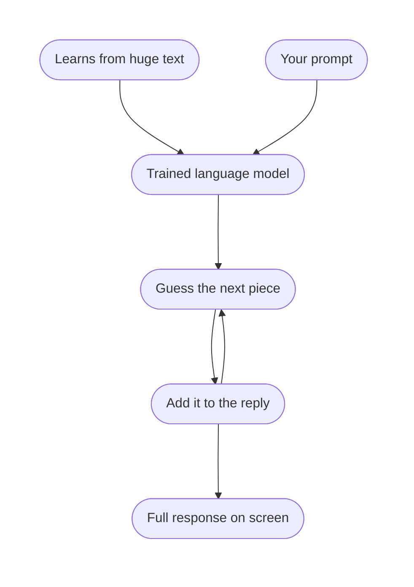
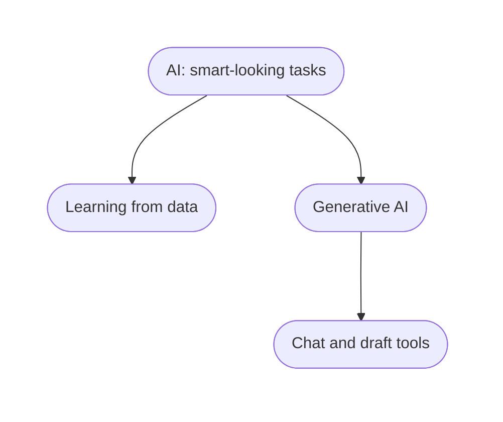
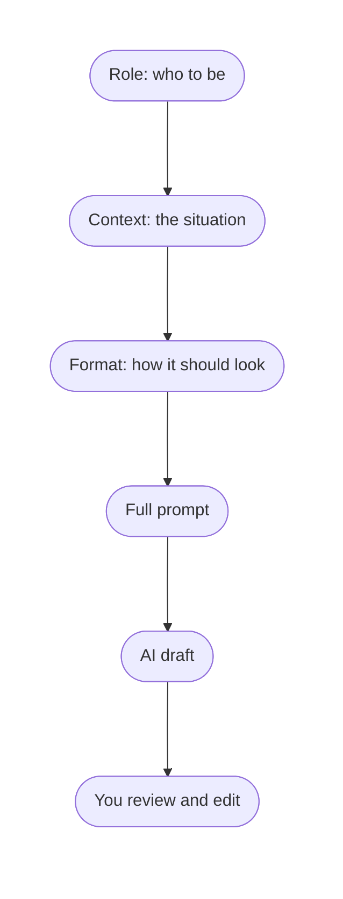

# AI Fundamentals: What It Is, How to Prompt It, What It Can Do

## What You Will Learn in This Lesson

This is your first step into working with **Artificial Intelligence (AI)** as a practical tool — not as a mystery, and not as magic. You do not need a computer-science background to follow along.

In this lesson, you will understand what **AI** and **Large Language Models (LLMs)** are, and how they differ from everyday software such as calculators, IRCTC, and UPI apps. You will see how these models generate replies by **predicting** the next piece of text — not by thinking like a human or fetching a stored answer. You will then meet **Generative AI**, practise **Role–Context–Format** prompts, and map which real tasks still need your judgement.

### A Real-Life Story — Why This Lesson Matters

Imagine Priya, a second-year student in Pune. Her HOD asks for a one-page note on why the college should start a weekend coding club. Priya opens a chatbot, types `write something on coding club`, and pastes the reply into a Word file.

- The reply sounds confident — full sentences, headings, even a fake “survey of 200 students.”
- Priya submits it. The HOD asks, “Which 200 students? When was this survey done?” Priya cannot answer.
- The same week, her roommate uses the same tool to draft a leave email, a study timetable, and a comparison of two internships — and then **checks** every fact against college rules and her own notes.

The tool was the same. The **way of using it** was different. This lesson is about that difference: what the tool is, how life around it is changing, how to talk to it clearly, and how to stay in charge of the result.

---

## Scene 1: Understanding AI & LLMs

In this scene you will learn what AI and large language models are, how they differ from ordinary software, how they generate responses, and why you will hear the word **token** around AI tools.

### What Is Artificial Intelligence?

- **Official Definition:** **Artificial Intelligence (AI)** is technology that allows computers and machines to imitate useful human-like abilities — such as learning from examples, recognising patterns, understanding language, solving problems, or generating new content.
- **In Simple Words:** AI is software that can handle messy, flexible tasks — like reading a paragraph and writing a reply — instead of only following one fixed formula.
- **Real-Life Example:** A calculator always does `2 + 2 = 4`. An AI chatbot can read “Bro write a sorry message to my team lead, I missed the stand-up, keep it short and professional” and draft a mail. Same laptop, different kind of software.

You already use AI many times a day, even when the screen never says the word “AI”:

- **Word prediction while typing** on a mobile keyboard — you type `On my way`, and the phone suggests `home` or `to college`.
- **Face unlock** — the phone checks whether the face in front of the camera matches the face it learned when you set it up.
- **Fingerprint unlock** — the sensor matches your fingerprint pattern instead of asking for a typed password every time.
- **YouTube / Netflix** suggesting the next video based on what you watched.
- **Gmail** offering a one-line reply such as “Thank you, I will check and get back.”
- **Google Maps** predicting traffic, or a **UPI app** flagging a strange payment.

| Everyday action | What the AI is doing | Traditional version of the same job |
|-----------------|----------------------|-------------------------------------|
| Keyboard suggesting the next word | Predicting likely text from your typing habits | You type every letter yourself |
| Face unlock | Matching a face pattern it has learned | Typing a PIN or password |
| Fingerprint unlock | Matching a fingerprint pattern it has learned | A physical key or a password |
| Chatbot drafting an email | Generating new sentences from your instruction | You write the full mail from a blank page |


- Face unlock and fingerprint unlock are still **AI**. They recognise a pattern. They do not write a poem or invent a story.
- Keyboard word prediction is a small cousin of what chat tools do — both **guess what comes next**.
- AI is **not** a person inside the computer. It is a program trained on large amounts of data.
- AI is **not** always correct. Confident language is not the same as a verified fact.
- AI is **not** the same as “the internet.” Some products add web search; many replies are generated only from learned patterns.

### Traditional Software vs AI

Watch this video first. It opens in a **new tab**. The clip shows **E-Eye**, an AI system that watches railway tracks, recognises elephants from size, shape, and walking pattern, and can send a warning without a person staring at every camera.

<a href="https://coding-platform.s3.amazonaws.com/dev/lms/tickets/4c52f3b8-4507-47f7-86c2-326d41cb325e/1UbaIsJ3NgtZNFL0.mp4" target="_blank" rel="noopener noreferrer">Watch: E-Eye — AI-based elephant movement prediction (opens in a new tab)</a>

Keep that example in mind as you read the rest of this section.

- A **traditional** track sensor could only follow a fixed rule: “if something large moves, switch on a light.” It could not reliably tell an elephant from a truck or debris.
- **E-Eye** learns patterns and can **decide** that the moving shape is an elephant, then alert drivers. That extra judgement is what AI adds on top of ordinary rules.
- You will still meet plenty of traditional software in the same world — a railway **PNR lookup** must stay exact. The video is about the part that needs recognition, not a booking form.

Before chat tools became common, almost all the software you used was **traditional software** — programs that follow fixed rules written by developers.

- **Official Definition:** **Traditional software** executes **predefined instructions**. If the input matches a known case, it returns a known result. If the case is not programmed, it fails or shows an error.
- **In Simple Words:** Traditional software is like a vending machine. Press 12, get a bottle. There is no “understand my mood and suggest a drink.”
- **Real-Life Example:** IRCTC shows trains only if you enter a valid station and date. It will not invent a train. A chatbot might still “describe” a train that never ran.

| Point | Traditional software | AI |
|-------|----------------------|----|
| How it works | Fixed rules and formulas | Patterns learned from large amounts of data |
| Input it likes | Exact fields: date, PNR, PIN, amount | Faces, fingerprints, messy sentences, mixed Hindi–English |
| Unknown situation | Error, blank, or “invalid input” | Often still produces *some* result — which may be wrong |
| Best at | Calculations, bookings, exact records | Recognition, drafting, summarising, brainstorming |
| Weak at | Flexible writing and open questions | Guaranteed facts, latest news, private college data |




- You still **need** traditional software. Banks, exam portals, and railway booking cannot run on “maybe this is the PNR.”
- A phone uses **both**: a PIN field is traditional; **face unlock** and **fingerprint unlock** are AI recognition; the keyboard’s next-word bar is AI prediction.
- A common doubt: *“If AI is so smart, why do we still use Excel and IRCTC?”* Those tools must be **exact**. AI is strong at patterns and language, not at being a source of truth.

**Activity: Label the Tool**

On paper, mark each item as **Traditional software**, **AI-powered**, or **Both**:

1. A simple phone calculator.
2. Swiggy showing “people also ordered garlic naan.”
3. Paytm generating a UPI QR for a fixed amount.
4. A chatbot rewriting your resume bullet points.
5. FASTag deducting the exact toll.
6. Unlocking your phone with your face.
7. Unlocking your phone with your fingerprint.
8. Your mobile keyboard suggesting the next word while you type a WhatsApp message.

*(Check: 1 Traditional, 2 Both — the suggestion is AI, while placing the order is ordinary software, 3 Traditional, 4 AI-powered, 5 Traditional, 6 AI-powered, 7 AI-powered, 8 AI-powered.)*

### What Is a Large Language Model?

Chat tools such as ChatGPT, Gemini, Claude, and Copilot are built on **Large Language Models**. They are one kind of AI — the kind that works with language at a large scale.

- **Official Definition:** A **Large Language Model (LLM)** is an AI model trained on a very large collection of text so it can predict and generate language — sentences, lists, code, and dialogue — that looks similar to how humans write.
- **In Simple Words:** An LLM is a next-word guessing engine that has seen so much text that its guesses often look like a well-written paragraph.
- **Real-Life Example:** Your phone keyboard suggests one next word. An LLM does the same idea at paragraph scale. If you start “The capital of India is…”, it almost automatically continues “New Delhi” — not because it opened a map, but because that continuation was extremely common in the text it learned from.

- **Large** means it learned from a huge amount of text.
- **Language** means the main skill is working with words, not unlocking a phone with a fingerprint.
- **Model** means it is a mathematical system, not a person and not “one correct page per question.”

An LLM is **not** a librarian fetching one stored answer, **not** a human mind, and **not** connected to your college ERP unless a product **adds** search or files. It often continues anyway instead of saying “I do not know.” That leftover confidence is why you must verify.

### How LLMs Generate Responses

Now that you know *what* an LLM is, the next question is *how* it produces a reply. This idea prevents both fear (“it is thinking like a human”) and blind trust (“it looked it up, so it must be true”).

- **Official Definition:** **Next-token prediction** is the process by which an LLM estimates the most likely next small piece of text, given everything so far (your prompt plus what it has already written).
- **In Simple Words:** The model keeps asking, “What usually comes next in text like this?” — then writes that piece, then asks again, until the reply looks finished.
- **Real-Life Example:** This is the same family of idea as **word prediction while typing** on your phone. The chat tool is simply doing it again and again until it has a full answer.

Picture this incomplete sentence:

`When I hear rain on my roof, I _______ in my kitchen.`

The model does not “remember a diary entry.” It ranks likely continuations, for example:

| Possible next idea | Why it might rank high |
|--------------------|------------------------|
| cook soup | Rain + kitchen often appear with cooking in stories and blogs |
| put the kettle on | Tea in the rain is a common Indian / household pattern |
| nap | Possible, but “in my kitchen” makes it less likely |

It then writes **one piece**, then predicts the next, then the next, until a full sentence appears. That is generation — not opening Wikipedia in the background.


During **training**, the model is shown enormous amounts of text and it gets better at this guessing. After training, when you type a prompt, it does **not** remember a specific page the way you remember a WhatsApp chat. It **reproduces patterns** that were common in the data.



Keep these three ideas separate. They are the most common mix-up in this topic.

| Idea | What people assume | What actually happens |
|------|--------------------|------------------------|
| **Thinking** | The model reasons like a person, with beliefs and goals | It generates fluent text that *looks* reasoned. There is no inner life and no exam fear. |
| **Retrieval** | It searches a database and copies the matching document | A basic chat completion **generates** text. Search or file lookup is an extra product feature, not the core model. |
| **Prediction** | “It is just guessing, so it is useless” | Guessing from rich patterns drafts useful emails. The same guessing invents a fake statistic. |

- If you ask “What is 2 + 2?”, a calculator **computes**. An LLM **writes the kind of answer** that usually follows that question — often `4`, but for harder maths it may look right and still be wrong.
- If you ask “Quote the exact circular my college sent yesterday,” a normal LLM **cannot** retrieve that circular unless you paste it or a tool fetches it. It may still produce a paragraph that *sounds* like a circular.
- **Hallucination** is the name for this: fluent, specific content that is **not true**. The model is not lying with intent. It is continuing a plausible pattern.
- Classic mix-up: you ask “Who is often credited with the practical electric light bulb?” and a sloppy model might say a famous scientist’s name with full confidence. Confidence is not proof. You still check.

The snippet below is **not** a real LLM. It only shows the idea of “continue the sentence.”

```python
# Tiny demo: continue a sentence from a small stored pattern
# This is NOT how ChatGPT is built — it only shows "predict what comes next"

patterns = {  # A tiny lookup table of example sentence starts
    "The capital of India is": "New Delhi",  # A common fact-style continuation
    "On my way": "home",  # The same idea as mobile keyboard prediction
}

user_start = "The capital of India is"  # Imagine this is your prompt
reply = patterns.get(user_start, "I am not sure")  # Look up a stored continuation
print(user_start + " " + reply)  # Shows: The capital of India is New Delhi
```

**How the code works:**

- `patterns` is a tiny dictionary of “if you see this start, continue like this.”
- A real LLM does not store one sentence per question. It stores statistical patterns across a huge amount of text.
- If the start is new, this toy program says it is not sure. A real LLM often **still generates something** — that is both its power and its danger.

- *“How does it answer questions it has never seen word-for-word?”* — It recombines patterns (email tone + report structure + common facts). Wording can vary because several next pieces may be likely.
- *“Can I trust a citation it gives?”* — Treat book names, paper titles, case names, and URLs as **unverified** until you open the source yourself.

**Activity: Prediction vs Retrieval**

Write two columns in your notebook: **Prediction** and **Retrieval**. Place each situation in one column:

1. Google showing the official IRCTC website for your search.
2. A chatbot writing a poem about Bengaluru rain.
3. Your college ERP displaying your actual attendance percentage.
4. A chatbot inventing a “2024 AICTE circular” with a realistic-looking number.
5. Your phone keyboard suggesting `home` after you type `On my way`.

*(1 and 3 are retrieval or database lookup. 2, 4, and 5 are prediction — 4 is a harmful hallucination if you act on it.)*

### Tokenization — A Word You Will Hear Around AI

You will hear **token** on AI product screens, in “message too long” warnings, and in blog posts. You only need a **working idea** of it. You do not need the engineering.

- **Official Definition:** A **token** is a small piece of text that a language model reads and writes. **Tokenization** is simply the step of cutting text into those pieces.
- **In Simple Words:** The model does not swallow your paragraph as one human thought. It reads in small bites — the way you tear a roti before eating, not the recipe of how the roti was milled.
- **Real-Life Example:** Picture `I love masala dosa` as a few small pieces such as `I`, `love`, `masala`, `dosa`. That picture is enough.


**Do not worry about how tokenization works inside the model.** You will not study the cutting rules, the software that does the cutting, or the numbers assigned to each piece. That detail is **not our scope**.

Why mention the word at all, then?

- It helps you remember that AI is a **pattern machine** working on pieces of text — the same family of idea as **word prediction on your phone**.
- It explains why a **clear, short instruction** is easier to follow than a messy two-page dump.
- It explains why a chat sometimes says the message is **too long**. There is a limit on how much text fits in one go.

Knowing that tokens exist is enough to understand AI as a user. Specialists can keep the rest.

| What you type | How to picture it | What you should do |
|---------------|-------------------|--------------------|
| `Hello` | A very small amount of text | Nothing special |
| `I love dosa` | A few small pieces | Still nothing special |
| A two-page paste with no question | A large pile of pieces | Add a clear ask, or shorten |

**Activity: Notice Prediction on Your Phone**

Open any chat on your phone. Type `On my way` and look at the suggested next word.

1. Write down the word the keyboard offers.
2. Remind yourself: the phone is guessing from patterns, just as a chat model guesses the next piece of a reply.
3. You still do **not** need to know how the text was cut into pieces. The guessing is the idea that matters for this lesson.

---

## Scene 2: Generative AI and Prompting AI Effectively

Scene 1 explained what AI is and how language models guess the next piece of text. This scene starts one step closer to the tools you will actually open: **Generative AI**, and how it is changing ordinary life. Once that picture is clear, you will learn how to **prompt** those tools so the guess is aimed at what you need.

In this scene you will learn what Generative AI is, how daily life and work are shifting because of it, the **Role–Context–Format** approach, the parts of a strong prompt, and how to repair a weak one.

### What Is Generative AI?

Not all AI *creates* new content. Face unlock **recognises** you. Fingerprint unlock **matches** a pattern. A spam filter **sorts** mail. **Generative AI** is the branch that **makes something new** from your request — a paragraph, an image, a quiz, a first draft of code.

- **Official Definition:** **Generative AI (GenAI)** is a type of AI that can create new content — such as text, images, audio, or code — based on a user’s request, instead of only classifying, matching, or retrieving an existing record.
- **In Simple Words:** Older AI often *detects* or *decides*. Generative AI *produces* — it can write the email, not only flag it as spam.
- **Real-Life Example:** Face unlock says “this is you” or “this is not you.” ChatGPT can write a new leave letter you have never stored. Same phone in your bag; two different jobs.


A simple family picture is enough. You do not need the engineering layers used in research papers.



- **AI** is the big umbrella: making machines useful at tasks that look intelligent.
- **Learning from data** (often called machine learning in textbooks) means the system improves from examples — thousands of faces, fingerprints, or typed sentences — instead of a developer writing a rule for every case.
- **Generative AI** sits inside that umbrella and specialises in **creating** new output.
- You do **not** need Deep Learning architecture, model sizes, or hardware names for this lesson. Those are specialist topics.

| Feature | Everyday AI (recognise / decide) | Generative AI (create) |
|---------|----------------------------------|------------------------|
| Primary job | Match a pattern or make a decision | Produce new content |
| Phone example | Face unlock, fingerprint unlock, spam detection | A chatbot writing your email |
| Prediction example | Keyboard suggesting the next word | A chatbot writing the next *paragraph* |
| Risk if it fails | You type a PIN instead | Fluent text that looks right but is wrong |

- A common doubt: *“Is my face unlock Generative AI?”* No. It is AI for **recognition**. It does not invent a new face. Chat tools that *write* or *draw* are Generative AI.
- Another doubt: *“Is all ChatGPT-like software the whole of AI?”* No. It is the loud, new corner. Unlock, maps, fraud flags, and recommendations were AI long before chatbots became famous.

**Activity: Recognise or Generate?**

Mark each as **Recognition / decision AI** or **Generative AI**:

1. Face unlock on your phone.
2. Fingerprint unlock.
3. Keyboard suggesting `college` after `On my way to`.
4. A chatbot writing a new club poster from a three-line brief.
5. A spam filter moving a mail to Junk.

*(Check: 1, 2, and 5 are recognition or decision AI. 3 is next-word prediction — still AI, not a full generated poster. 4 is Generative AI.)*

### How Generative AI Is Changing Everyday Life

Generative AI did not invent computers. It changed **who writes the first draft**, and **how fast** a blank page becomes a page with words.


A few markers help you place the shift — not as an exam timeline, but as “how we got to this week”:

- For decades, AI in public life meant **winning at chess**, **recommending videos**, or **voice assistants** that answered a few fixed questions.
- Around **2022**, chat tools built on large language models became easy to open in a browser. Ordinary students and office staff could type in plain language and get a full draft back.
- Since then, the default habit in many teams has been: **ask first, then edit** — instead of staring at a blank document.

Walk through one ordinary day and you will see both older AI and Generative AI sitting side by side:

- Morning: **face unlock** or **fingerprint unlock** opens the phone. That is recognition AI, not a chatbot.
- On the bus: you type a WhatsApp line and the keyboard **predicts the next word**. That is the same family of guessing you met earlier in this lesson.
- At college: you ask a chat tool to draft a mail to a faculty member. That is **Generative AI**.
- Evening: you still book a ticket on IRCTC with exact stations and dates. That is **traditional software**, and it should stay that way.

The life change is not that “everything is now a chatbot.” The change is that **creating text** became cheap and fast, so briefing and checking became core skills.

**What changed in student and early-career life**

- **Writing:** Leave mails, club notices, LinkedIn lines, and meeting agendas can start as a draft in seconds. You still own the send button.
- **Study:** You can ask for a simpler explanation, extra practice questions, or a weekend revision plan. You still sit the exam.
- **Work:** Interns are often expected to produce a first version faster. The skill is briefing the tool and checking the result — not pretending you typed every word from memory.
- **Small business:** A kirana or tuition teacher can draft a WhatsApp offer or a polite reminder without hiring a copywriter for every message.

**What did not change**

- **Truth** is still your job. The model can invent a survey, a circular, or a price.
- **Permission** is still your college’s or company’s job. Some assignments forbid submitting generated text as your own.
- **High-stakes decisions** still need a human and an official system — attendance portals, bank apps, medical advice, legal advice.
- **Trust** still follows people who verify. Priya’s roommate in the opening story is the person teams want.

| Before Generative chat tools | After they became common |
|-----------------------------|---------------------------|
| Blank page, then you type | First draft on the page, then you edit |
| “Search and copy from many tabs” | “Ask, then check the official source” |
| Help from a senior if they are free | Help on demand — quality still varies |
| Slow English polishing | Faster rewrite — your facts must still be yours |

**Activity: Life Before and After**

On paper, draw two columns: **Last week without a chat tool** and **Same task with Generative AI**.

Fill three real tasks from your life (travel, assignment, club, family message). For each, write one line on what the tool could draft and one line on what **you** must still do (check a date, add a name, open the official portal).

This is the habit the rest of the scene trains: the tool is a draft partner. The prompt is how you brief that partner.

### What Is a Prompt?

Because Generative AI creates from your request, the request is now a professional skill. That request is called a **prompt**.

- **Official Definition:** A **prompt** is the input text (and sometimes files or images) you give a generative AI system to condition what it should generate next.
- **In Simple Words:** A prompt is your instruction — the brief you would give an intern, written in one place.
- **Real-Life Example:** Telling a shop painter “paint it nice” versus “Paint the shop shutter royal blue, matte finish, no logos, finish by Friday, send a photo.” Same painter, different brief, different result.

- The model cannot see your unspoken goal. If you need a **formal** mail to an HOD, write that. If you need **120 words**, write that.
- Prompting is not cheating at thinking. It is **specifying the task** so the prediction is aimed at what you need.
- A common mistake is treating the first reply as final. Prompting includes **one revision** when the first draft is off.

A vague prompt wastes the life-change you just read about. `Tell me about trees` could mean biology, timber prices, or a poem. `Explain the importance of trees in controlling air pollution, in 3 simple bullet points, for school students` tells the tool the topic, the shape, and the audience.

### The Role–Context–Format Approach

A reliable way to structure a prompt is **Role–Context–Format (RCF)**. You can write it as three short blocks. You do not need fancy English.

- **Official Definition:** **Role–Context–Format** is a prompting pattern where you (1) assign the model a **role**, (2) supply the **situation and constraints**, and (3) specify the **output shape**.
- **In Simple Words:** Tell it *who to be*, *what is going on*, and *how the answer should look*.
- **Real-Life Example:** Briefing a senior student: “You are a placement-cell volunteer (role). I have a 10-minute slot with an HR from a Pune startup (context). Give me 6 questions in a numbered list, no paragraphs (format).”

**Role** is the hat you want the model to wear: “You are a polite office admin,” “You are a beginner-friendly explainer.” Role is **not** magic. “You are a Supreme Court lawyer” still must not replace actual legal advice.

**Context** is the background an intern would need — who you are, what happened, what is allowed. Include facts the model cannot know (college name, word limit, *offline in the seminar hall*). Put constraints here: “Do not invent statistics,” “Use Indian English,” “Keep it under 150 words.”

**Format** is the shape of the output: bullets, table, email with subject line, or “only a 5-line script.” If you skip format, you often get a long essay when you needed a checklist.




**Weak prompt:** `write a mail for leave`

**RCF prompt:**

```text
Role:
You are a polite college student writing to a faculty member.

Context:
My name is Ananya Sharma. I need two days of leave (12 and 13 September)
because my sister’s wedding is in Nashik. I will complete the pending lab
record before I go. Do not invent extra reasons. Do not mention medical issues.
Keep the tone respectful and short.

Format:
Write an email with:
- a clear Subject line
- a greeting
- one short paragraph of 4 to 6 lines
- a simple closing
Do not add a CV or a story about the wedding.
```

What improved: **who** is speaking, **concrete dates and reason**, **what not to invent**, and the **exact shape** of the reply.

### Components of an Effective Prompt

RCF is the skeleton. These components make the skeleton strong. Mix them into Role, Context, or Format as needed.

**Specificity** means naming the audience (HOD, teammate, “Class 12 student”), the goal (persuade, summarise, compare), and the scope (“only the disadvantages,” “only for a 3-day trip to Jaipur”). Vague: `tell me about marketing`. Specific: `Explain 4P marketing with one kirana-shop example each, for a first-year BBA student.`

**Constraints** are limits: length (“Max 120 words”), style (“Simple Indian English, no slang”), content bans (“Do not invent numbers”), and process (“If a fact is uncertain, say ‘please verify’ instead of guessing”). Constraints reduce hallucination because you told the model that **silence or a warning** is allowed.

**Desired output format** is how the answer should look: lists for scanning, tables for comparison, emails for sending. Example: “Give a table with columns: Task, Time needed, Risk if I skip it.” If you will paste into WhatsApp, say “plain text, no markdown tables.”

| Component | Weak | Strong |
|-----------|------|--------|
| Specificity | `Help with my project` | `Suggest 5 project titles on campus waste reduction for a 2-week mini project` |
| Constraints | *(none)* | `No paid software. Use only free tools. Do not invent government scheme names.` |
| Format | *(none)* | `Numbered list. One line per title. No paragraphs.` |

**Activity: Spot What Is Missing**

Here is a prompt: `You are a career coach. Make it good.`

On paper, write:

1. What **role** is present? (Career coach — present but thin.)
2. What **context** is missing? (Whose career? City? Course? Internship vs job? Deadline?)
3. What **format** is missing? (Email? LinkedIn About? 10 interview answers?)

Then rewrite it as a full RCF prompt for **your** real situation (even if you invent a simple one for practice).

### Other Useful Ways to Prompt

RCF is your default. These extra habits help when the first reply is generic, when you need a matching style, or when the task has steps. You can combine them with Role–Context–Format. You do not need new software — only a clearer message.

**Zero-shot** means you give the task with **no example**. Use it when the instruction is already clear: `Translate into simple Hindi: How are you?`

**One-shot** means you show **one** sample of the style you want, then ask for a new item in the same style.

**Few-shot** means you show **two to five** samples. This is useful for emails, notices, or MCQs that must look like a set.

```text
Here are two emails in the tone I want:
1) Subject: Meeting moved — Monday’s meeting is now Wednesday, 3 PM. Please confirm.
2) Subject: Design approved — The client approved the design. Development starts next week.
Now write a similar short email: office closed on 2 October for Gandhi Jayanti.
Do not add extra festivals. Do not invent a circular number.
```

**Step-by-step** (often called chain-of-thought in AI articles) means you ask the model to **show working** before the final answer. Use it for calculations or any task with more than one step: `A pencil costs Rs. 5 and a pen costs Rs. 10. Cost of 2 pencils and 1 pen? Show each step, then the total.`

**Self-check** means a second message: `Now review your answer. Fix any unclear line. Do not add new facts you cannot support.` This is how you use Generative AI as a draft partner instead of a one-click publisher.

**Activity: Pick a Prompt Style**

For each task, write which extra habit you would add on top of RCF:

1. Convert three English sentences into polite office Hindi.
2. Match the tone of two old club notices for a new event.
3. Work out a small budget for 4 notebooks at Rs. 45 each plus one pack of pens at Rs. 80.

*(Typical: 1 zero-shot or one-shot if you show one translated line, 2 few-shot, 3 step-by-step, then a self-check.)*

### Revising a Vague Prompt into a Clear One

Revision is a skill, not a failure. Professionals rewrite prompts the way they rewrite emails.

**Version 0 (almost useless):** `notes on AI`

No audience, no length, no angle, no format. The model will dump a generic essay.

**Version 1 (better, still loose):** `Explain AI to a beginner`

Still missing: how long, Indian or US examples, AI vs Generative AI, bullets or paragraphs.

**Version 2 (actionable):**

```text
Role:
You are a patient tutor for students who have never studied computer science.

Context:
Tomorrow I have to explain AI vs traditional software in a 3-minute class intro.
Use Indian examples (UPI, IRCTC, face unlock, mobile keyboard). Do not use scary movie plots.
Do not claim AI is conscious. If you mention a product name, keep it as an example, not an advertisement.

Format:
- 6 bullet points only
- Each bullet max 20 words
- End with 3 revision questions I can ask myself
```

The same repair idea applies to shopping: instead of `best phones`, add budget, use case, city, and **“do not invent prices — tell me to check Flipkart/Amazon today.”** That protects you from fake MRP figures.

**Activity: Repair These Three Prompts**

Rewrite each one using Role, Context, and Format. Keep your rewrite under 12 lines.

1. `make PPT`
2. `fix my English`
3. `what should I do in life`

For (3), force the model into a **small, practical** frame — for example, “options for this weekend to explore design vs coding,” not a life-destiny speech.

---

## Scene 3: Applying AI to Real Tasks

You now know what Generative AI is, how it is changing first drafts, and how to brief it. The last skill for this lesson is **judgement**: where AI saves time, where it is shaky, and how you evaluate a reply before it leaves your laptop.

In this scene you will map real tasks, separate suitable work from unsuitable work, and practise checking accuracy and relevance.

### What AI Can Meaningfully Help With Today

Treat this as a **map**, not a promise that every tool is equally good at every cell. Recognition AI (face, fingerprint, next-word bar) already sits in your pocket. The rows below focus on **Generative AI** help for student and early-career work.

| Task family | Examples you might actually do | How AI usually helps |
|-------------|-------------------------------|----------------------|
| **Writing** | Leave mail, SOP first draft, LinkedIn About, meeting agenda | Tone, structure, shorter sentences |
| **Study** | Explain a concept simply, generate practice questions, revision timetable | Alternative explanations, quiz items |
| **Research (first pass)** | List angles to investigate, suggest keywords, outline a report | Starting points — not final citations |
| **Analysis** | Summarise a PDF you **pasted** or uploaded, compare two internship JDs | Compression of *given* text |
| **Planning** | Weekend study plan, event checklist, packing list | Breaking a goal into steps |
| **Language & coding** | Rephrase English; explain an error message; first draft of a tiny script | Faster edit — you still read, run, and own it |
| **Brainstorming** | 10 club event ideas, 5 survey questions | Volume of options; you pick and filter |

- AI is a **draft partner**. You remain the author who submits, sends, or publishes.
- Uploading a PDF and asking for a summary is powerful **if the tool actually received the file**. Always skim the original for names, dates, and numbers.
- A common doubt: *“Will AI take my job?”* For most beginners, the nearer risk is the opposite: **people who cannot brief and check AI** will be slower than people who can.

**Activity: Map Your Week**

Write five tasks you will do in the next seven days (assignments, travel, club work, job hunt). Mark each as **AI can draft**, **AI can only brainstorm**, or **I must do this without AI**. Be honest about attendance portals, payments, and anything with a password.

### Where AI Is Strong, Unreliable, or Unsuitable

The same model can be excellent at one task and dangerous at another. The difference is not “AI is dumb.” The difference is **what failure costs** and **whether the model has the real data**.


**Tasks AI often handles well**

- First drafts of emails, notices, and agendas when **you** supply the facts.
- Rewriting, summarising text that is **in the prompt**, generating practice questions, and turning messy notes into a checklist.
- Exploring options: “Give me 8 ways to start a conversation at a networking event.”
- Everyday recognition you already trust at a low cost of failure: unlocking a phone, suggesting the next typed word — still with a PIN backup.

**Tasks where AI is unreliable**

- **Live facts:** train delays, today’s gold rate, last night’s cricket score, current job openings.
- **Citations and precise maths:** paper titles, page numbers, “as per section…” unless you provided the source; neat-looking calculations that still slip.
- **Personal or local data** the model was never given: your CGPA, college attendance rules, housing-society bylaws.

When the task is unreliable, you can still use AI **around** the fact: “Give me a template; I will fill the PNR myself.”

**Tasks that are unsuitable**

- **High-stakes advice you will act on blindly:** medical dosage, legal strategy, mental-health crisis, large money decisions.
- **Cheating or secrets:** submitting AI text as a graded essay when rules forbid it; passwords, Aadhaar, OTPs, unpublished company data.
- **Harm:** instructions for crime, harassment, or bypassing exam systems.

| Situation | Use AI? | Better move |
|-----------|---------|-------------|
| Draft a polite reminder to a teammate | Yes, then edit | You send after a human read |
| “What is my attendance this month?” | No | Open the official portal |
| “Summarise this 8-page PDF I uploaded” | Yes, then spot-check | Confirm names, dates, numbers |
| “Write my entire graded assignment” | Against most academic rules | Use AI for outline or feedback if allowed |
| “Here is my debit card number, pay this bill” | Never | Official banking app |

- **Unreliable** means: you may use the tool if you **verify**.
- **Unsuitable** means: the right answer is a different system, a human professional, or “do not paste that.”
- Face unlock failing is annoying. A hallucinated legal clause in a notice can hurt people. Match the **check** to the **cost**.

**Activity: Sort the Task List**

Mark each as **Well-suited**, **Unreliable (verify)**, or **Unsuitable**:

1. Create 10 MCQs from a chapter you paste.
2. Decide whether to accept a job offer based only on the chatbot’s “yes.”
3. Generate a packing list for a 2-day college fest.
4. Ask for tomorrow’s exact GATE paper questions.
5. Rephrase your own paragraph to simpler English.
6. Paste customer data from an internship and ask it to “clean the database.”

*(Typical answers: 1 Well-suited if the chapter is yours to use; 2 Unsuitable as a sole decision; 3 Well-suited; 4 Unsuitable — cheating, and something the model cannot honestly know; 5 Well-suited; 6 Unsuitable — privacy.)*

### Evaluating AI Output Before You Use It

The last habit is a short **quality gate**. If you skip it, Generative AI’s speed becomes Priya’s fake survey.

- **Official Definition:** **Output evaluation** is the practice of checking AI-generated content for **accuracy** (is it true?), **relevance** (does it answer *this* request?), and **fitness** (is it safe, appropriate, and usable in your real context?) before you rely on it.
- **In Simple Words:** Read it like a suspicious intern’s work — helpful, fast, and capable of confident mistakes.
- **Real-Life Example:** If a junior in your club writes “200 students already signed up” on a poster, you ask for the sheet. Do the same when the chatbot writes “200 students.”

**Accuracy:** Circle every **number, date, name, URL, law, and quote**. Check each against a primary source (official site, your notes, a human who knows). If you cannot check it quickly, remove it or mark it as unverified. Watch for **over-specific** details: exact percentages, fake report titles, imaginary “IIT study of 2023.” Specific does not mean true.

**Relevance:** Did it answer **your** question or a neighbouring one (“best laptops” when you asked for a **repair** checklist)? Did it ignore constraints (800 words when you asked for 80)? Did it change the audience (US college admissions when you needed a Pune internship mail)?

**Fitness and safety:** Would you be comfortable if your HOD, manager, or parent read this? Cut biased or stereotyped lines about gender, caste, region, or religion. If it pressures you (“you must take this loan”), discard the advice.

**Mini checklist — before you paste, send, or submit**

1. **Source:** Which lines came from *my* facts versus the model’s imagination?
2. **Verify:** Can I open a link or official page for every hard fact?
3. **Voice:** Does this sound like me (or like the organisation), or like a generic blog?
4. **Rules:** Does my college or workplace allow this use?
5. **Harm:** Any private data, insult, or false claim about a person?

**Activity: Evaluate This Fake Reply**

Suppose you asked: `How many states are in India? Give a short answer for a Class 6 quiz.`

The model replies:

> India has 29 states and 8 Union Territories. The newest state is Telangana, formed in 2014. For your quiz, you can also say there are 30 states if you count Delhi.

On paper, mark:

- Which sentences are **accurate**, **outdated**, or **wrong**?
- Is the reply **relevant** to a Class 6 quiz?
- What would you do next — accept, correct, or re-prompt?

You should catch that state counts change with official reorganisation, that Delhi is a Union Territory (not a state to “add on”), and that inventing “30 states” is exactly the kind of helpful-sounding error evaluation is meant to stop. Look up the **current official count** yourself and rewrite a correct two-line quiz answer.

---

## Key Takeaways

- **AI** already sits in your pocket: **word prediction** while typing, **face unlock**, and **fingerprint unlock** are AI for patterns. **Traditional software** still runs exact records such as bookings and payments.
- A **large language model** generates replies by **predicting** the next piece of text from training data. It is not a human mind and not, by itself, a search engine that retrieves one stored truth.
- **Tokenization** only means text is handled in small pieces. You do **not** need to learn how that cutting works. Knowing the word exists is enough to understand AI as a user.
- **Generative AI** creates new content from a prompt and has changed who writes the first draft. Strong prompts use **Role–Context–Format** plus specificity, constraints, format, and — when needed — examples, step-by-step working, or a self-check.
- Use AI as a **draft partner** for suitable tasks, verify everything that looks like a fact, and never paste secrets or outsource high-stakes decisions. Upcoming lessons will build on this foundation as you apply AI inside real product and delivery workflows.

---

## Important Commands, Libraries & Terminologies

| Term | What It Means |
|------|----------------|
| **Artificial Intelligence (AI)** | Software that performs tasks associated with human-like abilities such as language, pattern matching, and generation |
| **Traditional software** | Programs that follow predefined rules and exact inputs (calculators, booking systems, a typed PIN) |
| **E-Eye** | AI system that recognises elephants near railway tracks and can send a warning — used here to contrast rules vs learned patterns |
| **Face unlock / fingerprint unlock** | AI that matches a learned face or fingerprint pattern to unlock a device |
| **Word prediction** | AI that suggests the next word while you type, as on a mobile keyboard |
| **Generative AI (GenAI)** | AI that creates new content (text, images, code) from a prompt, rather than only recognising or retrieving |
| **Large Language Model (LLM)** | A model trained on large text data to generate language by predicting the next piece of text |
| **Training data** | The large collection of text used to teach the model patterns |
| **Next-token prediction** | Generating the next small piece of text based on what came before |
| **Hallucination** | Fluent, specific output that is not actually true |
| **Token / tokenization** | A small piece of text; the cutting of text into those pieces — internals are out of scope here |
| **Prompt** | The instruction (and extra material) you give a generative model |
| **Role–Context–Format (RCF)** | A prompting pattern: who to be, what the situation is, how the answer should look |
| **Zero-shot / few-shot** | Task with no example / task after two to five examples of the style you want |
| **Step-by-step prompting** | Asking the model to show working before the final answer |
| **Self-check prompting** | Asking the model to review and improve its own draft |
| **Specificity / constraint / format** | Exact task and audience; limits such as length or “do not invent numbers”; required shape of the reply |
| **Retrieval** | Fetching a stored record from a database or search index (different from generation) |
| **Output evaluation** | Checking accuracy, relevance, and fitness before using AI text |
| **Primary source** | The original official page, document, or dataset you use to verify a claim |
