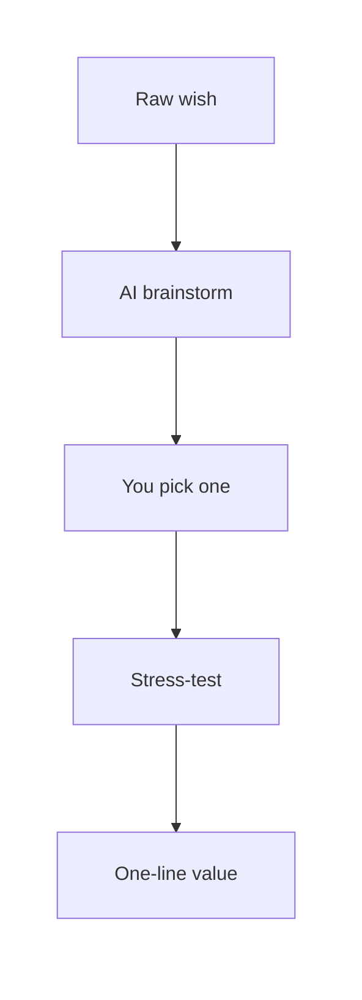
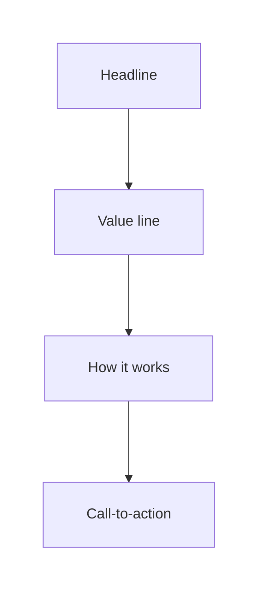
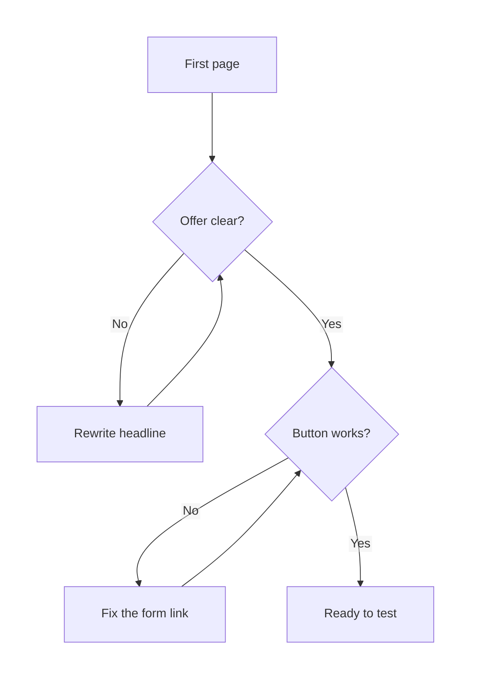

# Building a Product with AI - Part 1: From Idea to Prototype

## What You Will Learn in This Lesson

In the previous lesson you learned what **AI** and **Large Language Models** are, how they generate text by prediction, and how to brief them with a **Role–Context–Format** prompt. You also practised checking a reply for accuracy before you use it.

This lesson puts that skill on a product path. You will brainstorm and **stress-test** an idea, lock a one-line **value proposition**, build a **wireframe** or **landing page** on a simple website such as **Google Sites** or **Canva**, and decide whether that version is **good enough to test**.

You will leave with one concrete concept and one shareable prototype — not a finished business, and not a full product.

What you will practise, in order:

- Turn a vague wish into a **product idea**, then **stress-test** who, what pain, and why now.
- Put the offer on **one page** using **Google Sites**, **Canva**, **Carrd**, or **Durable**: headline, value line, three steps, one working button.
- Judge whether that page is **testable**, and write the **feedback plan** you will use later.

### A Real-Life Story — Why This Lesson Matters

Imagine Kabir, a second-year student in a Pune hostel. Every Sunday the laundry room turns into an argument: one machine, no booking, wet clothes left in the drum.

- Kabir tells friends, “Someone should make an app.” He opens a chatbot and types `make a laundry app`. The reply is a 12-feature wishlist: payments, ratings, a map, and a dark mode.
- He spends two weekends designing logos. He never shows a single screen to a roommate. The idea stays in a Google Doc.
- His roommate Meera uses AI to name the user, the pain, and one sentence of value. She builds a one-page site the same afternoon: headline, three steps, a “Join the waitlist” button.
- She does not polish for a week. She only asks: can a stranger understand this and react?

The tool was the same. The **size of the first version** was different. This lesson follows Meera’s path — **idea → concept → prototype → ready to test** — and leaves sharing, replies, and changes for the upcoming lesson.

---

## Scene 1: Idea Generation & Refinement with AI

A chatbot can list twenty ideas in a minute. Volume is easy. The skill is turning a vague wish into a **concept** a stranger can understand.

In this scene you will brainstorm with AI, **stress-test** an idea (**target user**, **problem**, **why now**), and write a **one-line value proposition**.

### What Counts as a Product Idea

People often confuse a complaint, a theme, a feature, and a product idea. AI will mix all four unless you separate them.

- **Official Definition:** A **product idea** is a proposed offer that helps a **specific user** solve a **specific problem** in a way they can try.
- **In Simple Words:** It is not “an app about college.” It is “this person, this pain, this simple help.”
- **Real-Life Example:** “Hostel life is messy” is a complaint. “Add a dark mode” is a feature. “Hostel students book a 30-minute laundry slot so they stop waiting in the basement” is a product idea.

| Phrase | What it really is | Can you show it this week? |
|--------|-------------------|----------------------------|
| “Someone should fix hostel laundry.” | A complaint | No — nothing to show |
| “College life / hostel problems.” | A theme | No — too wide |
| “The app should have UPI and ratings.” | Features | Not yet — no core offer |
| “Book a laundry slot in your hostel.” | A product idea | Yes — you can show a page |


- If you cannot name **who** hurts and **when**, you have a theme, not an idea.
- AI will happily expand a theme into a feature list. That feels productive and still leaves you with nothing to show.
- A **feature** is a piece of a product (a button, a payment option, a dark mode). A feature without a user and a pain is not an idea you can test.
- A common doubt: *“Is a WhatsApp group already the product?”* A group can be today’s **workaround**. Your idea must say what is still painful about that workaround.

This lesson uses one running example: **WashQ** — hostel students book a laundry-machine slot. Use **your own** idea in the activities if you prefer. WashQ is the teaching example, not the only allowed product.

Keep a one-page **idea card** as you work. You will fill it by the end of this scene.

```text
Idea name:
Target user (who, where, when the pain happens):
Problem (what they do today, what still goes wrong):
Why now (why the old workaround is failing this year):
First version does:
First version must NOT do:
One-line value proposition:
```


### Using AI to Brainstorm and Refine

A vague prompt still gets a vague draft. Brainstorming needs a **brief**, then a **filter** — use Role–Context–Format from the previous lesson so the model does not invent a startup pitch.

- **Official Definition:** **AI-assisted idea generation** is using a generative model to produce many candidate ideas, then using a tighter prompt to refine one candidate into a clearer concept.
- **In Simple Words:** First ask for options. Then pick one and make it sharper. Do not build all twenty.
- **Real-Life Example:** Asking a senior “give me project topics” is step one. Asking “make *this* topic specific for a two-week hostel test” is step two.

**Step 1 — Volume (brainstorm).** Ask for many small ideas, not one giant platform.

```text
Role: You are a practical product coach for Indian college students.
Context: I live in a Pune hostel. I want simple product ideas a student
can explain on one page. Do not suggest payments, maps, or a chatbot
as the first version. Do not invent surveys or market-size numbers.
Format: Give 8 ideas as a table with columns:
Idea name | Who it is for | Problem in one line | Smallest thing I could show
```

A typical dump looks busy. Most of it should die in the next step. Here is a sample of the kind of list you might get, and how a careful student would mark it:

| Idea from AI | First reaction | Keep? |
|--------------|----------------|-------|
| City-wide laundry delivery with riders | Needs a company | No |
| Dark mode for the college ERP | A feature request | No |
| Mess skip counter for one hostel | Real user, small show | Maybe |
| Library seat booking on one floor | Real user, small show | Maybe |
| Campus lost-and-found photo board | Real user, small show | Maybe |
| WashQ — book the one basement machine | Already happening on Kabir’s floor | Yes |

- Notice what the model loves: “AI-powered,” “for everyone,” “marketplace.” Those words often hide a missing user.
- Notice what survives: a **named place**, a **named moment**, and a **smallest thing you could show**.

**Step 2 — Filter (you decide, not the model).** Mark each idea yes or no:

- Can I name a **real person** who has this problem this week?
- Can I show something **on a website builder** in one sitting?
- Would I be willing to show a rough version to a roommate?

Pick **one**. WashQ survives: Kabir’s floor already fights over the machine, and a page can explain the offer.

**Step 3 — Refine (narrow the idea).** Paste the winner. Ask what the first version **must not** do. That sentence saves you from a feature pile.

```text
Role: You are a product coach who prefers small, testable ideas.
Context: I picked this idea: hostel students book a laundry-machine slot.
There is one machine in the basement. People leave clothes in it.
Do not add extra features. Do not invent how many hostels will pay.
Format: Rewrite in 5 bullets —
(1) User (2) Problem (3) What the first version does
(4) What it must NOT do (5) One risk if this idea is wrong
```

A useful refine for WashQ looks like this after you edit the AI wording:

- **User:** A second-year student in a Pune hostel who does laundry on Sunday evening.
- **Problem:** One machine, no booking, leftover clothes, arguments in the basement.
- **First version does:** Explains the slot idea and lets people join a waitlist.
- **First version must NOT do:** Payments, rider pickup, ratings, a city map.
- **Risk:** People may prefer shouting “I am next” and ignore a page.

- The model’s job is **options and sharper wording**. Your job is **choice**.
- If the reply invents “87% of hostels,” delete that line. You practised this check in the previous lesson.
- A common mistake is asking `make my idea better` with no idea pasted. The model cannot refine a blank.

**Activity: Brainstorm Then Pick One**

Open any chat tool you used earlier. Run the volume prompt for a setting you know (hostel, commute, mess, library, or a family shop).

1. Copy eight ideas into your notebook. Cross out any idea that needs a team, a payment gateway, or a month of work.
2. Circle **one** idea you could explain to a friend in 20 seconds.
3. Run the refine prompt on that idea and keep the five bullets on your idea card.

### Stress-Testing the Idea: User, Problem, Why Now

A refined paragraph can still be fluffy. **Stress-testing** asks three questions a weak idea cannot answer.

- **Official Definition:** **Idea stress-testing** is checking whether a concept has a clear **target user**, a painful **problem**, and a believable **why now** — before you spend time building.
- **In Simple Words:** You try to break the idea with questions, the way you would question a confident but unchecked chatbot reply.
- **Real-Life Example:** “A food app for everyone in India” fails. “Hostel students who miss mess breakfast on exam mornings need a 7 AM menu and a skip message” can pass.

**Target user** is not “students” or “everyone with a phone.” Name a person you could actually meet — for WashQ, a second-year student in a Pune hostel who does laundry on Sunday evening.

**Problem** is the pain in a real moment, not a slogan — the machine is busy, then someone else’s clothes are still inside. Ask what they **already try**: WhatsApp group, paper list on the door, shouting down the corridor.

**Why now** is why the old workaround is failing *this year* — more students, the same one machine, a noisy WhatsApp group that nobody updates. “Because AI exists” is not a why now; AI is only the tool you will use to write the page.


Use AI to **interview the idea**, not to praise it.

```text
Role: You are a sceptical roommate who will not flatter my idea.
Context: Idea: WashQ — hostel students book a 30-minute laundry slot.
Target user: second-year student in a Pune hostel, one shared machine.
Do not invent statistics. If something is unclear, ask me a question.
Format: Three headings — Target user, Problem, Why now — 3 bullets each.
End with 2 tough questions I must answer myself.
```

| Stress-test question | Weak answer | Stronger answer |
|----------------------|-------------|-----------------|
| Who exactly? | Everyone | Sunday-evening laundry users on one floor |
| What is the pain? | Life is busy | A long wait + leftover clothes in the drum |
| What do they try today? | Nothing | WhatsApp group, paper list, shouting |
| Why now, why not WhatsApp? | Apps are popular | More residents, same machine; the group is noisy and slots get double-booked |

Tough questions the sceptical prompt might throw at WashQ — and an honest answer:

- *“Why not a laminated timetable on the machine?”* — A paper list gets overwritten; a page can sit on every phone. If paper already works on your floor, WashQ may be the wrong idea.
- *“Who enforces the slot?”* — The first version does not enforce. It only explains and collects interest.

- If AI writes a glowing market story, ask it to **attack** the idea instead. Praise is not a test.
- If you cannot answer “why not a paper timetable on the door?”, the concept is not sharp yet.
- A common doubt: *“What if my idea fails the stress-test?”* That is a successful test. Shrink the user or switch idea — do not add features to hide the hole.

**Activity: Run the Three Questions**

On paper, fill this for **your** circled idea (or for WashQ):

1. Write **target user**, **problem**, and **why now** (who, when it hurts, what they do today, why the workaround fails now).
2. Paste those answers into the sceptical-roommate prompt. Write the two tough questions it asks, then answer them in your own words.
3. Copy the surviving answers onto your idea card. If a tough question kills the idea, pick another row from your brainstorm.

**Activity: Repair This Fluffy Idea**

Here is a weak brief: `An AI-powered smart campus ecosystem for all students.`

Rewrite it as a product idea using only this frame:

- User: ________ (one person you could meet this week)
- Problem: ________ (one moment, not “campus is hard”)
- First version: ________ (one page, no login)
- Must not include: ________

Then run the sceptical-roommate prompt on your rewrite. If you cannot fill the blanks, the original line was a theme, not an idea.

### From Raw Idea to a One-Line Value Proposition

After the stress-test you need a sentence you can put at the top of a page. That sentence is the **value proposition**.

- **Official Definition:** A **value proposition** is a concise statement of **who** the offer is for, **what outcome** they get, and **what pain** they avoid.
- **In Simple Words:** It is the one line a stranger should understand in five seconds.
- **Real-Life Example:** Everyday UPI means “send money to any phone number without cash or a card machine.” You do not need the full specification to understand the offer.

A useful skeleton: `[Product] helps [user] [do this job] without [this pain].`


WashQ, after refinement: `WashQ helps hostel students book a 30-minute laundry slot without waiting in the basement or arguing over the machine.`

That line has three parts. If any part is missing, the page will wobble.

| Part | In the WashQ line | If you drop it |
|------|-------------------|----------------|
| User | hostel students | Visitors think it is a city laundry shop |
| Job | book a 30-minute laundry slot | Visitors hear a slogan, not an action |
| Pain avoided | without waiting or arguing | Visitors ask “why not WhatsApp?” |

| Line | Verdict | Why |
|------|---------|-----|
| “WashQ is an AI-powered smart laundry ecosystem.” | Reject | Buzzwords, no user, no pain |
| “Book laundry slots. Fast. Easy. Modern.” | Reject | Adjectives, no who or why |
| “Revolutionising hostel hygiene with seamless slot intelligence.” | Reject | Nobody talks like this in a basement |
| “WashQ helps hostel students book a 30-minute laundry slot without waiting in the basement.” | Keep | User, action, pain |

Ask AI to **draft options**. You pick and edit. Do not accept jargon.

```text
Role: You write plain Indian English for college landing pages.
Context: User is a hostel student with one shared machine. Problem is
waiting, leftover clothes, no fair turn. Offer: book a 30-minute slot.
Do not use ecosystem, revolutionary, seamless, or AI-powered.
Format: Give 5 one-line value propositions. Star the clearest line.
```

When the five lines arrive, run this edit pass:

1. Circle any word a Class 12 student would have to Google. Delete it.
2. Circle any number you did not give the model. Delete it.
3. Read the surviving line aloud. If you need a breath in the middle, it is too long.
4. Put the winner on the idea card. That line becomes the headline or the line under the headline.

- A value proposition is not a slogan contest. “No queue. No fight. Just your slot.” can sit under the line. It is not a replacement for the line.
- If a classmate cannot repeat your line after hearing it once, it is still too long or too vague.
- You will paste this line into the prototype next. If the line is weak, the page will be weak.

**Activity: Lock Your One-Liner**

Write three versions by hand. Then generate five more with the prompt above.

1. Circle the line a roommate could repeat.
2. Remove any word you cannot explain to a Class 12 student.
3. Keep the final line on your idea card.



You now have a concept that can sit on a page. The next scene turns that sentence into something a person can **see**.

---

## Scene 2: Building the Prototype

A value proposition on paper is still invisible. This scene builds the smallest thing a person can look at: a **wireframe** or a one-page **landing page**.

In this scene you will put the offer on a real page using **Google Sites**, **Canva**, **Carrd**, or **Durable**, structure it around headline / value / **call-to-action**, and generate supporting copy and visual ideas with AI.

### What You Are Building — Wireframe, Prototype, Landing Page

These three words get mixed up. Keep them separate so you do not accidentally build a company website.

- **Official Definition:** A **prototype** is an early, incomplete version of a product used to **show the idea** and learn — not to serve every customer at full quality.
- **In Simple Words:** It is a sketch you can click or show, not the final hostel-wide system.
- **Real-Life Example:** A paper menu at a new stall is a prototype of the restaurant. It is not the full kitchen.

- **Official Definition:** A **wireframe** is a low-detail layout that shows **what sits where** — boxes, labels, and order — without final colours or pictures.
- **In Simple Words:** It is the pencil plan: title here, button there, three steps below.
- **Real-Life Example:** Before a painter letters a shop shutter, someone marks “shop name on top, phone number at the bottom” with chalk.

- **Official Definition:** A **landing page** is a single web page built for one purpose: help a visitor understand the offer and take **one action**.
- **In Simple Words:** One screen, one story, one button. Not a 20-page website.
- **Real-Life Example:** A fest poster with the event name, three highlights, and “Register on this Google Form” is a landing page on paper.

| Artefact | Looks like | Job in this lesson |
|----------|------------|--------------------|
| Wireframe | Boxes on paper or empty sections in a builder | Decide structure first |
| Landing page | A real link you can open on a phone | Let someone read the offer |
| Full product | Login, payments, admin panel | Out of scope here |


- You do **not** write programs in this lesson. You will type your four bands into a **website builder** that works like a slide: click, paste, publish.
- **AI-assisted** means a chat tool writes the words first. You still choose the structure and you still paste only facts you believe.

**Activity: Box the Page on Paper**

Draw one mobile-shaped rectangle (a tall phone screen). Divide it into four bands and label them only:

1. **Headline**
2. **Value line** (your one-liner)
3. **Three steps** (how it works)
4. **Button** (the action)

Do not decorate. Do not add a logo. This paper wireframe is the plan you will copy into the builder.

### Core Elements of a Landing Page

For a first prototype, build **four bands**. The visitor still notices three things first: headline, value, and the button.

- **Official Definition:** A **headline** is the first line a visitor reads. It should name the outcome or the offer, not the technology.
- **In Simple Words:** It is the big sentence at the top — the one you can shout across a hostel corridor.
- **Real-Life Example:** “Book your laundry slot” is a headline. “Welcome to WashQ v1 platform” is not.

- **Official Definition:** On a page, the **value proposition** is the short supporting line that makes the headline specific — who it is for and what pain goes away.
- **In Simple Words:** If the headline is the shout, this is the one-breath explanation under it.
- **Real-Life Example:** Headline: `Book a 30-minute laundry slot.` Value line: `For hostel students tired of waiting in the basement.`

- **Official Definition:** **How it works** on an early page is a short sequence — usually three steps — that shows the visitor what happens after they say yes.
- **In Simple Words:** It answers “okay, then what?” without a user-manual.
- **Real-Life Example:** Pick a slot → Get a reminder → Use the machine. A ten-step journey with “sync your calendar” is not a first page.

- **Official Definition:** A **call-to-action (CTA)** is the single next step you want the visitor to take, shown as a button or a clear link.
- **In Simple Words:** It is the one thing they should do — join a waitlist, fill a 3-field form, or message you.
- **Real-Life Example:** “Join the waitlist” is a CTA. “Learn more” with no destination is not.

The top of a phone screen is the only part many people will see before they scroll. Put headline, value line, and CTA in that first view if you can; the three steps can sit just below.




Optional extras, if they stay short: a “who this is for / is not” line, and a simple **icon row**. Example: “Not a laundry service. Not a payment app. Just a fair queue.”

| Element | WashQ example | Common mistake |
|---------|---------------|----------------|
| Headline | Book a 30-minute hostel laundry slot | “Welcome to our website” |
| Value line | No basement wait. No leftover-clothes fight. | A paragraph of history |
| How it works | Pick a slot → Get a reminder → Use the machine | A ten-step user journey |
| CTA | Join the waitlist | Five buttons: Login, Shop, Blog, About, Contact |

CTA labels are a small writing job with a large effect. The button should name the **outcome**, not the mechanism.

| Weak CTA | Why it is weak | Stronger CTA |
|----------|----------------|--------------|
| Click here | Here is not a job | Join the waitlist |
| Submit | Sounds like an exam | I’m in — notify me |
| Learn more | No destination | See how a slot works |
| Get started | Started doing what? | Book interest for my floor |

- One page should have **one primary CTA**. Extra buttons split attention. If a section does not help a stranger understand or act, delete it.
- A common doubt: *“Do I need testimonials?”* Not if they are fake. Invented “200 students already joined” is the same class of error you learned to catch earlier.

**Activity: Rewrite These CTAs**

On paper, rewrite each label so it names the job. Keep each rewrite under four words.

1. `Click here`
2. `Submit`
3. `Learn more`
4. `Get started`

Then pick **one** rewrite for your own page. If two buttons still feel necessary, you probably have two products. Keep one.

### Building the Page on a Website Builder

You will build in two layers: **words first**, **layout second**. Words first stops you from decorating an empty story.

**Layer 1 — Words (any chat tool).** Generate only the text blocks you planned on paper.

```text
Role: You write landing-page copy for Indian hostel students.
Context: Product is WashQ.
Value line: WashQ helps hostel students book a 30-minute laundry
slot without waiting in the basement or arguing over the machine.
Do not invent user counts, prices, or college names.
Do not mention payments or an app store.
Format:
(1) Headline, max 8 words
(2) Value line, max 20 words
(3) How it works, exactly 3 steps, 8 words each
(4) CTA button label, max 4 words
(5) What this is not, 2 short lines
```

Copy the output into a notes file. Edit anything that sounds like an advertisement. A first AI draft and a usable edit often look like this:

| Band | Raw AI line | After you edit |
|------|-------------|----------------|
| Headline | Experience next-gen laundry slot booking | Book a 30-minute laundry slot |
| Value | Seamlessly skip basement chaos forever | For hostel students tired of waiting in the basement |
| Step 2 | Our intelligent system nudges you in real time | Get a reminder before your turn |
| CTA | Commence your journey | Join the waitlist |

**Layer 2 — Layout (pick one website builder).** Open **one** of the sites below. You only need a college Gmail or a free Canva / Carrd account. Pick the one you can log into today.

- **Official Definition:** A **website builder** is a visual tool that lets you create a web page by typing into boxes and clicking Publish — without writing a program.
- **In Simple Words:** It is like making a poster in Canva, except the result is a link someone can open on a phone.
- **Real-Life Example:** Google Sites with a college Gmail is the same idea as pinning a fest poster on a notice board, except the “poster” is a page with a button.

| Website | Open this | Use it when |
|---------|-----------|-------------|
| **Google Sites** | [sites.google.com](https://sites.google.com) | You want a free one-page site with your college Gmail. This is the default starting site. |
| **Canva** | [canva.com](https://www.canva.com) | You already design posters there. Create a **Website** (or a tall one-page design) and publish a link. |
| **Carrd** | [carrd.co](https://carrd.co) | You want a very simple one-page landing page. The free plan is enough for one prototype. |
| **Durable** | [durable.co](https://durable.co) | You want the site to draft a first page from your value line. Then you delete extra sections it invents. |
| **Google Forms** | [forms.google.com](https://forms.google.com) | This is not the landing page. It is the **button target** — the 3-field waitlist your CTA opens. |


You will still use a **chat tool** (the same kind you used in the previous lesson) for Layer 1 words. The websites in the table are only for putting those words on a page people can open.

**A reliable Google Sites path** (if you picked Canva, Carrd, or Durable, follow the same four steps inside that site):

1. Create a **blank one-page** site. Give it a simple name such as `WashQ-waitlist`.
2. Recreate your four paper bands as text boxes: headline, value line, numbered three steps, button.
3. Point the button at something real you control: a **Google Form** with three fields, or a WhatsApp link to you.
4. Publish and open the link on your **phone**. If the headline wraps into five lines, shorten it.

**The waitlist form is part of the prototype.** A pretty page that opens a dead button is not testable. Keep the form tiny.

| Field | Why it is here | Why not more |
|-------|----------------|--------------|
| Name | So you know who replied | You do not need roll number yet |
| Hostel block / floor | So the offer stays local | A full address is extra |
| “I want this — yes / no” | Desire, in their words | A 20-box survey is not a first CTA |

Do **not** ask for Aadhaar, passwords, parent phone numbers, or payment details. You learned in the previous lesson that private data does not belong in a chatbot. It also does not belong on a student waitlist form.

If Durable (or a similar AI page builder) generates a full site from a prompt, paste the same structured copy. Then **delete** extra sections it adds (pricing tables, fake team photos, blog blocks, “Our investors”).

- You are still the editor. The website only gives you boxes to type into.
- If the tool adds stock photos of a foreign laundromat, replace them or drop images and keep icons.
- A common mistake is decorating before the CTA works. A pretty page with a dead button is not a prototype you can test.

**Phone preview checklist** (do this before you call the page done):

- Headline readable without pinching zoom.
- Only **one** obvious button, and that button opens the form or chat.
- Three steps fit without a novel; no invented numbers on the screen.

**Activity: Assemble the Four Bands**

In **Google Sites**, **Canva**, **Carrd**, or **Durable**, recreate the paper wireframe using **your** idea (or WashQ).

1. Paste your headline, value line, three steps, and CTA label.
2. Connect the button to a 3-field Google Form or a WhatsApp link.
3. Open the published link on your phone and run the preview checklist.
4. If the builder is slow, a clear photo of the paper wireframe plus the form link still counts as a first prototype — finish the live page the same day.

### Using AI for Supporting Copy and Visuals

The four bands are the skeleton. Supporting copy and visuals make the page easier to scan. They must not steal the job of the headline or the CTA.

- **Official Definition:** **Supporting copy** is extra text around the core offer — who it is for, what it is not, or a short FAQ — that helps a visitor decide without inventing new facts.
- **In Simple Words:** It is the small print that prevents the wrong person from joining, and answers one sceptical question.
- **Real-Life Example:** “For hostel students on this campus. Not a home pickup service.” is supporting copy. A fake “Trusted by 10,000 hostels” line is not.

```text
Role: You write short supporting lines for a student landing page.
Context: Keep the WashQ value line unchanged.
Visitors are hostel students, not investors.
Do not invent testimonials, ratings, or “trusted by” logos.
Format:
- Who this is for: 1 line
- Who this is not for: 1 line
- FAQ: 3 questions a sceptical roommate would ask, each with a 2-line answer
```

Treat the FAQ as **clarity**, not as a sales script. Useful WashQ FAQ answers stay honest:

- *“Do I pay?”* — No. This version only collects interest.
- *“Does this replace the machine queue today?”* — Not yet. It is a first page to see if people want slots.
- *“Is this official hostel software?”* — No. It is a student prototype.

If the model writes “Yes, live in 40 hostels,” delete it. You did not give it that fact.

**Visuals** on a first prototype should explain, not decorate.

- **Official Definition:** A **visual direction** is a plain-language description of the image or layout you want — subject, setting, and what to avoid — so an image tool or a photo library can match it.
- **In Simple Words:** You describe the picture the way you would brief a friend with a phone camera.
- **Real-Life Example:** “A simple drawing of one washing machine and a clock, no people, no brand logos” is a direction. “Make it look premium” is not.

```text
Role: You brief simple, respectful visuals for an Indian hostel product.
Context: Page is WashQ. Audience is hostel students.
Do not show luxury apartments, foreign laundromats, or sad stereotypes.
Format: Give 3 visual options, max 2 lines each —
(1) a photo I could take in a hostel basement
(2) a 3-icon row for the steps
(3) what I should NOT put on the page
```

| Visual choice | When to use it | Risk |
|---------------|----------------|------|
| Photo you take | The real machine, the real queue | Blurry is fine; humiliating a roommate is not — ask before you shoot faces |
| 3-icon row | Explaining the three steps | Too many icons become decoration |
| Generated image | Placeholder only | Looks “finished”; people may think it is a real customer |

- Prefer a **photo you take** over a stock smiling model.
- If you use an image generator, treat the picture as a **placeholder**. Do not claim it is a real customer.
- Icons for three steps are usually enough. A film-style banner is polish, not clarity.
- Check every supporting line the same way you checked chatbot facts: no invented counts, no fake quotes.

**Activity: Copy + One Visual Plan**

For your page, produce only this bundle:

1. Headline, value line, three steps, CTA (already done).
2. One “who this is for” line and one “who this is not for” line.
3. One visual plan: either a real photo you can take today, or a 3-icon row.
4. Paste the final text into the builder. Do not add a second page.

You now have something a person can open. The last scene of this lesson is not “make it prettier.” It is “is this good enough to put in front of people?”

---

## Scene 3: Evaluating the Prototype

Building feels finished. Evaluating asks a colder question: **can this version teach you something if you share it?**

In this scene you will mark what “good enough to test” means, separate a **polished** prototype from a **testable** one, and write down **what feedback and data** you will collect when you do share it. You will not run that sharing exercise yet.

### What Makes an Early Prototype Good Enough to Test

“Good enough” is not a feeling about colours. It is a short checklist about **understanding** and **action**.

- **Official Definition:** A prototype is **good enough to test** when a new person can understand the offer, see a next step, and give a reaction you can write down — even if the design is rough.
- **In Simple Words:** If a roommate who never heard your idea can explain it back and tap something, you are ready to test.
- **Real-Life Example:** A chalk menu with three dishes and an “order here” arrow can be tested tonight. A perfect logo with no dishes cannot.

Use this gate before you share the link (sharing itself is upcoming work):

| Check | Pass looks like | Fail looks like |
|-------|-----------------|-----------------|
| Offer is clear | They can repeat your one-liner | They ask “is this a laundry shop?” |
| User is clear | They know it is for hostel students | They think it is a city-wide brand |
| Next step exists | One working button or form | Buttons that go nowhere |
| You can learn | You know what you will write down after they look | You only want them to say “nice” |
| Scope is small | One job (book a slot) | A map, wallet, and ratings on page one |

Walk a **failed** WashQ page so you can spot the same mistakes on yours:

- Headline: `Welcome to WashQ`. Nobody knows the job.
- Two buttons: `Login` and `Shop now`. There is no shop.
- A stock photo of a US laundromat and a fake “4.9 stars from 2,000 users.”
- The only form field is “Enter Aadhaar to continue.”

That page can look expensive and still fail every row of the table. Fixing it means rewriting the headline, cutting buttons, deleting fake stars, and pointing one CTA at a 3-field form — not picking a new theme.

- Good enough is **not** “my friends will clap” or “the template looks expensive.” The check is whether a **new** person understands.
- If the CTA is dead, the prototype is not testable. Fix the link before you worry about fonts.
- A common doubt: *“What if I am shy about the rough design?”* Rough is expected. Confusion is the real blocker. Confusion means rewrite the headline, not download a new theme.

**Activity: The Roommate Read-Back (on yourself first)**

Put the phone aside, then open only the published link (or the paper photo). Pretend you have never heard of WashQ (or your own idea).

1. In a few seconds, write the offer in one sentence **without** looking at your notebook.
2. Tap the CTA. Confirm it opens the form or chat.
3. Mark **Pass** or **Fail** on the five-row table above.
4. If any row fails, fix that row now. Do not add a new feature to compensate.

### Polished Prototype vs Testable Prototype

These two look similar on a laptop and are not the same thing.

- **Official Definition:** A **polished prototype** has extra visual or feature work that does **not** change what you can learn from a first look. A **testable prototype** is clear enough to show, small enough to explain, and ready enough that a reaction can be recorded.
- **In Simple Words:** Polished is “it looks finished.” Testable is “I can learn from it this week.”
- **Real-Life Example:** Spending three days choosing a logo colour is polish. A plain page with a working waitlist form is testable.




| Signal | Polished-but-late | Testable-and-ready |
|--------|-------------------|--------------------|
| Time spent | Themes, animations, extra pages | Headline, steps, working CTA |
| Extra features | UPI, login, admin dashboard | None — one job only |
| What you can learn | Very little, because nobody has seen it | Whether the offer is understood and wanted |
| Risk | You fall in love with decoration | You might hear that the idea is weak — that is useful |

Early polish has favourite hiding places. Park these unless they fix understanding: logo and dark mode, login or payment, extra pages (About / Blog / Team), animation, and “coming soon” screens that replace a working form.

Login is a special trap: it **blocks** the test. If someone must create an account before they can understand WashQ, you will learn about signup friction, not about laundry slots.

- Polish is not evil. It is **early** polish that wastes the lesson. After you know the offer is understood, looks can improve.
- Adding features to avoid a test is a hiding move. “I will show it after I add notifications” often means “I will never show it.”
- If two versions are equally clear, pick the **simpler** one. You can always add a second step later.

**Activity: Cut One Polishing Task**

List three things you still “want to add” before showing the page.

1. Mark each as **Needed for understanding** or **Decoration / extra feature**.
2. Do only the “needed for understanding” items.
3. Move the rest to a parked list. Do not build them in this lesson.

**Activity: Sort These Nine Items**

Mark each as **Need it to test** or **Park it**: (1) working waitlist form (2) custom logo animation (3) headline a stranger can repeat (4) UPI checkout (5) phone-readable type (6) dark mode (7) a “what this is not” line if people think you are a laundry shop (8) admin dashboard (9) a second page called “Our story.”

*(Typical: 1, 3, 5, and maybe 7 are need-to-test. The rest are park-it.)*

### What Feedback and Data You Will Collect

Evaluating also means deciding **in advance** what you want to learn. If you share first and decide later, you will only collect compliments.

- **Official Definition:** **Planned feedback** is the set of questions and simple counts you decide to collect when a prototype is shared, so you can judge understanding, desire, and confusion.
- **In Simple Words:** Write the questions before anyone sees the page. Otherwise you will only hear “looks good.”
- **Real-Life Example:** A mess cook who asks “which two sabzis should we repeat?” learns something. A cook who asks “food was nice, no?” learns nothing.

You are **defining the plan** here. You are not running interviews, not generating fake users, and not changing the product yet. That work belongs to the upcoming lesson.

Keep three layers, and keep each layer small.

| Layer | What you want to learn | Sample question | Weak version to avoid |
|-------|------------------------|-----------------|------------------------|
| **Understanding** | Did they get the offer? | “What do you think this does? Who is it for?” | “Cool page, right?” |
| **Desire** | Do they want the job done? | “Would you use this on a normal Sunday — yes / maybe / no?” | “Would you totally love an AI laundry ecosystem?” |
| **Confusion** | Where do they stall? | “What was confusing? What did you expect to see?” | “What features should I add?” |


If their understanding does not match your one-liner, the page is unclear. That is a **page** problem, not a user problem.

A polite “nice idea” with a “no” on use is more honest than a long compliment. Note the **first** place their eyes get stuck — often the headline or the CTA.

**Simple counts** you can tally later (still only a plan in this lesson):

| What you will count | Why it matters | What it does **not** mean |
|---------------------|----------------|---------------------------|
| People who opened the link | Did anyone look? | Not proof this is a business |
| People who completed the waitlist form | Did the CTA work and feel worth it? | Not the same as paying money |
| Yes / maybe / no on “I would use this” | Desire, in their words | Not a national survey |
| List of confused words | Clarity of the page | Not a feature backlog yet |

Write your collection sheet **now**, while the page is in front of you:

```text
Prototype name:
One-line value:
Link or photo:
People I will show it to (first names only):
Question 1 (understanding):
Question 2 (desire: yes / maybe / no):
Question 3 (confusion):
Counts I will tally: opens, form fills, yes-maybe-no
I will not ask: empty praise, logo opinions, or “what features should I add?”
I will not collect: Aadhaar, passwords, extra phone numbers I do not need
```

A filled WashQ sheet (plan only — answers stay blank until you actually share):

```text
Prototype name: WashQ
One-line value: WashQ helps hostel students book a 30-minute laundry slot
without waiting in the basement or arguing over the machine.
Link: (your published Google Site)
People: Meera, Rohan, the floor mentor
Q1: What do you think this page is offering?
Q2: Would you use this on a normal Sunday? yes / maybe / no
Q3: What line or button confused you first?
Counts: opens, form fills, yes-maybe-no
I will not ask: “Please say it looks professional.”
```

- Collect **reactions to this page**, not a wishlist for a future company.
- Do not lead with “what features should I add?” You will get a shopping list and lose the plot.
- Do not plan fake volume (“I will get 200 responses”). Plan a small, real set — people you can actually reach.
- Upcoming work will use this sheet: gathering replies, deciding what to change, and explaining those changes. This lesson stops at a **testable prototype and a written plan**.

**Activity: Fill the Collection Sheet**

Copy the sheet into your notebook and complete it for your prototype.

1. Write three names of people you could show it to. Do not show it yet — that is upcoming work.
2. Write the three questions in your own words. Leave blank lines for answers.
3. Keep ready: the live link (or paper photo), the one-liner, the idea card, and this sheet.

**Activity: Mark These Questions**

For each planned question, write **Keep**, **Rewrite**, or **Drop**: (1) “Looks premium, no?” (2) “What do you think this product does?” (3) “Which extra modules should we raise funding for?” (4) “Would you use this on a normal Sunday — yes, maybe, or no?” (5) “What was confusing on the first screen?” (6) “Give me a testimonial I can put on the page.”

*(Typical: 2, 4, 5 Keep; 1 and 6 Drop; 3 Drop or Rewrite into a confusion question.)*

---

## Key Takeaways

- A **product idea** names a user, a problem, and a small offer. AI is useful for **volume** and **sharper wording**; you still pick, and you still reject invented numbers.
- **Stress-testing** checks target user, problem, and why now. A **one-line value proposition** is the sentence a stranger can repeat.
- A first **prototype** is a **wireframe** or one **landing page** on **Google Sites**, **Canva**, **Carrd**, or **Durable**: headline, value line, a short how-it-works, and one working **call-to-action** — not a full product.
- **Good enough to test** means a new person can understand the offer and act. **Polish** that does not change what you can learn should wait.
- Before you share, write the **feedback and counts** you want. The upcoming lesson takes this prototype into gathering, changes, and a clearer next version.

---

## Important Commands, Libraries & Terminologies

| Term | What It Means |
|------|----------------|
| **Product idea** | A specific user + problem + small offer you can show |
| **Theme / complaint / feature** | A wide topic, a gripe, or a single extra piece — none of these is a full idea |
| **Workaround** | What people already do (WhatsApp group, paper list, shouting) |
| **Idea card** | A one-page record of user, problem, why now, scope, and the one-liner |
| **Brainstorm / refine (with AI)** | Generate many options, then tighten one; the model does not choose |
| **Stress-test** | Check target user, problem, and why now before building |
| **Target user** | The real person and moment of pain — not “everyone” |
| **Why now** | Why the old workaround is failing at this time |
| **Value proposition** | One line: who it is for, what they get, what pain they avoid |
| **Prototype** | An early version used to show the idea and learn |
| **Wireframe** | A box-level layout of what sits where, before decoration |
| **Landing page** | One page with one story and one main action |
| **Website builder** | A visual page tool (Google Sites, Canva, Carrd, Durable) — type, click Publish, no program |
| **Google Sites** | Free one-page site at [sites.google.com](https://sites.google.com) — default builder for this lesson |
| **Canva** | Design a Website or one-page layout at [canva.com](https://www.canva.com) and publish a link |
| **Carrd** | Simple one-page landing page at [carrd.co](https://carrd.co) |
| **Durable** | AI-assisted first page at [durable.co](https://durable.co) — delete extra sections it invents |
| **Google Forms** | Waitlist behind the button, at [forms.google.com](https://forms.google.com) |
| **Headline** | The first, largest line that names the offer or outcome |
| **How it works** | Three short steps that show what happens after someone says yes |
| **Call-to-action (CTA)** | The one next step — button or link — you want the visitor to take |
| **Waitlist form** | A tiny form (name, context, yes/no) used as a real CTA target |
| **Supporting copy** | Extra lines (who it is for, FAQ) that must not invent facts |
| **Visual direction** | A plain brief for a photo, icon row, or generated placeholder |
| **Good enough to test** | Clear offer, working next step, and a way to record a reaction |
| **Polished vs testable** | Extra decoration vs a clear, small page ready to show |
| **Planned feedback** | Questions and simple counts decided *before* the page is shared |
