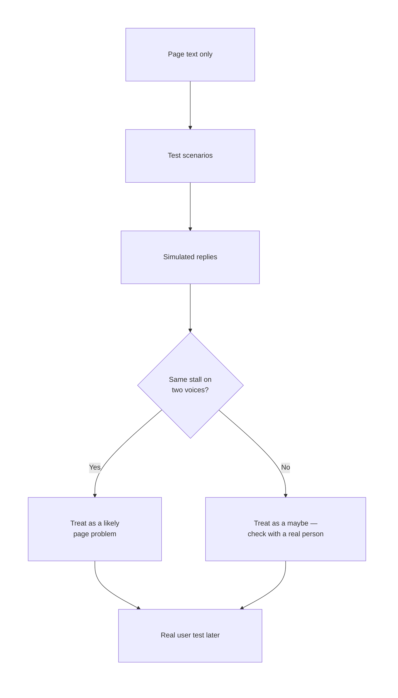
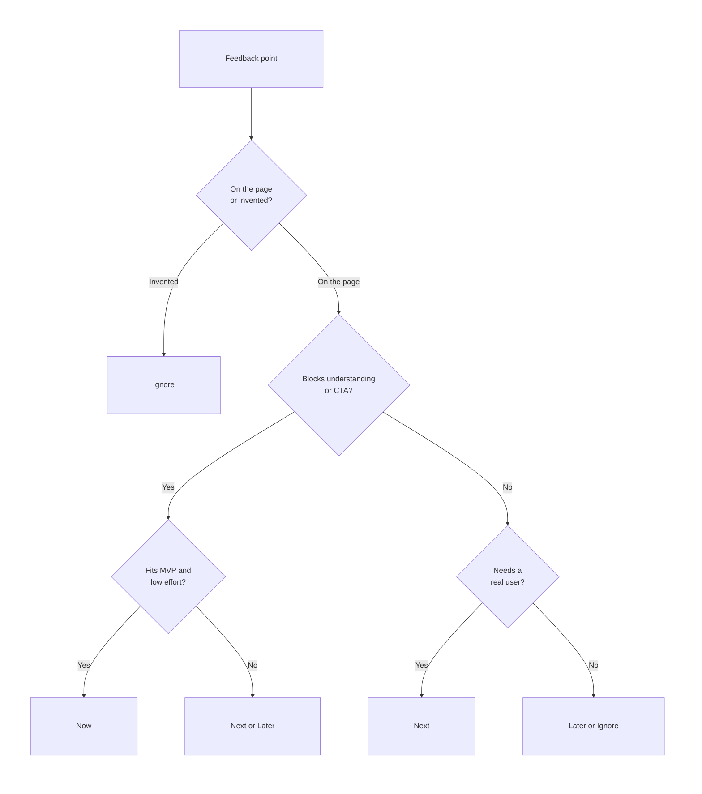

# Building a Product with AI - Part 2: Refining & Validating

## What You Will Learn in This Lesson

In the previous lesson you turned a vague wish into a **product idea**, locked a **one-line value proposition**, and built a **testable prototype** — a one-page **wireframe** or **landing page** with a headline, value line, three steps, and one working **call-to-action**. You also wrote a **feedback plan** (understanding, desire, confusion) but you did not collect replies yet.

This lesson starts from that page. You will **simulate feedback** with AI, decide what a first **MVP** should and should not include, **iterate** the prototype under time pressure, and **present** the refined offer with a clear reason for every change.

You will leave with a tighter page and a short explanation of *why* it changed — not a finished business, and not proof that strangers already love the product.

What you will practise, in order:

- Use AI to invent **test scenarios** and **simulated user replies**, then write questions that check whether the prototype solves the **intended problem**.
- Name an **MVP**, apply a few changes from feedback, and **park** the rest.
- Present the refined idea so each change points back to a finding, and each skipped feature has a **trade-off** you can defend.

The running example stays **WashQ** — hostel students book a laundry-machine slot. Use **your own** prototype from the previous lesson in the activities. WashQ is the teaching example, not the only allowed product.

---

## Scene 1: Gathering Feedback with AI

A testable page is only useful if you can learn from it. Sharing with real roommates is the gold standard, but they are not always available the moment you need practice.

In this scene you will generate **test scenarios**, **simulate user feedback** with AI, write questions that test the **intended problem**, and mark where simulated replies are weaker than real users.

### Using AI to Generate Test Scenarios and Simulated Feedback

Feedback is not “please say it looks nice.” Feedback is a **reaction in a situation**. AI can invent those situations and then speak as a person in them — if you brief it tightly.

- **Official Definition:** A **test scenario** is a short story of a real moment: who the person is, where they are, what they are trying to do, and what they see when they open the prototype.
- **In Simple Words:** It is a mini-case. Not “a user.” A named moment, like “Sunday 8 pm, one machine, clothes still in the drum.”
- **Real-Life Example:** Testing a mess menu by asking “food good?” is weak. Testing it as “You have 12 minutes before class and only two counters are open” is a scenario.

- **Official Definition:** **Simulated user feedback** is a generative model answering *as if* it were a type of person looking at your prototype, using only the page content you paste.
- **In Simple Words:** The chatbot role-plays a roommate, a sceptic, or the wrong user. It is a rehearsal, not a survey of India.
- **Real-Life Example:** Practising a viva with a friend who pretends to be the examiner is useful. It is still not the real viva.

Start from the **collection sheet** you wrote earlier. Paste the live page text (or a photo description) into the chat. Do not describe your *hopes*. Describe what is **on the screen**.


**Step 1 — Generate test scenarios (volume, then you pick).**

```text
Role: You are a practical product tester for Indian college products.
Context: This is the WashQ landing page a hostel student would open.
Paste of the page:
Headline: Book a 30-minute laundry slot
Value line: For hostel students tired of waiting in the basement
How it works: 1) Join the waitlist  2) Get a reminder  3) Use your slot
CTA: Join the waitlist
Who this is not for: Not a home pickup laundry shop
Do not invent download numbers, ratings, or college names.
Do not praise the idea. Find realistic situations.
Format: Give 6 test scenarios as a table:
Who | When and where | What they want | What they see first | Risk if the page fails them
```

A typical dump mixes useful moments with fantasy. Mark each row yourself:

| Scenario from AI | Useful for WashQ? | Why |
|------------------|-------------------|-----|
| Sunday 8 pm, second-year, clothes in a bucket, machine occupied | Yes | This is the intended pain |
| Floor mentor after a basement argument | Yes | A different but real stakeholder |
| Day scholar who lives at home | Yes — as a **wrong user** | The page should not recruit them |
| Investor in Bengaluru wanting a pitch deck | No | Not a first test of a hostel page |
| Tourist booking a city laundry app | No | Wrong product entirely |
| Parent paying fees from another city | Maybe later | Not the person who uses the machine |

Keep **three to four** scenarios. Always include **one intended user**, **one sceptic who likes the old workaround**, and **one wrong user**. The wrong user tells you if the page is too vague.

**Step 2 — Simulate feedback (one person at a time).** Run a separate prompt per scenario. If you mash all six into one reply, the model blends voices and sounds like a committee.

```text
Role: You are Priya, a second-year student in a Pune hostel.
Context: It is Sunday 8 pm. One machine. Someone's clothes are still inside.
You open this page on your phone. You have never heard the name WashQ.
Page text: [paste headline, value line, three steps, CTA, FAQ]
You are busy and slightly annoyed. You are not a startup mentor.
Do not invent features that are not on the page.
Do not give a score out of 10.
Format:
(1) In one sentence, what you think this page is offering
(2) Would you tap the button tonight — yes / maybe / no, and why
(3) The first line or button that confused you
(4) What you expected to see that is missing
(5) One honest line you would send on the floor WhatsApp group
```

Repeat for a sceptic (Rohan, who shouts “I am next”) and a wrong user (Aarav, a day scholar). A useful set of simulated replies for WashQ often looks like this after you delete fluff:

| Simulated person | What they think it is | Desire | First confusion |
|------------------|----------------------|--------|-----------------|
| Priya (intended) | “Some list so I don’t wait downstairs” | Yes | “Where do I pick the time?” |
| Rohan (sceptic) | “A form. We already shout in the basement.” | No | “Join the waitlist” feels like spam |
| Aarav (wrong user) | “A laundry shop I can book from home” | No | Headline never said *hostel machine* |

- The model’s job is **plausible reactions**. Your job is **pattern spotting**. If two voices stall on the same line, that line is the problem.
- If the reply invents “UPI checkout is slow,” check the page. If UPI is not on the page, the model hallucinated a feature. Delete that line.
- A common mistake is prompting `tell me why my product is great`. The model will cheer. That is not a test.

**Activity: Four Scenarios, Three Voices**

Open the same chat tool you used earlier. Paste **your** page text (or WashQ if you are following the example).

1. Run the scenario prompt. Keep four rows: intended user, sceptic, wrong user, and one extra that still feels real.
2. Simulate feedback for the first three voices, one prompt each.
3. Copy their five answers into a table in your notebook. Highlight any line **two voices** stalled on.
4. Cross out any comment that names a feature not on your page.

### Designing Questions That Test the Intended Problem

Simulated replies are only as good as the questions you ask. Weak questions test taste. Strong questions test whether the prototype does the **job you claimed**.

- **Official Definition:** An **intended problem** is the specific pain your value proposition promised to reduce — not every inconvenience in the user’s life.
- **In Simple Words:** WashQ promised “stop waiting and arguing over the machine.” It did not promise cheaper detergent or a prettier basement.
- **Real-Life Example:** If a canteen app claims “skip the lunch queue,” the test is “did this help you get food faster?” not “do you like the logo?”

The previous lesson already split feedback into **understanding**, **desire**, and **confusion**. Keep those three layers, and add a fourth: **job** — did this version attack the intended problem, or only look neat?

| Layer | Question that tests the problem | Question that only tests taste (avoid) |
|-------|--------------------------------|----------------------------------------|
| Understanding | “What do you think this helps you do on Sunday evening?” | “Cool page, right?” |
| Desire | “Would you use this instead of shouting ‘I am next’ — yes / maybe / no?” | “Would you love a premium laundry ecosystem?” |
| Confusion | “Which line made you unsure this is for your hostel machine?” | “Which colours feel off-brand?” |
| Job | “If this existed tonight, what would still go wrong in the basement?” | “What extra modules should we build?” |


Write questions **before** you generate more AI drama. Otherwise the model will wander into features, funding, and fonts.

A tight question set for WashQ (you can reuse the skeleton for your idea):

```text
Q1. After 10 seconds, what is this page offering you?
Q2. Who is this for — and who is it not for?
Q3. Would you join this waitlist before a normal Sunday laundry — yes / maybe / no? Why?
Q4. What did you expect to tap that you could not tap?
Q5. If you used only this page, would the basement fight get smaller, stay the same, or get worse? Why?
```

- **Q1–Q2** catch a fuzzy headline. If people say “laundry shop,” the intended problem never landed.
- **Q3** is desire in their words. A polite “nice idea” plus **no** is more useful than a long compliment.
- **Q4** catches a dead or vague CTA. “Join the waitlist” with no slot picker often fails here — that is a finding, not a reason to build a full app tonight.
- **Q5** is the problem test. If they say the fight stays the same because nobody respects a waitlist, you have learned about **trust**, not about button colour.

**How to brief AI so it answers your questions, not its own.**

```text
Role: You answer only the five questions below, as the person described.
Context: You are Rohan. You think shouting in the basement already works.
You are looking at this page text: [paste]
Do not suggest new product lines. Do not mention investors.
Do not skip a question.
Format: Q1 ... Q5, each answer max 3 sentences.
Questions:
[paste Q1 to Q5]
```

Compare three voices on the **same** five questions. You are looking for agreement, not average scores.

| Question | Priya | Rohan | Aarav | What you do with this |
|----------|-------|-------|-------|------------------------|
| Q1 offer | Slot so I don’t wait | A Google Form | Home laundry booking | Headline still too wide |
| Q3 use | Yes | No — I’ll shout | No — I don’t live here | Desire is mixed; wrong user correctly dropped off |
| Q5 fight | Maybe smaller | Same — people won’t follow a list | Not my problem | Trust and enforcement are open risks |

- Good questions are **short**, **specific to this page**, and answerable in one sitting.
- Do not ask “what features should I add?” You will get a shopping list and lose the intended problem.
- A common doubt: *“Should I include a 1–10 rating?”* Skip it. People (and models) invent a number. Yes / maybe / no plus a reason is enough.

**Activity: Lock Five Questions**

Copy the five-question skeleton. Rewrite each line so it names **your** user and **your** intended problem.

1. Read the questions aloud. If a roommate could answer without opening the page, rewrite them.
2. Run the “answer only these questions” prompt for two voices: intended user and sceptic.
3. Mark each question **Keep**, **Rewrite**, or **Drop**. Drop any item about logo, funding, or extra modules.
4. Save the final five questions. You will reuse them after you change the page.

**Activity: Spot the Weak Question**

For each line, write **Tests the problem** or **Tests taste / noise**: (1) “Would this reduce the Sunday wait?” (2) “Does the blue feel premium?” (3) “Who is this for?” (4) “Should we add dark mode?” (5) “What would still go wrong in the basement?” (6) “Give me a testimonial.”

*(Typical: 1, 3, 5 test the problem. 2, 4, 6 are taste or noise.)*

### Limitations of Simulated Feedback Compared to Real User Testing

AI is a fast rehearsal partner. It is not a hostel full of wet clothes. If you treat simulated quotes as proof, you will polish the wrong thing.

- **Official Definition:** **Real user testing** is watching or listening to actual people in the target situation as they use the prototype, then recording what they understood, wanted, and stumbled on.
- **In Simple Words:** A roommate with a laundry bag is a real test. A chatbot pretending to be that roommate is a practice round.
- **Real-Life Example:** Rehearsing a complaint with a chatbot is useful. Filing the complaint at the warden’s office is the real event. The two are not interchangeable.

Know the failure modes so you do not over-trust the table you just made.

| Limitation | What happens in the chat | What happens with a real person | How you stay honest |
|------------|--------------------------|---------------------------------|---------------------|
| **The model already knows the brief** | You pasted the problem, so it “gets” WashQ too easily | A new person has only the page | Paste **page text only**. Do not paste your idea card into the simulation. |
| **No body, no basement** | It will not pinch-zoom, miss the button, or stand in a wet queue | Thumbs, glare, hostel Wi-Fi, leftover clothes | Treat “I would tap yes” as a guess, not a tap. |
| **Polite or dramatic** | It may cheer or rant because you asked for honesty | Real people mumble “okay” and leave | Prefer short, bored answers. If the tone is a TED talk, rerun with “you are busy and slightly annoyed.” |
| **Invented features** | It reviews UPI, maps, or an app that does not exist | They can only react to what is on screen | Delete any comment about something not on the page. |
| **Same brain, many voices** | Priya and Rohan are still one model | Two roommates disagree for real reasons | Never let one simulation be your only evidence. |
| **No social cost** | Fake Rohan can say “I hate this” | Real Rohan may not want to insult a friend | Simulated “no” is easier than a real “no.” Plan to hear softer real answers later. |
| **Confirmation bias** | `Find 10 problems` will invent 10 problems | Some pages are simply clear | Ask the five questions. Do not ask the model to manufacture a backlog. |

What simulated feedback **is** good for:

- Catching a headline a stranger cannot repeat.
- Catching a CTA that sounds like spam or a shop.
- Catching a missing “who this is not for” line.
- Practising your question list before you bother real people.

What it **cannot** prove:

- That hostel students will actually join.
- That a waitlist will stop basement fights.
- That your colours, photos, or brand name “work in the market.”
- That you should add payments because one fake user asked for UPI.



- Simulated feedback is a **filter**, not a verdict. Use it to decide what to try on the page. Confirm important bets with real people when you can.
- If AI says the page is perfect, do not celebrate. You probably leaked the idea card into the prompt.
- A common doubt: *“Can I skip real users if the simulation was detailed?”* No. Detail is not evidence. It is fluent text.

**Activity: Trust Label**

Take six comments from your simulation table. Mark each **Likely page issue**, **Needs a real user**, or **Ignore (invented)**.

1. “I thought this was a city laundry shop” — if two voices said it, **likely page issue**.
2. “I would pay ₹99” — **ignore** unless the page mentioned price.
3. “I still won’t trust a waitlist in a real fight” — **needs a real user**.
4. “The UPI gateway timed out” — **ignore** (not on the page).
5. “Join the waitlist sounds like an email trap” — **likely page issue** if the sceptic also stalled there.
6. “Add a map of all Pune hostels” — **ignore** as a first-version request; park it.

Write one sentence under the table: *What I will not claim after this rehearsal.* Example: “I will not claim hostel students want WashQ. I will claim the current headline is easy to misread as a shop.”

You now have scenarios, a question set, and a humble reading of AI replies. The next scene is not “build everything they mentioned.” It is “name the smallest real product, then change only what is worth changing now.”

---

## Scene 2: Iterating on the Prototype

Feedback without a size limit becomes a second wishlist. Iteration is changing the prototype **on purpose**, inside a small box, so the page still tests one job.

In this scene you will define an **MVP**, apply changes from simulated feedback, and **prioritise** what to do now versus what to defer.

### Defining an MVP — What It Should and Should Not Include

People hear “MVP” and think “cheap unfinished app.” The useful meaning is **smallest version that can still test the promise**.

- **Official Definition:** A **Minimum Viable Product (MVP)** is the smallest offer that delivers the core value to the target user and can be put in front of people to learn whether the intended problem is being addressed.
- **In Simple Words:** It is the least you can show that still does the one job — not a broken product, and not a company.
- **Real-Life Example:** For a new chai stall, an MVP is tea, sugar, and a kettle at the gate — not a food court, UPI mini-app, and loyalty stamps on day one.

Your **prototype** from the previous lesson is a page used to learn. The **MVP** is the first version of the *product* you are willing to stand behind this week. They can be almost the same object (a waitlist page) as long as you are honest about what it does and does not do.

Fill an **MVP card** before you touch fonts. If you skip this card, every simulated comment will feel mandatory.

```text
MVP name:
Core job (one sentence):
Target user (who, when):
This version INCLUDES:
This version does NOT include:
How we will know it is working enough to learn:
```

A filled WashQ MVP card:

```text
MVP name: WashQ waitlist
Core job: Hostel students on this floor can show interest in a 30-minute laundry slot.
Target user: A student with a laundry bag on a busy evening.
This version INCLUDES:
- One page that names the hostel-machine job
- Three steps
- One waitlist form (name, block/floor, yes/maybe/no)
- A line that this is not a pickup laundry shop
This version does NOT include:
- Live slot calendar, payments, machine lock, ratings, city map, login, admin dashboard
How we will know: strangers repeat the offer, and some intended users tap yes or maybe.
```

Use a simple include / exclude test. If a feature does not help you learn about the **core job** this week, it does not belong in the MVP.

| Candidate | In the WashQ MVP? | Reason |
|-----------|-------------------|--------|
| Clear headline + hostel context | Yes | Without it, people think it is a shop |
| Working waitlist form | Yes | Without a next step, you cannot see desire |
| “What this is not” line | Yes | Wrong users were joining the story |
| Live 30-minute calendar | No | Needs rules, reminders, and trust you do not have yet |
| UPI / refunds | No | You are testing interest, not a laundry business |
| Dark mode / custom logo | No | Does not change what you learn about the basement fight |
| Ratings of other students | No | Social features need real usage first |
| WhatsApp reminder by you, manually | Maybe | A **manual** workaround can be in an MVP if it is honest and small |


- **Viable** means someone can try the core job, even if the backstage is manual (you copy form replies into a sheet).
- **Minimum** means you cut anything that does not serve that try.
- A common mistake is calling a logo and a 12-page site an MVP because “it looks like a product.” Looks are not viability.

**Activity: Write the MVP Card**

Complete the card for **your** idea.

1. Circle the one job. If you circled two jobs, split them and keep one.
2. List at most five includes and at least five excludes.
3. For each excluded item: if you can still test the intended problem without building it, it stays excluded.
4. Pin the card next to your page. You will use it when feedback asks for a city-wide app.

### Iterating on the Prototype Based on Simulated Feedback

**Iteration** is a loop: see a finding, change the smallest thing that addresses it, then look again. It is not a redesign because you felt bored.

- **Official Definition:** **Iteration** is making a bounded change to a prototype in response to evidence, then checking whether the intended problem is clearer or closer to being solved.
- **In Simple Words:** Change one confusing line. Do not rebuild the whole site because a fake user asked for a map.
- **Real-Life Example:** If customers keep asking “is this spicy?”, you add a chilli mark to the menu. You do not close the stall and open a restaurant.

Work from **findings**, not from raw quotes. A finding is a pattern you trust enough to act on (often two voices, or a limitation you already labelled “likely page issue”).

WashQ findings after Scene 1 (example):

| Finding | Evidence | MVP-relevant? |
|---------|----------|---------------|
| Headline can be read as a city laundry shop | Aarav + Priya both missed “hostel machine” | Yes |
| “Join the waitlist” feels like spam | Rohan stalled on the CTA | Yes |
| People expect to pick a time on the page | Priya asked “where do I pick the time?” | Partly — explain, don’t build a calendar yet |
| Trust: a list may not stop a real fight | Rohan | Important, but not a new feature this week |
| Request for UPI and a Pune map | One invented comment | No — exclude |

Now change the **page**, not the dream. Keep the four bands (headline, value line, how it works, CTA). Update supporting copy only if it fixes a finding.

| Band | Before (testable but leaky) | After (still an MVP, clearer) |
|------|-----------------------------|-------------------------------|
| Headline | Book a 30-minute laundry slot | Book the hostel basement machine |
| Value line | For hostel students tired of waiting in the basement | For students on this floor who lose Sunday to the one machine |
| How it works | Join → reminder → use slot | Join this floor’s list → we share a simple slot sheet → you take your 30 minutes |
| CTA | Join the waitlist | Join this floor’s list |
| Supporting | Not a home pickup shop | Not a laundry shop. Not live booking yet. A list to see if slots would help. |


Notice what you **did not** build: no calendar product, no payments, no login. You **explained** the gap Priya felt, instead of pretending the MVP is already a booking system.

**A safe iteration order** (do it in this sequence so you do not decorate first):

1. **Clarity** — headline and “who / where” so the intended problem is obvious.
2. **Next step** — one CTA, honest label, working form.
3. **Expectation** — one line on what this version is not, so Priya does not hunt for a time-picker that does not exist.
4. **Only then** optional extras that still fit the MVP card.

After you edit, **re-run the same five questions** on the new page text. If Priya still thinks it is a shop, the headline is still wrong. If she now says “it’s a floor list, not a live booking,” the expectation line worked.

```text
Role: You are Priya again. Same Sunday 8 pm situation.
Context: The page text has changed. Judge ONLY the new text.
New page text: [paste after]
Answer the same Q1 to Q5. Max 3 sentences each.
Flag if you still think this is a city laundry shop.
```

- Iteration is **small and checkable**. If you cannot say what you will re-test, you are decorating.
- Do not add a feature to soothe a feeling. Add a sentence, a label, or a cut.
- A common doubt: *“The simulation asked for a calendar — isn’t that the product?”* The product *vision* may include slots. The **MVP** may still be a list plus a manual sheet. Honesty on the page is an iteration. A fake calendar is a lie.

**Activity: Three Changes, One Recheck**

From your findings table, pick **three** page changes that fit your MVP card.

1. Write before → after for headline, CTA, and one supporting line.
2. Update Google Sites / Canva / Carrd / Durable (or the paper photo plus form). Keep one button.
3. Re-run Q1–Q5 with one intended voice and one sceptic.
4. If a new comment names a feature on your exclude list, park it. Do not build it in this pass.

### Prioritising Feedback: Act Now versus Defer

You will always have more comments than hours. **Prioritisation** is choosing under a time limit, not collecting a perfect backlog.

- **Official Definition:** **Prioritisation** is ranking possible changes by how much they improve learning about the intended problem, how much effort they take, and whether they fit the MVP — then acting on a few and deferring the rest.
- **In Simple Words:** Do the clarity fixes first. Leave the shopping-mall features for later, even if the chatbot sounded confident.
- **Real-Life Example:** Before a fest, you fix the broken stall sign before you order neon lights. Time is part of the decision.

Use a **Now / Next / Later** board. Three columns are enough. Do not invent a scoring app.

| Column | Put a change here when | WashQ examples |
|--------|------------------------|----------------|
| **Now** | It blocks understanding or the CTA, and you can do it in this sitting | Rewrite headline; one honest CTA; “not a shop / not live booking yet” |
| **Next** | It would help, but needs a real user or a bit more time | Manual slot sheet on WhatsApp; ask two roommates the five questions |
| **Later** | It is a bigger product, or it is polish | Live calendar, UPI, ratings, second hostel, dark mode, logo animation |


A second filter, when two **Now** items compete:

| Change | Helps the intended problem? | Fits MVP? | Effort | Decision |
|--------|----------------------------|-----------|--------|----------|
| Clearer headline | Yes | Yes | Low | **Now** |
| Honest CTA label | Yes | Yes | Low | **Now** |
| Manual reminder to the floor group | Maybe | Yes, if you say it is manual | Medium | **Next** |
| In-page time picker | Yes in the long run | No — not this MVP | High | **Later** |
| UPI | No for this test | No | High | **Later** |
| New colour theme | No | No | Medium | **Later** (polish) |

Time constraints make **Later** a feature, not a failure. Shipping a clear list today teaches more than a half-built calendar next month.



Rules that keep you out of trouble:

- **Clarity beats features** when time is short.
- **One Now list**, not twelve. Three Now items is a good cap for a single pass.
- If two changes fight (calendar vs honesty line), pick the one that protects the MVP story.
- Defer is not “never.” Write the parked item in one line so you can show it in the presentation.

**Activity: Now / Next / Later**

Dump every leftover comment from the simulation into a list. Sort the list into three columns.

1. Cap **Now** at three items. If you have six, force three into Next or Later.
2. For each Now item, write the page change in one sentence.
3. For each Later item, write “parked because…” (time, MVP, or invented).
4. Do not move a Later item back to Now because it sounded exciting.

You have a smaller product and a changed page. The last scene is making that story speakable: what changed, why, and what you refused to build.

---

## Scene 3: Presenting the Refined Product

A refined prototype that you cannot explain will look like random edits. Presentation here is not a sales pitch. It is a **clear account** of the offer, the evidence, and the trade-offs.

In this scene you will present the refined idea with a **rationale**, tie each change to a **finding**, and justify what you cut or delayed.

### Presenting the Refined Product with a Clear Rationale

- **Official Definition:** A **rationale** is the reasoned explanation for a decision — what you changed or kept, and why that choice serves the user and the MVP.
- **In Simple Words:** “We changed the headline because two voices thought this was a laundry shop” is a rationale. “We made it nicer” is not.
- **Real-Life Example:** A mess secretary who says “we dropped a sabzi because 30 plates came back uneaten” is presenting a rationale. “We felt like changing the menu” is not.

Use a short, repeatable spine. Ninety seconds is enough if every sentence earns its place.

```text
1. Who and the intended problem (one breath)
2. What the first page offered
3. What we heard (simulated, labelled as simulated)
4. What we changed
5. What we parked, and why
6. What we want to learn next from real people
```

A WashQ presentation (read it aloud; cut any sentence you cannot defend):

- **Problem:** On our floor, one machine and no booking turns Sunday into a wait and an argument.
- **First page:** “Book a 30-minute laundry slot” plus a waitlist button.
- **What we heard (simulation, not a survey):** An intended user wanted a time picker; a sceptic thought shouting already works; a day scholar thought this was a home laundry shop.
- **What we changed:** The headline now names the **hostel basement machine**. The button says **join this floor’s list**. A line says this is **not live booking yet**.
- **What we parked:** A live calendar and UPI — they do not fit this MVP and would fake a product we cannot run this week.
- **Next:** Ask two real roommates the same five questions, without showing them the idea card first.

**Do / don’t when you present:**

| Do | Don’t |
|----|--------|
| Show before and after of **one screen** | Flip through five themes and call it iteration |
| Say “simulated feedback” when that is the source | Say “users love us” after a chatbot role-play |
| Name the MVP boundary | Hide the waitlist and pretend slots are live |
| End with one ask (look at the page / answer Q1–Q5) | End with a funding story or a feature roadmap of twelve items |

Keep artefacts in one folder so you are not scrolling mid-sentence: idea card, MVP card, before/after text, findings table, Now/Next/Later board, live link.

**Activity: Ninety-Second Script**

Write the six-line spine for **your** product. Time yourself once.

1. Delete adjectives (revolutionary, seamless, AI-powered) unless you can point to them on the page.
2. Replace every “we felt” with a finding or an MVP rule.
3. Record a voice note. If you cannot hear the intended problem in the first ten seconds, rewrite line 1.

### Tying Specific Changes Back to Feedback or Test Results

A change without a source looks like taste. A source without a change looks like you ignored the test. Pair them in a **change log**.

- **Official Definition:** A **change log** (for this lesson) is a simple table that maps each prototype edit to the feedback or test result that prompted it, including edits you refused.
- **In Simple Words:** Each row is “they stalled here → we did this.” Empty rows are not allowed.
- **Real-Life Example:** “We moved the water cooler because three people asked where it was” is tied to feedback. “We moved it for vibes” is not.

```text
Change:
Prompted by (quote or finding):
Source (simulated voice / real person — say which):
What we changed on the page:
What we did not change:
How we rechecked:
```

Filled WashQ change log:

| Change | Prompted by | Source | On the page | Recheck |
|--------|-------------|--------|-------------|---------|
| Headline names hostel machine | “I thought this was a laundry shop” | Simulated Aarav + Priya | Headline rewrite | Priya Q1 no longer says “shop” |
| CTA = this floor’s list | “Waitlist sounds like spam” | Simulated Rohan | Button label | Sceptic still may say no, but knows it is local |
| Honesty line: not live booking | “Where do I pick the time?” | Simulated Priya | Supporting copy | Q4: she looks for a picker less; Q5 still flags trust |
| No UPI added | “I would pay ₹99” | Simulated, **invented** | Nothing | Ignored — not on original page |
| No city map | “Map of Pune hostels” | Simulated, out of MVP | Nothing | Parked on Later |

Rules for a trustworthy log:

- If two findings fight, record **both** and show the MVP tie-break.
- If you changed something with **no** finding, label it **taste** and be ready to undo it.
- If you did not change something important (trust in a real fight), say so. That is a **next** test, not a hidden failure.

**Activity: Five-Row Change Log**

Build a five-row table for your refined page.

1. Three rows must be **did change**, each with a source.
2. Two rows must be **did not change**, with a reason (invented, out of MVP, needs real user).
3. For every “did change” row, write the **before** phrase and the **after** phrase.
4. If you cannot find a source, the change does not belong in the presentation.

### Justifying Design and Feature Trade-offs

Every Now item is also a **no** to something else. A **trade-off** is that choice, said out loud.

- **Official Definition:** A **trade-off** is accepting a downside in one area to protect a more important outcome — here, usually clarity, honesty, or fit to the MVP under a time limit.
- **In Simple Words:** You cannot have a live calendar *and* a truthful one-week page. You pick.
- **Real-Life Example:** A train ticket that is cheap but slow is a trade-off. Pretending it is both cheap and fast is not a trade-off; it is a false claim.

WashQ trade-offs you should be ready to defend:

| We chose | We gave up | Why this is acceptable for now | Risk we still own |
|----------|------------|--------------------------------|-------------------|
| Floor waitlist page | Live 30-minute booking | We can learn desire without building a scheduler we cannot enforce | Priya may still want a time; we said so on the page |
| Manual sheet / reminder later | Automatic SMS | Automatic needs tools and trust we do not have | If we never send a reminder, desire will look weaker than it is |
| One CTA | Login + Shop + Waitlist | Extra buttons hide which single action you are testing | The page looks less “like an app” |
| Honest “not a shop / not live yet” | Looking finished | Wrong users and false expectations were the bigger bug | Some people may bounce because it looks small |
| No UPI | Revenue on day one | Payments would test checkout, not the basement problem | We still do not know if anyone would pay |

How to say a trade-off without sounding apologetic:

- Name **both sides**. “We kept the page ugly” is incomplete. “We kept one screen so the offer stays testable” is a trade-off.
- Tie it to **time** or **MVP**, not to mood.
- Name the **risk you still own**. If Rohan’s trust concern is real, do not pretend the honesty line solved basement fights.

A short spoken pattern:

```text
We chose X instead of Y.
X protects [intended problem / MVP / time].
Y would have [cost / lie / extra job].
The open risk is Z, which we will test with real people next.
```

WashQ in that pattern:

- We chose a **floor list** instead of a **live calendar**.
- The list protects a one-job MVP we can actually run.
- A calendar would imply slots we cannot guarantee this week.
- The open risk is trust in a real queue, which a chatbot cannot settle.

**Activity: Three Trade-offs**

Write three trade-off rows for your product using the table headers above.

1. At least one row must be a **feature you refused**.
2. At least one row must be a **design simplicity** choice (one screen, one button, fewer pictures).
3. Read each row into a voice note. If it sounds like an excuse, add the risk you still own.
4. Put the three rows under your change log. That bundle *is* the refined-product story.

**Activity: Full Dry Run**

Open the live link. Deliver the ninety-second spine to your voice note, then read the change log and one trade-off row aloud.

1. Pause and answer this out loud: “Does it book a slot today?” Use the MVP card, not a new feature promise.
2. If your script treats simulated voices as a survey, rewrite that sentence to name the source.
3. Stop. Do not add a roadmap of ten future modules.

---

## Key Takeaways

- **Test scenarios** and **simulated feedback** help you rehearse reactions to the page you already built. Brief the model with **page text**, not with your hopes, and run one voice at a time.
- Strong questions test the **intended problem** (understanding, desire, confusion, and whether the basement fight would actually shrink). Weak questions test taste, logos, and extra modules.
- Simulated replies are a **filter**. They miss thumbs, trust, and social cost. Do not treat them as proof. Label what must wait for **real user testing**.
- An **MVP** is the smallest offer that still tests the core job. **Iterate** with a few Now changes; **defer** features that break the MVP or the time box.
- Present the refined product as **rationale + change log + trade-offs**. Every edit should point to a finding; every skipped feature should have a downside you can name. Upcoming work is taking this tighter page to real people, not inventing a larger company.

---

## Important Commands, Libraries & Terminologies

| Term | What It Means |
|------|----------------|
| **Test scenario** | A who / when / where / what-they-want story used to test the prototype |
| **Simulated user feedback** | AI role-play as a user type looking at your page text |
| **Intended problem** | The specific pain the value proposition promised to reduce |
| **Job-to-be-done (in testing)** | Whether this version actually attacks that pain |
| **Real user testing** | Reactions from actual people in the target situation |
| **Prototype** | Early page or wireframe used to show the idea and learn |
| **MVP (Minimum Viable Product)** | Smallest offer that delivers the core job and can be tested |
| **Include / exclude list** | What this version does and refuses to do |
| **Iteration** | A bounded change from evidence, then a recheck |
| **Finding** | A pattern you trust enough to act on (not one raw quote) |
| **Prioritisation** | Ranking changes by learning value, effort, MVP fit, and time |
| **Now / Next / Later** | Simple board for act, soon, or park |
| **Rationale** | The reason a change or a cut serves the user and the MVP |
| **Change log** | Table mapping each edit (or refusal) to a feedback source |
| **Trade-off** | A chosen downside that protects a more important outcome |
| **Call-to-action (CTA)** | The one next step on the page |
| **Waitlist form** | Tiny form used as a real next step in an early MVP |
| **Confirmation bias (with AI)** | The model invents problems or praise because the prompt asked for them |
