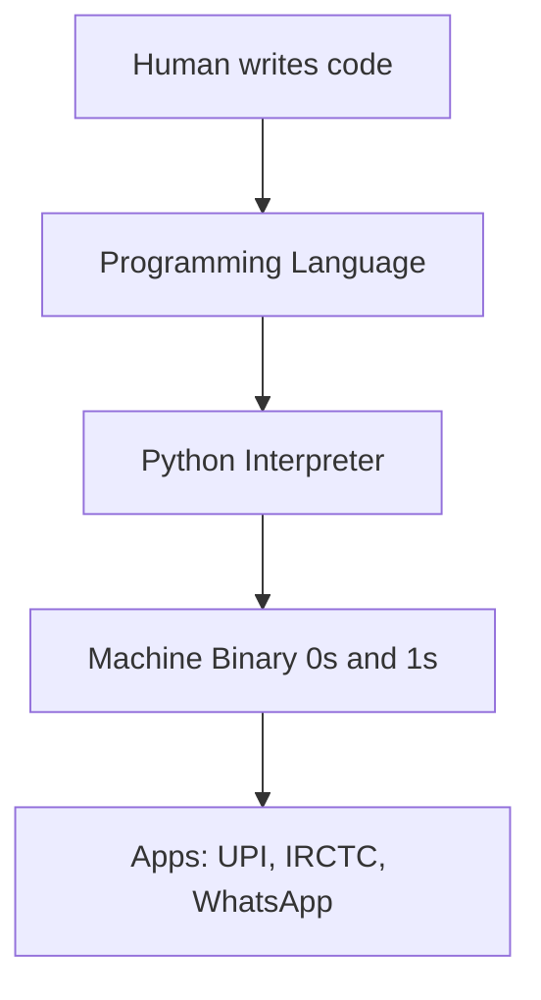
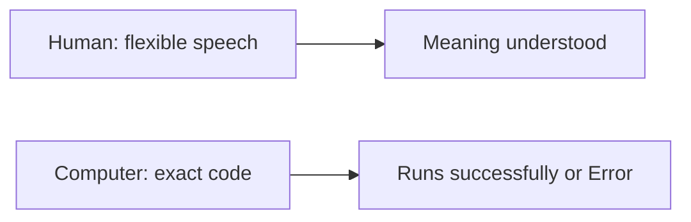
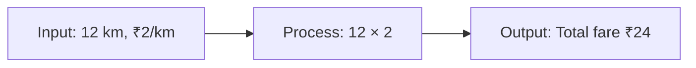
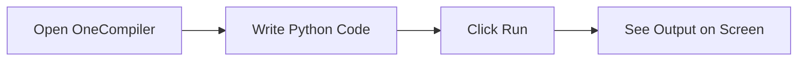
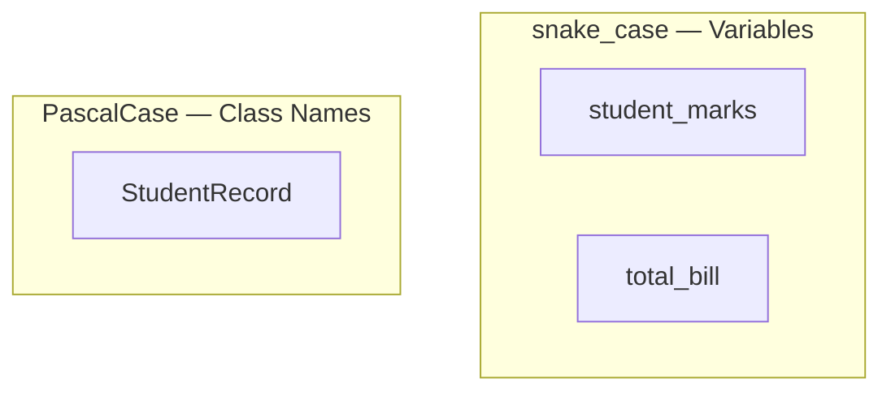
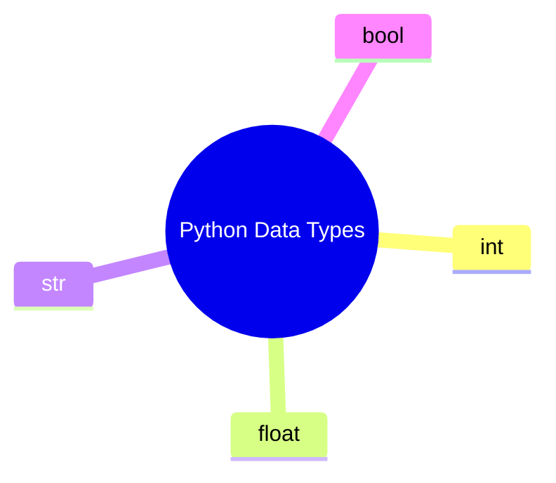
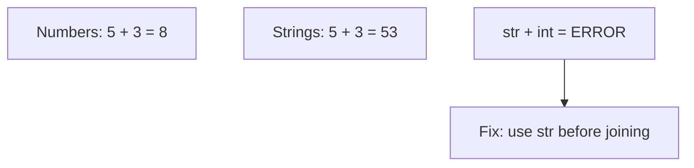
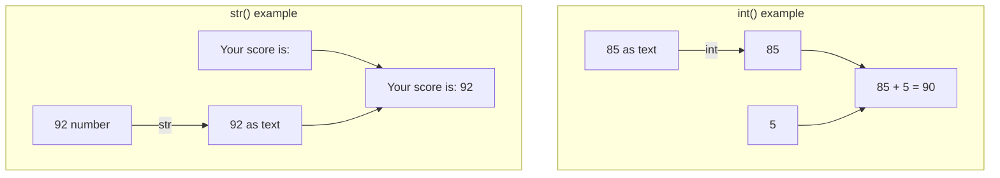

# Python Basics — Introduction to Programming, Python, Variables & Data Types


## What You Will Learn

- First step into programming — no prior coding needed
- What a **programming language** is and how it solves real-life problems
- Meet **Python** — write and run first programs on an **online compiler**
- Store information using **variables**
- Organise data using **data types**
- By the end: explain how a computer follows instructions, write small programs, identify number / text / true-false

---

## What is a programming language, and why do we use it?

- Small hotel, tasty food, dining full, long queue, bills written by hand
- Manual billing is slow → queue grows → customers leave
- No clear daily totals, popular dishes, or old records
- **Billing system** (program): tap dish + qty → instant bill → faster queue → auto sales tracking
- Programming languages exist to handle repetitive tasks quickly and accurately


- **Official:** Formal set of rules and symbols to write instructions a computer can execute
- **Simple:** How humans talk to computers — step-by-step, exact
- **Example:** Washing machine buttons — specific presses in order, not “please wash nicely”
- Without programming languages → no billing systems, websites, automation



- Computers do not understand English or Hindi directly — they understand **binary** (0s and 1s)
- Programming language = **translator** between human thinking and machine execution
- UPI, IRCTC, WhatsApp, shopping apps — all run on code

<hr style="height: 2px; background-color: #1976d2; border: none;">

## How programming solves real-life problems with step-by-step logic

- Break any real-world task into **small, clear steps**
- IRCTC flow: source + destination → trains → payment → ticket = **logic in code**
- Teaches organised thinking — studies, jobs, daily decisions

<hr style="height: 2px; background-color: #1976d2; border: none;">

## Human language vs computer instructions

| Human Language | Computer Instructions |
|----------------|----------------------|
| Flexible — “That’s wonderful” can mean many things | Strict — must be exact |
| We fill gaps from context | Does only what is written |
| Can change mid-sentence | Runs line by line unless told otherwise |
| Mistakes often forgiven | One spelling/punctuation error can stop the program |

- **Official:** Computer instructions = precise, unambiguous commands
- **Simple:** Like giving directions to someone who has never been to your city
- Human: *“Meet me around 5 pm near the bus stand”* — friend understands
- Computer: `print(Hello)` vs `print("Hello")` → **SyntaxError**
- Keywords in English (`print`, `if`, `else`); text in quotes can be any message: `name = "Hello"`



- **Need maths?** — Basic arithmetic is enough; logic matters more
- **Will the computer understand English?** — Keywords in English; everyday text can live in quotes
- **Mistakes?** — Normal. Errors help you learn

<hr style="height: 2px; background-color: #1976d2; border: none;">

## Input → Process → Output

- Every program follows this flow — design solutions before writing code
- **Official:** IPO = receive data → operate on it → produce a result
- **Simple:** Take something in, do something, give something back
- **Example:** Kirana billing — scan items (**input**) → GST total (**process**) → print bill (**output**)

| Step | What Happens | Everyday | Programming |
|------|--------------|----------|-------------|
| **Input** | Data enters | kg of rice needed | `quantity = 5` |
| **Process** | Logic / calc | price × quantity | `total = price * quantity` |
| **Output** | Result shown | printed bill | `print(total)` |




<hr style="height: 2px; background-color: #1976d2; border: none;">

## Break a real-world problem into smaller steps before writing code

**Activity: Bus fare (on paper)**

- Distance = 12 km, Rate = ₹2/km
- Input → Process (12 × 2) → Output (Total fare: ₹24)
- Also try: 3 notebooks × ₹45; hours left before 6 PM if now 2 PM
- This step-by-step thinking = **algorithm design**

**Activity: IPO for a greeting**

1. **Input:** Name (e.g. "Ananya")
2. **Process:** Combine with greeting
3. **Output:** "Hello, Ananya!"
- Later: same logic with variables + `print()`

<hr style="height: 8px; background-color: #d32f2f; border: none; border-radius: 2px;">

## What Python is, and why it is beginner-friendly

- **Official:** High-level, general-purpose language — readable syntax; used in software, data, automation
- **Simple:** Instructions that almost read like English
- **Example:** Automatic scooter — easy to start, good for beginners
- Clean, readable syntax — more logic, less memorising symbols
- Used by Google, Netflix, ISRO
- Short programs, easy to read
- Core language for **AI/ML and data analytics**
- Versatile — web backends, automation, APIs
- **OneCompiler** (and similar) — browser, no download
- Local install comes in a later session
- Early lessons: online compiler is enough


- Where Python is used: web development, data analysis, AI/ML, automation

<hr style="height: 2px; background-color: #1976d2; border: none;">

## How Python code is written and executed

- Need: place to **write** (editor) + way to **execute** (interpreter / online compiler)
- **Official:** Editor = write/edit files; online compiler = run in browser, no local install
- **Simple:** Editor = notebook; compiler = Run button
- **Example:** Like Google Docs for code — type, click Run, see result

**OneCompiler setup**

1. Open [https://onecompiler.com/](https://onecompiler.com/)
2. Click **Python**
3. Sign up / sign in (save + share with instructor)
4. Type in the **editor**
5. Click **Run** → output below / beside
6. **Save** your work

```python
# This is my very first Python program
# Comments start with # — Python ignores these lines
print("Hello, World!")  # This line displays a greeting on the screen
```

- `#` = **comment** — Python skips it
- `print()` = shows output
- `"Hello, World!"` = **string**
- Runs **top to bottom**



- Forgot to click **Run**
- Wrong spelling / case: `Print` / `PRINT` ≠ `print`
- Curly quotes from WhatsApp / Word — use straight `" "`
- Not saving work

```python
print("Ravi Kumar")
print("Mysuru")
```

- Each `print()` = one line
- First `print()` finishes before the second starts

<hr style="height: 2px; background-color: #1976d2; border: none;">

## What a variable is

- Printing only fixed text cannot calculate percentage or a bill — need **variables**
- **Official:** Named reference that holds a value in memory
- **Simple:** Labelled box — name on the box, value inside
- **Example:** Ration shop bag labelled “Rice — 5 kg” → name `rice`, value `5`


<hr style="height: 2px; background-color: #1976d2; border: none;">

## Create variables and assign values

```python
age = 21
name = "Kavya"
math_score = 88
print(age)
print(name)
print(math_score)
```

- `=` = **assignment** (store), not mathematical equality
- Text must be in quotes
- `print(age)` shows the **value**, not the word “age”

```python
balance = 1000
balance = balance - 250
print(balance)  # 750
```

- Value can **change**
- Old value replaced by new value

```python
product_name = "Notebook"
product_price = 45
quantity = 3
total_cost = product_price * quantity
print(product_name)
print(product_price)
print(quantity)
print(total_cost)  # 135
```

- Store once, reuse in calculations
- Change price in one place only

**Activity: Personal information card**

```python
my_name = "Suresh"
my_age = 20
favourite_subject = "Physics"
print(my_name)
print(my_age)
print(favourite_subject)
```

**Activity: Kirana bill** — 2 kg sugar @ ₹42/kg + 1 L oil @ ₹120

```python
sugar_kg = 2
sugar_rate = 42
oil_litres = 1
oil_rate = 120
sugar_cost = sugar_kg * sugar_rate
oil_cost = oil_litres * oil_rate
total_bill = sugar_cost + oil_cost
print(total_bill)  # 204
```

<hr style="height: 2px; background-color: #1976d2; border: none;">

## Naming rules and `print()`

- **Official:** Syntax = grammar rules so Python can read and run code
- **Simple:** Spelling, punctuation, structure — one wrong character can stop the program
- **Example:** OMR sheet — wrong circle invalidates the answer
- **Case-sensitive:** `print()` works; `Print()` / `PRINT()` error
- Straight quotes `"` or `'` — not curly quotes
- Runs **top to bottom**


- Comments start with `#` — Python ignores them
- Full-line comment vs inline comment

```python
# Full-line comment
print("Hello, World!")  # inline comment
exam_marks = 85
print(exam_marks)
```

| Style | Looks Like | Used For | Example |
|-------|------------|----------|---------|
| **snake_case** | lowercase + underscores | Variables, functions | `student_marks`, `total_bill` |
| **PascalCase** | Each word capitalised | Class names (later) | `StudentRecord`, `BusTicket` |

- Letters, numbers, underscores — **cannot start with a number**
- **Case-sensitive:** `Age` ≠ `age`
- Descriptive names: `student_marks` > `x`
- No spaces — use underscores
- Do not use reserved words: `print`, `if`, `else`, `True`, `False`
- Variables: **snake_case**; classes later: **PascalCase**

```python
student_name = "Anita"
total_marks = 92
bus_fare = 24.50
print(student_name)
print(total_marks)
print(bus_fare)
```



```python
# My first program — prints a greeting message
print("Hello, World!")  # Shows greeting on the screen
```

<hr style="height: 8px; background-color: #d32f2f; border: none; border-radius: 2px;">

## What data types are, and why they matter

- Age = number, name = text, passed exam = true/false
- Python needs to know **type** so it handles data correctly
- **Official:** Kind of value a variable holds; which operations are valid
- **Simple:** Kitchen labels — rice (numbers), oil (decimals), spice packets (text)
- **Example:** Aadhaar form — Age expects number, Name expects text

<hr style="height: 2px; background-color: #1976d2; border: none;">

## Identify int, float, str, and bool

| Data Type | Python Name | What It Holds | Example |
|-----------|-------------|---------------|---------|
| **Integer** | `int` | Whole numbers | `25`, `0`, `-10` |
| **Float** | `float` | Decimals | `3.14`, `99.5` |
| **String** | `str` | Text in quotes | `"Hello"`, `"Welcome"` |
| **Boolean** | `bool` | True / False | `True`, `False` |


```python
students_in_class = 35       # int
temperature = 36.6           # float
student_name = "Manjunath"   # str
is_passed = True             # bool — capital T / F
print(students_in_class)
print(temperature)
print(student_name)
print(is_passed)
```

- Python detects type from how you write the value
- `"85"` is **text**, not a number
- `True` / `False` — capital first letter



<hr style="height: 2px; background-color: #1976d2; border: none;">

## Check a data type with `type()`

```python
age = 22
height = 5.8
name = "Divya"
is_student = True
print(type(age))         # <class 'int'>
print(type(height))      # <class 'float'>
print(type(name))        # <class 'str'>
print(type(is_student))  # <class 'bool'>
```

- Use `type()` when the program behaves unexpectedly

**Activity: Type detective**

```python
my_age = 19
my_height = 5.7
my_name = "Lakshmi"
is_enrolled = True
print(type(my_age))
print(type(my_height))
print(type(my_name))
print(type(is_enrolled))
```

<hr style="height: 2px; background-color: #1976d2; border: none;">

## How data types behave in operations

**Numbers**

```python
apples = 5
oranges = 3
print(apples + oranges)  # 8
price = 99
gst = 0.18
print(price + (price * gst))  # 116.82 (float)
```

**Strings**

```python
first_name = "Raj"
last_name = "Kumar"
print(first_name + last_name)           # RajKumar
print(first_name + " " + last_name)     # Raj Kumar
print("-" * 20)
```

- `"5" + "3"` → `"53"` (join), not `8`
- `5 + 3` → `8`
- `"Score: " + 85` → **error**



<hr style="height: 2px; background-color: #1976d2; border: none;">

## Type conversion

| Function | Converts To | Example |
|----------|-------------|---------|
| `int()` | Integer | `int("42")` → `42` |
| `float()` | Float | `float("3.14")` → `3.14` |
| `str()` | String | `str(85)` → `"85"` |
| `bool()` | Boolean | `bool(1)` → `True` |

```python
marks_text = "85"
marks_number = int(marks_text)
print(marks_number + 5)  # 90

score = 92
print("Your score is: " + str(score))

print(int(149.99))  # 149 — cuts decimal, does not round
```

- Convert **before** mixing types
- `"Score: " + 85` → **TypeError** — fix: `str(85)`
- `int("hello")` → **ValueError** — only convert numeric text like `"85"`



**Activity: Bus fare with type conversion** — distance as text `"15"`, rate `2.5`

```python
distance_text = "15"
rate_per_km = 2.5
distance = float(distance_text)
total_fare = distance * rate_per_km
print("Total bus fare: Rs. " + str(total_fare))  # 37.5
```

<hr style="height: 8px; background-color: #d32f2f; border: none; border-radius: 2px;">

## Key Takeaways

- **Programming language** = precise instructions; machines do not guess
- Every program: **Input → Process → Output** — break problems this way first
- **Python** — start on OneCompiler; **syntax**, **# comments**, **snake_case**
- Types: **int**, **float**, **str**, **bool** — check with `type()`; convert with `int()`, `float()`, `str()`
- Next: user input, more calculations, conditions

## Quick Reference

| Term / Command | What It Does |
|----------------|--------------|
| Programming Language | Rules for writing computer instructions |
| Python | Beginner-friendly, high-level language |
| OneCompiler | Free online compiler (no local install) |
| Variable | Named container (`name = "Ravi"`) |
| Assignment (`=`) | Stores a value (not maths equality) |
| `print()` | Displays output |
| `#` | Comment — Python ignores it |
| Syntax | Grammar of valid Python |
| snake_case | Variables: `student_marks` |
| PascalCase | Classes: `StudentRecord` |
| `int` / `float` / `str` / `bool` | Whole / decimal / text / True-False |
| `type()` | Returns the data type |
| `int()` / `float()` / `str()` | Type conversion |
| IPO | Input → Process → Output |
| Algorithm | Step-by-step procedure |
| Concatenation | Join strings with `+` |
| Type Conversion | Change one type to another |
