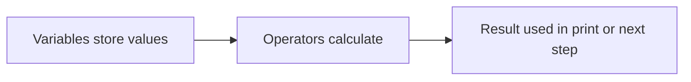
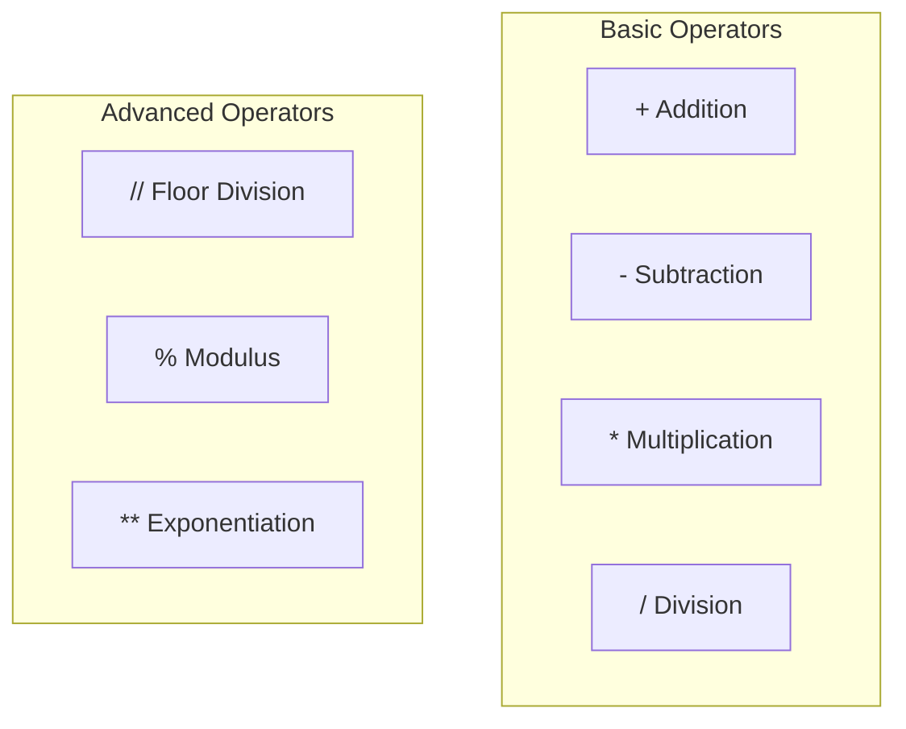
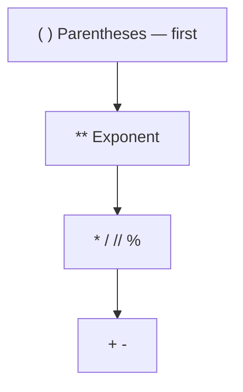
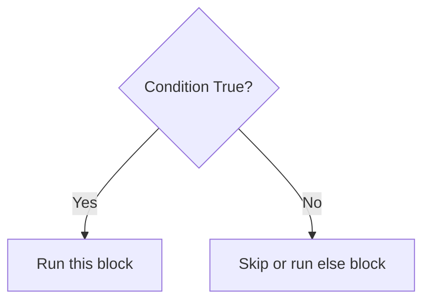
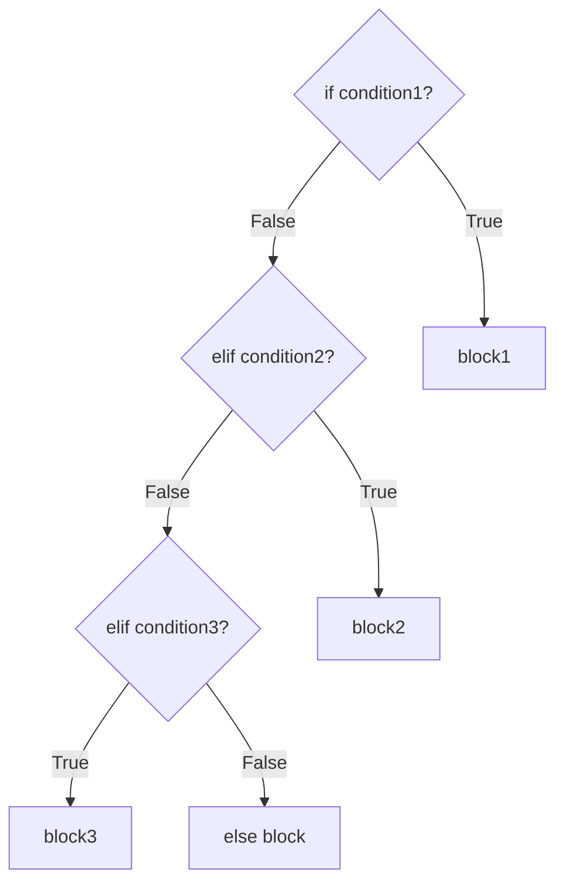
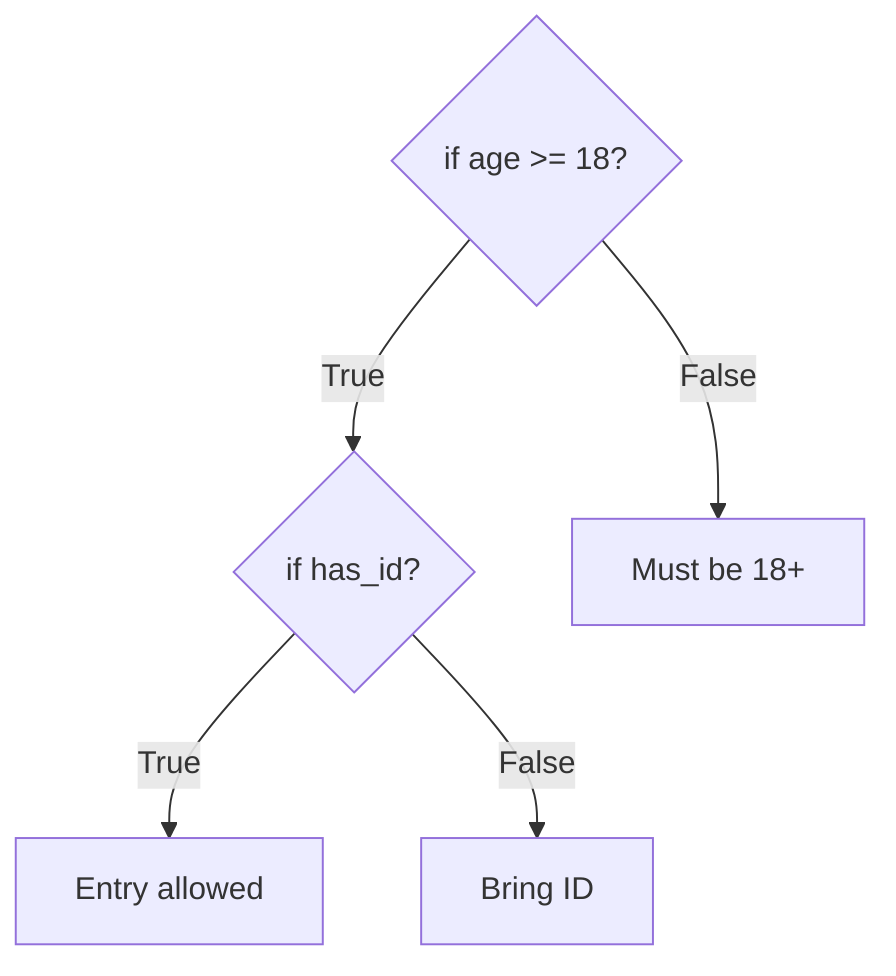
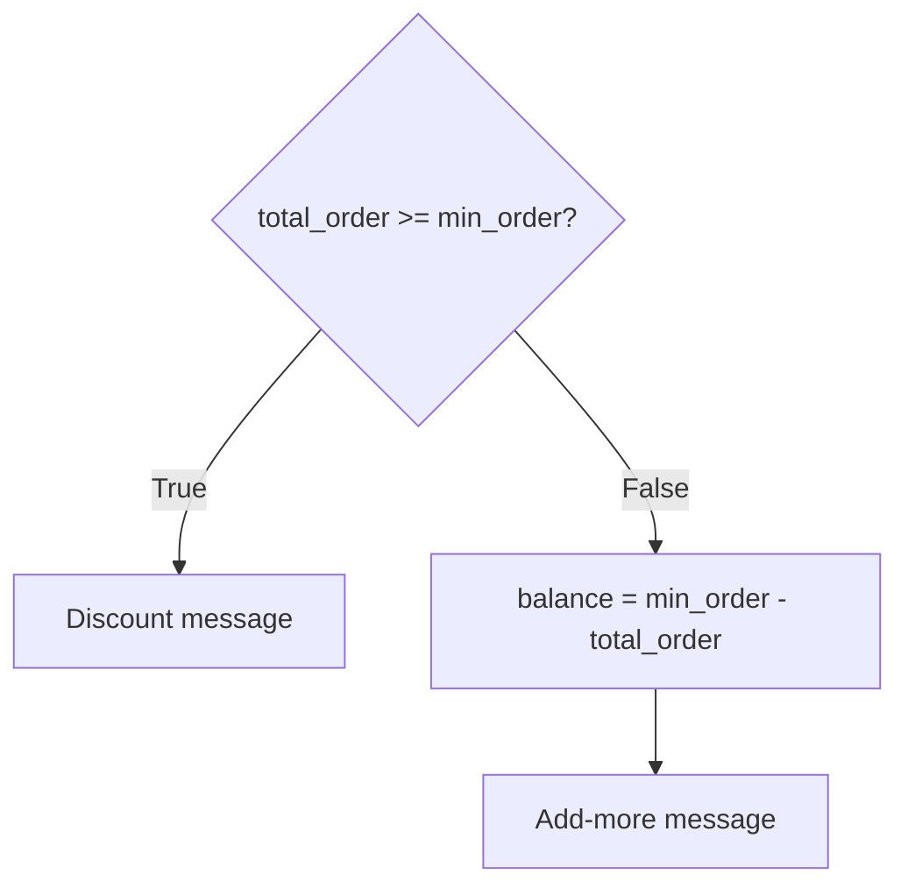

# Python Building Blocks — Operators and Conditional Statements

## What You Will Learn

- Already know: variables, data types, `print()`, type conversion
- Next: **operators** for calculations + **conditionals** for decisions
- Arithmetic operators, **precedence**, bills / marks / area
- `if`, `elif`, `else`, comparison operators, **indentation**

---

## Why programs need operators

- Billing app must **calculate**, not only store a price
- **Official:** operator = symbol that performs an operation on operands
- **Simple:** maths / logic symbols that tell Python to calculate or compare
- **Example:** kirana shop ₹42 × 2 kg = ₹84 → same job as `*`
- Without operators you can only store and show; with them you **process** data




- Already used: `balance - 250`, `price * quantity`, `first_name + " " + last_name`

<hr style="height: 2px; background-color: #1976d2; border: none;">

## Arithmetic operators

| Operator | Name | Example | Result |
|----------|------|---------|--------|
| `+` | Addition | `10 + 3` | `13` |
| `-` | Subtraction | `10 - 3` | `7` |
| `*` | Multiplication | `10 * 3` | `30` |
| `/` | Division (always float) | `10 / 3` | `3.333...` |
| `//` | Floor division | `10 // 3` | `3` |
| `%` | Modulus (remainder) | `10 % 3` | `1` |
| `**` | Exponentiation | `2 ** 3` | `8` |


```python
math_marks = 78
science_marks = 82
total_marks = math_marks + science_marks   # 160
marks_needed = 100 - math_marks            # 22
notebook_cost = 45 * 4                     # 180
print(total_marks)
print(marks_needed)
print(notebook_cost)
```

```python
sweets_per_student = 20 / 4   # 5.0 — float even when exact
print(type(sweets_per_student))  # <class 'float'>
```

```python
full_boxes = 17 // 5          # 3 full boxes
leftover_apples = 17 % 5      # 2 leftover
print(full_boxes)
print(leftover_apples)
```

- `/` when you need exact decimal; `//` when you need complete groups
- `% 2` remainder `0` → even; `1` → odd


```python
side = 5
print(side ** 2)   # 25
print(side ** 3)   # 125
```



**Activity — predict then run**

```python
a = 15
b = 4
print(a + b, a - b, a * b, a / b, a // b, a % b, a ** b)
```

<hr style="height: 2px; background-color: #1976d2; border: none;">

## Operators with numbers and variables

- **Official:** expression = values + variables + operators → one result
- **Simple:** a maths line in code, e.g. `price * quantity`
- Change the variable → output updates without rewriting the formula

```python
rice_kg = 3
rice_rate = 55
dal_kg = 1
dal_rate = 90
total_bill = rice_kg * rice_rate + dal_kg * dal_rate  # 255
print(total_bill)
```

```python
wallet = 500
wallet = wallet - 120
wallet = wallet + 50
print(wallet)  # 430
```

```python
total_fare = 12 * 2.5   # int * float → 30.0 float
print(type(total_fare))
```

- `"Total: " + 255` → **TypeError** — fix: `"Total: " + str(255)`

**Activity: pocket money**

```python
pocket_money = 1000
pocket_money = pocket_money - 150
pocket_money = pocket_money - 80
pocket_money = pocket_money + 200
print(pocket_money)  # 970
```

<hr style="height: 2px; background-color: #1976d2; border: none;">

## Operator precedence

- Python does **not** always go left to right — like BODMAS
- Same priority → left to right
- Parentheses `()` force order

| Priority | Operators |
|----------|-----------|
| 1 Highest | `**` |
| 2 | `*`, `/`, `//`, `%` |
| 3 Lowest | `+`, `-` |




```python
print(10 + 2 * 3)      # 16
print((10 + 2) * 3)    # 36
print(2 * 3 ** 2)      # 18
print(20 // 3 % 2)     # 0
```

- Without brackets: `internal + final_exam / 2` divides first — wrong average
- Correct: `(internal + final_exam) / 2`

**Activity — predict**

```python
print(5 + 10 * 2)
print((5 + 10) * 2)
print(100 - 20 / 4)
print(2 ** 3 + 1)
print(2 ** (3 + 1))
```

<hr style="height: 2px; background-color: #1976d2; border: none;">

## Real problems with operators


**Marks**

```python
physics, chemistry, biology = 42, 38, 45
total_marks = physics + chemistry + biology   # 125
average_marks = total_marks / 3               # 41.66...
print(total_marks)
print(average_marks)
```

**Kirana bill** — sugar 2 kg @ ₹48, biscuits 3 @ ₹15, oil 1 L @ ₹130

```python
final_bill = 2 * 48 + 3 * 15 + 1 * 130   # 271
print(final_bill)
```

**Area**

```python
area_rectangle = 12 * 8                  # 96
area_circle = 3.14 * 7 ** 2              # 153.86 — ** before *
print(area_rectangle)
print(area_circle)
```

**Activity: tiffin order** — 2 meals @ ₹80 + 1 water @ ₹20 → `180`

<hr style="height: 8px; background-color: #d32f2f; border: none; border-radius: 2px;">

## Why programs need decisions

- Calculate is not enough — **pass/fail**, vote age, senior ticket
- **Official:** conditional runs a block only when condition is **True**
- **Simple:** “if this happens, then do that”
- **Example:** cinema — if under 12 → child ticket; else adult price




| Real Life | Python |
|-----------|--------|
| If it rains, take an umbrella | `if is_raining:` |
| If marks ≥ 35, pass | `if marks >= 35:` |
| If balance is low, warn | `if balance < 100:` |

<hr style="height: 2px; background-color: #1976d2; border: none;">

## if, elif, and else

**`if`** — one check, one action. Colon `:` + 4-space indent.

```python
age = 20
if age >= 18:
    print("You are eligible to vote.")
print("Thank you for checking.")  # always runs
```

```python
marks = 28
if marks >= 35:
    print("Congratulations! You have passed.")  # skipped — False
print("Result processing complete.")
```

- Missing `:` → **SyntaxError**; missing indent → **IndentationError**

**`if-else`** — True → A; False → B. Exactly one block runs.

```python
marks = 42
if marks >= 35:
    print("Pass")
else:
    print("Fail")
```

```python
number = 17
if number % 2 == 0:
    print("even")
else:
    print("odd")
```

**`if-elif-else`** — more than two outcomes. Top to bottom; **first True wins**.

- One `if`, many `elif`, one `else`




```python
marks = 78
if marks >= 90:
    print("Grade: A")
elif marks >= 75:
    print("Grade: B")   # matches — stops
elif marks >= 60:
    print("Grade: C")
elif marks >= 35:
    print("Grade: D")
else:
    print("Grade: F — Fail")
```

- Put **higher ranges first** — otherwise 90+ could match a lower band

**Activity: traffic signal** — `"red"` / `"yellow"` / `"green"` + `else` for invalid

<hr style="height: 2px; background-color: #1976d2; border: none;">

## Comparison operators

Always return **True** or **False**. `=` stores; `==` checks.

| Operator | Meaning | Example |
|----------|---------|---------|
| `==` | Equal | `5 == 5` → True |
| `!=` | Not equal | `5 != 3` → True |
| `>` `<` | Greater / less | `10 > 3` → True |
| `>=` `<=` | Greater/less or equal | `10 >= 10` → True |


```python
a = 10
b = 20
print(a == 10)   # True
print(a == b)    # False
print(a != b)    # True
print(b > a)     # True
print(a >= 10)   # True
```

- Strings: `"Hello" == "hello"` is **False** (case-sensitive)
- `if marks = 50:` → **SyntaxError** — use `==`

<hr style="height: 2px; background-color: #1976d2; border: none;">

## Indentation controls the block

- 4 spaces per level; `elif`/`else` align with `if`
- Less indent = outside the block

```python
marks = 50
if marks >= 35:
    print("Pass")
    print("Well done!")
print("Program finished.")  # always
```

**Nested if**

```python
age = 20
has_id = True
if age >= 18:
    if has_id:
        print("Entry allowed.")
    else:
        print("Please bring your ID card.")
else:
    print("You must be 18 or older.")
```



<hr style="height: 2px; background-color: #1976d2; border: none;">

## Apply conditionals to real problems

**Eligibility** — attendance ≥ 75 **and** marks ≥ 35

```python
attendance = 80
marks = 42
if attendance >= 75:
    if marks >= 35:
        print("Eligible for final exam.")
    else:
        print("Marks too low. Not eligible.")
else:
    print("Attendance too low. Not eligible.")
```

**Pass / fail**

```python
marks = 33
if marks >= 35:
    print("Result: PASS")
else:
    print("Result: FAIL")
```

**Largest of three**

```python
a, b, c = 15, 28, 22
if a >= b and a >= c:
    print(a, "is the largest.")
elif b >= a and b >= c:
    print(b, "is the largest.")
else:
    print(c, "is the largest.")
```

**Discount tiers** — ≥5000 → 20%; ≥2000 → 10%; ≥1000 → 5%

**Calculate then decide**

```python
user_name = "Anita"
total_order = 800
min_order = 1000
if total_order >= min_order:
    print("Hurray " + user_name + ", 10% discount applied!")
else:
    balance = min_order - total_order
    print("Dear " + user_name + ", add Rs." + str(balance) + " more to qualify.")
```



**Activity: movie tickets** — under 12 → ₹100; 60+ → ₹120; else ₹180

**Activity: report card** — total + average with operators, then pass/fail with `if`

<hr style="height: 8px; background-color: #d32f2f; border: none; border-radius: 2px;">

## Key Takeaways

- **Operators** calculate: `+` `-` `*` `/` `//` `%` `**`
- **Precedence:** `**` then `*` `/` `//` `%` then `+` `-`; use `()`
- **`if` / `elif` / `else`** — only the matching True block runs
- **`==`** compares; **`=`** assigns
- **Indentation (4 spaces)** defines the block

## Quick Reference

| Term / Symbol | What It Does |
|---------------|--------------|
| Operator | Symbol that performs an operation |
| `+` `-` `*` `/` | Add, subtract, multiply, divide (float) |
| `//` `%` `**` | Floor divide, remainder, power |
| Expression | Values + variables + operators → one result |
| Precedence | Which operation runs first |
| `()` | Force order |
| `if` / `elif` / `else` | Decision blocks |
| `==` `!=` `>` `<` `>=` `<=` | Comparisons → True/False |
| Indentation | 4 spaces group a block |
| SyntaxError / IndentationError | Missing colon / wrong indent |
