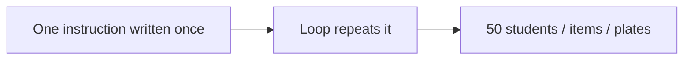
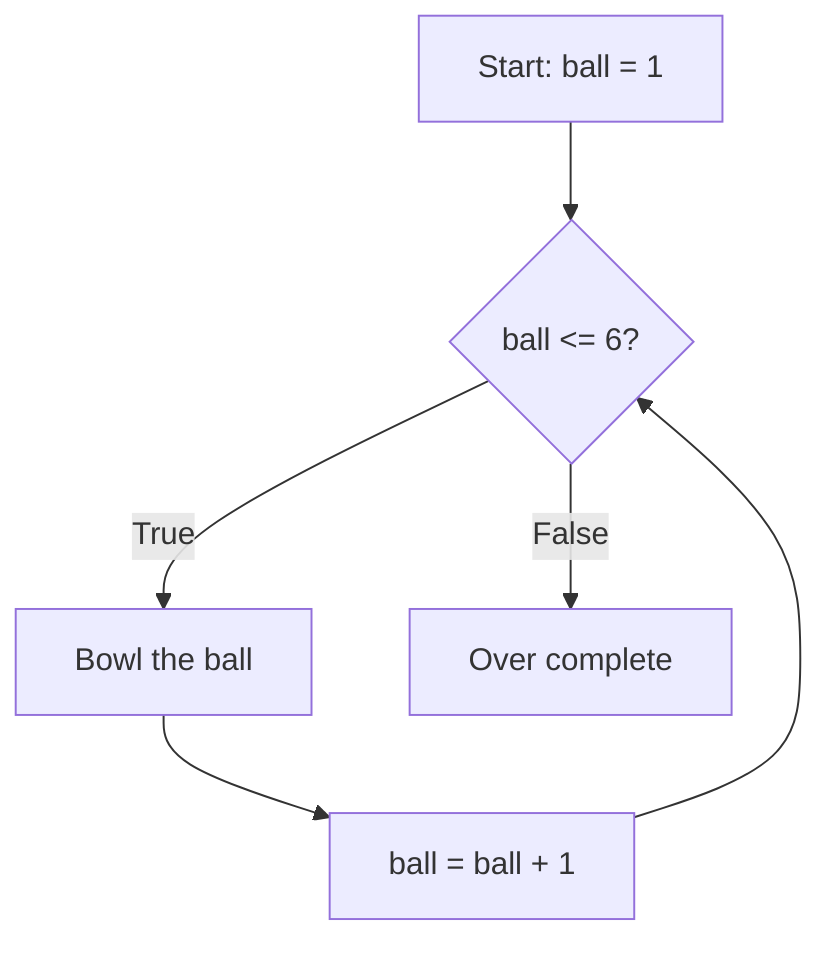
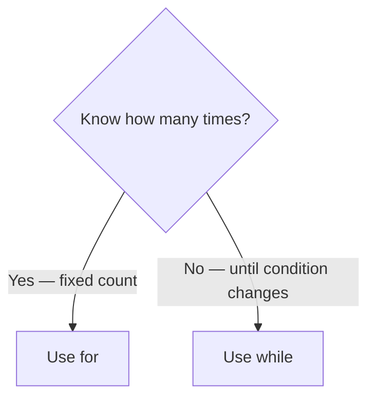
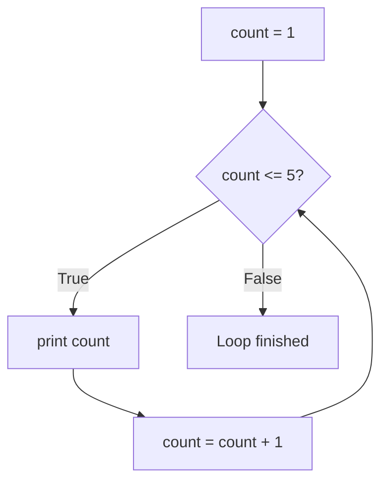
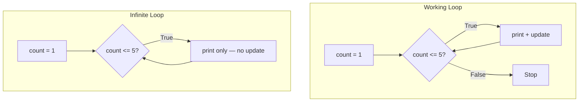
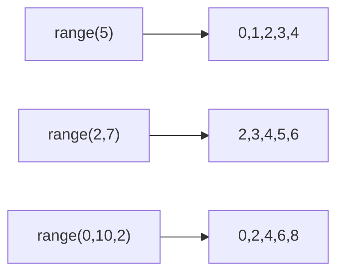
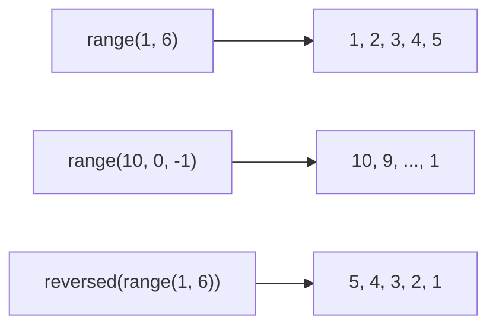
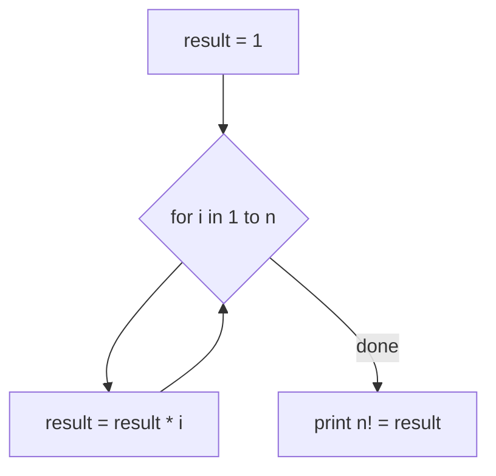

# Mastering Control Flow: Conditional and Loop in Python

## What You Will Learn

- Already know: variables, operators, `if` / `elif` / `else`
- Next: **repeat** actions with loops — each line still runs only once without them
- **`while`**: start, stop, update; **infinite loops**
- **`for`** + **`range()`**: start, stop, step, reverse
- Summation, tables, **factorial**

---

## Why programs need loops

- Dosa tiffin centre: 50 plates — do not write “flip dosa 1…50”
- Billing: every kirana item; results: every student; conductor: every passenger
- **Official:** loop / iteration = repeat a block until a condition fails or a count is done
- **Simple:** “Do this again and again” instead of copy-paste
- **Example:** temple prasad — one laddu **each** person in the queue




- Conditionals: **should** this block run? Loops: **how many times?**
- Together = **control flow** — think and repeat

<hr style="height: 2px; background-color: #1976d2; border: none;">

## Incrementing and decrementing

- Almost every loop needs values that **go up** or **go down**
- **Official:** increment = increase (usually +1); decrement = decrease (usually −1)
- **Simple:** counting up 1, 2, 3 vs down 10, 9, 8
- **Example:** lift — floor 0 → 1 → 2 → 3; coming down decrements


```python
current_floor = 0
current_floor = current_floor + 1   # 1
current_floor += 1                  # same idea — now 2, then 3
print(current_floor)
```

```python
countdown = 10
countdown = countdown - 1   # 9
countdown -= 1              # 8
```

- Forgetting the update inside a loop → value never changes → loop never ends

**Cricket over** — same bowl action; ball counter 1…6 then stop



<hr style="height: 2px; background-color: #1976d2; border: none;">

## Types of loops and `while` syntax

| Type | Best when | Idea |
|------|-----------|------|
| `while` | Until a **condition** changes | Keep doing this **while** True |
| `for` | Known **count** / range | Do this **for every** number |

- Know how many times? → `for`. Until something happens? → `while`
- **Example:** 5 thali items → `for`; wait for cooker whistle → `while`




```python
count = 1
while count <= 5:
    print(count)
    count = count + 1

for num in range(1, 6):
    print(num)
```

- `while` = you write start, condition, update
- `for` + `range()` = Python counts for you

**`while`** — checked **before** each round. “While the signal is red, wait.”

```python
while condition:   # colon required
    # body — 4 spaces
    # something must eventually make condition False
```

| Part | Meaning |
|------|---------|
| `while` | Keyword |
| condition | True → keep going |
| `:` | Required |
| Indented body | Repeats |

- Comparisons: `>` `<` `>=` `<=` `==` `!=`
- Unindented lines run **once**, after the loop

<hr style="height: 2px; background-color: #1976d2; border: none;">

## Start, stop, and update

Every working `while` needs three parts — race **start**, **finish**, **steps**.

| Part | Role | Example |
|------|------|---------|
| Start | Value before the loop | `count = 1` |
| Stop | Condition to continue | `while count <= 5` |
| Update | Change so it can end | `count = count + 1` |


```python
count = 1
while count <= 5:
    print(count)
    count = count + 1
print("Loop finished!")
```

- Rounds 1–5 print 1…5; at 6 the condition is False
- Forget `count = count + 1` → prints `1` forever



**Countdown**

```python
countdown = 5
while countdown > 0:
    print("T-minus", countdown)
    countdown = countdown - 1
print("Liftoff!")
```

**Savings** — ₹500/month from ₹0 until ≥ ₹3000

```python
balance = 0
while balance < 3000:
    balance = balance + 500
    print("Current balance: Rs.", balance)
print("Goal reached! Final balance: Rs.", balance)
```

**Activity:** even numbers 2 to 10 — start 2, add 2 each round

```python
number = 2
while number <= 10:
    print(number)
    number = number + 2
```

<hr style="height: 2px; background-color: #1976d2; border: none;">

## Infinite loops

- Condition never becomes False → program stuck in a circle
- **Example:** fan with no off switch — you must build the off switch into the loop


**Missing update**

```python
# WARNING — runs forever
count = 1
while count <= 5:
    print(count)
    # forgot count = count + 1
```

**Wrong direction** — want down, but add instead

```python
# WARNING — countdown goes 11, 12, 13...
countdown = 10
while countdown > 0:
    print(countdown)
    countdown = countdown + 1   # should be - 1
```

- OneCompiler: **Stop** or refresh
- Later: `break` / `continue`

| Check | Ask |
|-------|-----|
| Start | Counter set before the loop? |
| Condition | Will it become False? |
| Update | Increment or decrement inside? |
| Direction | Moving **toward** the stop? |

- Test with small numbers first (1 to 3 before 1 to 100)



<hr style="height: 8px; background-color: #d32f2f; border: none; border-radius: 2px;">

## The `for` loop — vs `while`

- Best when you know **how many** times — especially with `range()`
- **Official:** run the body once per number from `range()`
- **Example:** conductor — Stop 1, Stop 2, Stop 3…


```python
for num in range(1, 6):
    # runs once per number
```

| Part | Meaning |
|------|---------|
| `for` / `in` / `:` | Keywords + colon |
| variable | Current number (`num`, `i`) |
| `range()` | Numbers to visit |
| Indented body | Once per number |

```python
for stop_number in range(1, 5):
    print("Arriving at stop:", stop_number)
```

- `print` **outside** the loop shows only the **last** value

```python
count = 1
while count <= 5:
    print(count)
    count = count + 1

for num in range(1, 6):
    print(num)
```

| | `while` | `for` |
|--|---------|-------|
| Counter | You write start / condition / update | `range()` handles it |
| Best for | Unknown count, condition stop | Known count |
| Risk | Infinite loop if update forgotten | `range()` always ends |

**Activity:** bus ₹2/km for 1–5 km

```python
rate_per_km = 2
for distance in range(1, 6):
    fare = distance * rate_per_km
    print(distance, "km → Rs.", fare)
```

<hr style="height: 2px; background-color: #1976d2; border: none;">

## `range()` — start, stop, step

- Token counter: 1, 2, 3… without listing each number
- Cricket over: `range(1, 7)` → balls 1–6

| Form | Meaning | Example |
|------|---------|---------|
| `range(stop)` | 0 to stop−1 | `range(5)` → 0,1,2,3,4 |
| `range(start, stop)` | start to stop−1 | `range(2, 7)` → 2,3,4,5,6 |
| `range(start, stop, step)` | jump by step | `range(0, 10, 2)` → 0,2,4,6,8 |

- **Always stops before** the stop value
- Want 1 through 5 → `range(1, 6)` not `range(1, 5)`




```python
for i in range(5):
    print(i)   # 0 1 2 3 4

for num in range(1, 6):
    print(num)   # 1 through 5

for num in range(0, 10, 2):
    print(num)   # evens 0..8
for num in range(1, 10, 2):
    print(num)   # odds 1..9
```

- Count 1 to N → `range(1, N + 1)`

<hr style="height: 2px; background-color: #1976d2; border: none;">

## Range variations and reverse

**Negative step**

```python
for num in range(10, 0, -1):
    print("T-minus", num)
print("Liftoff!")
```

- `range(10, 0, -1)` → 10 down to 1 (stops **before** 0)
- N down to 1 → `range(N, 0, -1)`

**`reversed()`**

```python
for num in reversed(range(1, 6)):
    print(num)   # 5 4 3 2 1
```



**Activity:** table of 6 — `6 × 1` to `6 × 10`

```python
number = 6
for i in range(1, 11):
    result = number * i
    print(number, "x", i, "=", result)
```

- Stop is **11**, not 10

<hr style="height: 2px; background-color: #1976d2; border: none;">

## Solve problems with `for`

**Sum 1 to 100** — accumulator starts at 0

```python
n = 100
total = 0
for num in range(1, n + 1):
    total = total + num
print("Sum from 1 to", n, "is:", total)   # 5050
```

- `print` **outside** the loop — once after all adds

**Multiples of 5** to 50 — use **step**, no `if` needed

```python
for num in range(5, 51, 5):
    print(num)
```

**Even / odd 1 to 10** — loop + `%` + `if`

```python
for num in range(1, 11):
    if num % 2 == 0:
        print(num, "→ EVEN")
    else:
        print(num, "→ ODD")
```

**Activity:** squares 1 to 5

```python
for num in range(1, 6):
    square = num * num
    print(num, "squared =", square)
```

<hr style="height: 2px; background-color: #1976d2; border: none;">

## Factorial with a `for` loop

- `n!` = 1 × 2 × … × n — e.g. `5! = 120`
- Arranging 4 books → `4! = 24` orders
- `0!` is **1** (mention only)

| n | n! |
|---|-----|
| 3 | 6 |
| 4 | 24 |
| 5 | 120 |


- Start `result = 1`; multiply by 1, 2, 3, 4, 5 → 120

```python
n = 5
result = 1
for i in range(1, n + 1):
    result = result * i
    print("After multiplying by", i, "→ result =", result)
print(n, "! =", result)   # 5! = 120
```



**Same job with `while`**

```python
n = 5
result = 1
counter = 1
while counter <= n:
    result = result * counter
    counter = counter + 1
print(n, "! =", result)
```

**Activity:** paper first — `4! = 24`, `6! = 720`, `7! = 5040`

| Problem | Likely cause | Fix |
|---------|--------------|-----|
| Same number forever | Missing `while` update | Add `+ 1` or `- 1` |
| One too few / many | Off-by-one in `range()` | Stops **before** stop |
| Only last value | `print` outside the loop | Indent it |
| Wrong total | Accumulator outside | Keep update **inside** |
| Never stops | Update away from stop | Check + vs − |

**Trace:** `range(1, 5)` → 1+2+3+4 = **10** (not 5)

<hr style="height: 8px; background-color: #d32f2f; border: none; border-radius: 2px;">

## Key Takeaways

- **Loops** repeat without copy-paste
- **`while`**: start + stop condition + **update** — or infinite loop
- **`for`** + **`range()`** when the count is known
- `range()` stops **before** `stop`; negative step counts down
- **Accumulator:** 0 for sums, 1 for factorial

## Quick Reference

| Term | What it does |
|------|----------------|
| Loop / iteration | Repeat a block |
| `while` / `for` | Condition repeat / once per `range()` value |
| Increment / decrement | `+= 1` / `-= 1` |
| Infinite loop | Condition never False |
| `range(stop)` | 0 … stop−1 |
| `range(start, stop, step)` | Custom step; negative = down |
| `reversed()` | Flip a `range()` |
| Accumulator / counter | Running total / progress tracker |
| Factorial `n!` | Product 1…n |
| Off-by-one | Loop one too many or too few |
