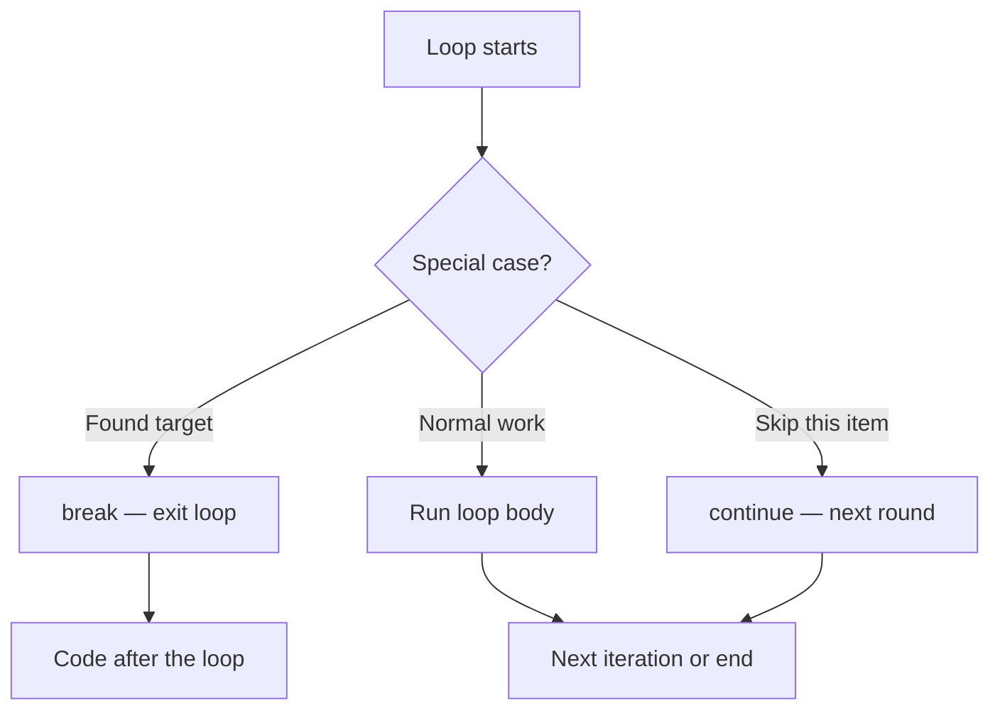
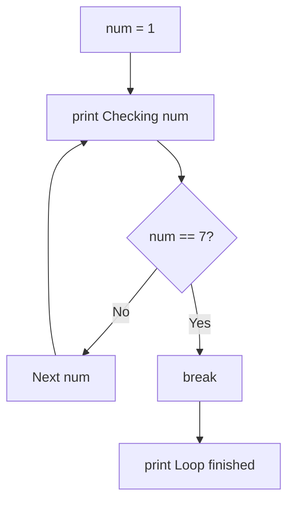
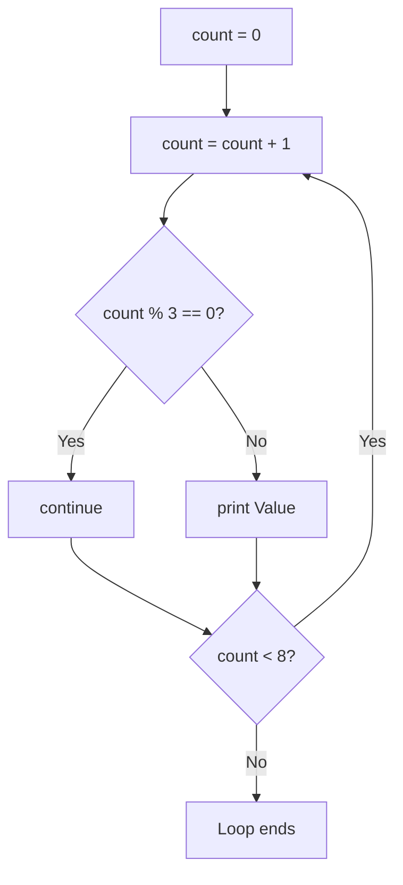
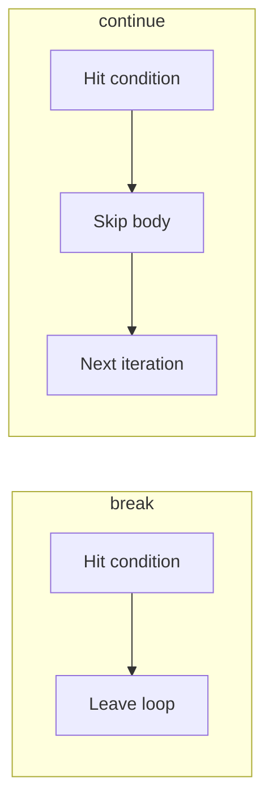
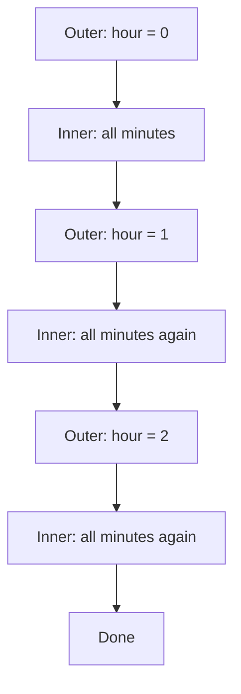
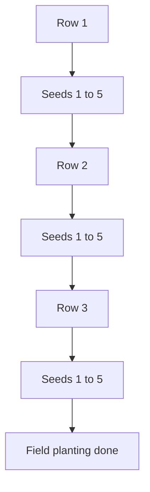

# Understanding break, continue, and Nested Loops

## What You Will Learn

- Already know: `while`, `for`, `range()`, start / stop / update
- Next: finer control — **`break`**, **`continue`**, **nested loops**
- Exit early, skip one round, outer + inner cycles
- Alarm-clock timing and **field-and-seed** planting

---

## Why loops need early control

- Full bus route visits every stop — real life often stops early or skips one item
- Keys in bag 2 → **stop** searching remaining bags
- Broken biscuit packet → **skip** it, keep checking
- Alarm: for **each hour**, count **every minute**

| Real need | Tool |
|-----------|------|
| Stop the whole loop early | `break` |
| Skip one item, keep going | `continue` |
| Repeat inside another repeat | Nested loops |

- **Official:** loop control changes flow from **inside** the body
- **Simple:** `break` = stop now; `continue` = skip this round; nested = for each outer, finish all inner



<hr style="height: 2px; background-color: #1976d2; border: none;">

## Purpose of `break`

- Goal already met → remaining rounds waste time / print junk
- **Official:** terminate the **innermost** loop; continue after that loop
- **Simple:** emergency exit door of the loop
- **Example:** find the oil brand on the shelf → stop scanning other bottles


- Search and stop; abort countdown on safety fail; clearer than one giant condition
- Write `break`, not `break()` — does **not** end the whole program

<hr style="height: 2px; background-color: #1976d2; border: none;">

## Demonstrate `break`

```python
for num in range(1, 11):
    if num == 5:
        break
    print(num)   # 1 2 3 4
```

| Part | Role |
|------|------|
| Loop | `for` or `while` |
| `if` | When to exit early |
| `break` | Stop that loop now |
| Code after loop | Runs after exit |

```python
for num in range(1, 15):
    print("Checking:", num)
    if num == 7:
        print("Found 7 — stopping the loop.")
        break
print("Loop finished. Program continues here.")
```

- Numbers 8–14 never visited



**First multiple of 13** — search-and-stop (without `break`, later multiples overwrite)

```python
found = 0
for num in range(1, 101):
    if num % 13 == 0:
        found = num
        break
print("First multiple of 13 is:", found)   # 13
```

<hr style="height: 2px; background-color: #1976d2; border: none;">

## `break` with `while` and `if`

- Plan up to 12 months; **real** stop = goal ₹2000 — clearer with `if` + `break`

```python
balance = 0
month = 1
monthly_saving = 400

while month <= 12:
    balance = balance + monthly_saving
    print("Month", month, "→ balance Rs.", balance)
    if balance >= 2000:
        print("Goal reached early. Stopping the loop.")
        break
    month = month + 1

print("Final balance: Rs.", balance)
```

- After month 5, balance = 2000 → `break`; months 6–12 never run

<hr style="height: 2px; background-color: #1976d2; border: none;">

## Purpose of `continue`

- Ignore **one** round; loop keeps going
- **Official:** skip rest of **current** iteration; go to next
- **Simple:** skip this item, move to the next
- **Example:** blank answer sheet → skip for now, check the rest


| Statement | Effect |
|-----------|--------|
| `break` | Exit the loop completely |
| `continue` | Skip rest of **this** round |
| Neither | Finish body, then next round |

- Code **below** `continue` is skipped that round
- **`while` trap:** update **after** `continue` → infinite loop

<hr style="height: 2px; background-color: #1976d2; border: none;">

## Apply `continue` (and vs `break`)

**Odds only**

```python
for num in range(1, 11):
    if num % 2 == 0:
        continue
    print(num)   # 1 3 5 7 9
```

**`while` + `continue` — update first**

```python
count = 0
while count < 8:
    count = count + 1   # UPDATE before continue
    if count % 3 == 0:
        continue
    print("Value:", count)   # 1 2 4 5 7 8
```




**Skip multiples of 4 when printing squares**

```python
for num in range(1, 13):
    if num % 4 == 0:
        continue
    square = num * num
    print(num, "squared =", square)
```

**Activity:** print 1–30, skip multiples of 10

```python
for num in range(1, 31):
    if num % 10 == 0:
        continue
    print(num)
```

**Side by side**

```python
print("Using break:")
for num in range(1, 8):
    if num == 5:
        break
    print(num)   # 1 2 3 4

print("Using continue:")
for num in range(1, 8):
    if num == 5:
        continue
    print(num)   # 1 2 3 4 6 7
```




**Predict:** `break` at 3 → `1 2`; `continue` at 3 → `1 2 4 5`

<hr style="height: 8px; background-color: #d32f2f; border: none; border-radius: 2px;">

## Why nested loops — alarm clock

- Two levels: each outer step needs a full **inner** cycle
- **Official:** inner loop completes once per outer iteration
- **Simple:** for every outer item, finish all inner items
- Hours = outer; minutes = inner

| Situation | Outer | Inner |
|-----------|-------|-------|
| Alarm clock | Each hour | Each minute |
| Classroom | Each row | Each seat |
| Farm | Each field row | Each seed |
| Timetable | Each day | Each subject slot |

- Total iterations ≈ outer × inner (3 × 4 = 12)
- Hour 0 → minutes; hour 1 → minutes again; hour 2 → again




<hr style="height: 2px; background-color: #1976d2; border: none;">

## Nested loop syntax — outer and inner

- Inner indented **one level deeper** than outer
- Inner **restarts from the beginning** for every new outer value
- Wrong indent → two separate loops, not nested

```python
for outer in range(1, 4):
    for inner in range(1, 3):
        print("outer =", outer, "| inner =", inner)   # 3 × 2 = 6
```

| Outer | Inner | Prints |
|-------|-------|--------|
| 1 | 1, 2 | two lines |
| 2 | 1, 2 | two lines |
| 3 | 1, 2 | two lines |

**Classroom seats**

```python
for row in range(1, 4):
    print("--- Starting row", row, "---")
    for seat in range(1, 5):
        print("Row", row, "Seat", seat)   # 3 × 4 = 12
```

<hr style="height: 2px; background-color: #1976d2; border: none;">

## Nested `range` — start, stop, step

- Outer = major cycles; inner = sub-steps; steps can differ

**Alarm with step minutes**

```python
for hour in range(0, 3):
    for minute in range(0, 60, 20):
        print("Alarm check →", hour, ":", minute)
# (0,0)(0,20)(0,40)(1,0)…(2,40)
```

**Different steps**

```python
for group in range(1, 4):
    print("Group", group)
    for item in range(2, 9, 2):
        print("  Item number:", item)   # 2 4 6 8 each group
```

**Activity:** hours 1–2; minutes 50, 55

```python
for hour in range(1, 3):
    for minute in range(50, 56, 5):
        print("Time", hour, ":", minute)   # 4 lines
```

<hr style="height: 2px; background-color: #1976d2; border: none;">

## Multiple ranges — grids and pairs

**Multiplication grid**

```python
for row in range(1, 4):
    for col in range(1, 5):
        product = row * col
        print(row, "x", col, "=", product)
    print("----")
```

**Inner stop depends on outer**

```python
for a in range(1, 4):
    for b in range(1, a + 1):
        print("Pair:", a, b)
```

**Activity:** sum 1–4 per group — reset accumulator **inside** outer

```python
for group in range(1, 4):
    total = 0
    for num in range(1, 5):
        total = total + num
    print("Group", group, "sum =", total)   # each 10
```

- `total = 0` outside both loops → totals keep growing — common bug

<hr style="height: 2px; background-color: #1976d2; border: none;">

## Field and seed planting

- Outer = walk to next **row**; inner = plant each **seed** in that row


```python
field_rows = 3
seeds_per_row = 5

for row in range(1, field_rows + 1):
    print("Walking to field row", row)
    for seed in range(1, seeds_per_row + 1):
        print("  Planting seed", seed, "in row", row)
    print("Row", row, "complete.\n")
# 3 × 5 = 15 plantings
```



**Step instead of continue** — odd positions only

```python
for row in range(1, 3):
    for position in range(1, 6, 2):
        print("Row", row, "→ seed at position", position)   # 1 3 5
```

**Activity:** 4×3 then 2×6 — same total (12), different shape

```python
rows = 4
seeds = 3
for r in range(1, rows + 1):
    for s in range(1, seeds + 1):
        print("R", r, "S", s)
```

**`break` / `continue` in nested** — affect **innermost** only

```python
for outer in range(1, 4):
    print("Outer starts:", outer)
    for inner in range(1, 6):
        if inner == 3:
            break
        print("  Inner:", inner)   # 1 2 each outer; outer still continues
```

```python
for outer in range(1, 3):
    for inner in range(1, 5):
        if inner == 2:
            continue
        print("outer", outer, "inner", inner)
```

| Problem | Fix |
|---------|-----|
| Stops too early | Check `if` guarding `break` |
| One value missing | Check `continue` filter |
| `while` + `continue` forever | Update **above** `continue` |
| Flat nested output | Indent inner under outer |
| Wrong group totals | `total = 0` inside outer |
| Thought `break` stopped all | Only innermost exits |

**Trace:** `(1,1)(1,3)(2,1)(2,3)` when `continue` on `b == 2`

<hr style="height: 8px; background-color: #d32f2f; border: none; border-radius: 2px;">

## Key Takeaways

- **`break`** — exit innermost loop now (search-and-stop, early goals)
- **`continue`** — skip one round; in `while`, update **before** `continue`
- **Nested loops** — inner completes for each outer (alarm, seats, field)
- **`range(start, stop, step)`** still controls each nesting level
- `break` / `continue` do **not** stop an outer loop by themselves

## Quick Reference

| Term | What it does |
|------|----------------|
| `break` | Exit innermost enclosing loop |
| `continue` | Skip rest of current iteration |
| Nested / outer / inner | Loop inside loop; major vs sub cycle |
| Early exit / skip iteration | Stop early / ignore one round |
| `range(start, stop, step)` | Independent counting per level |
| Innermost rule | `break`/`continue` affect only the loop that contains them |
| Combination / pair iteration | Visit all pairs from two ranges |
