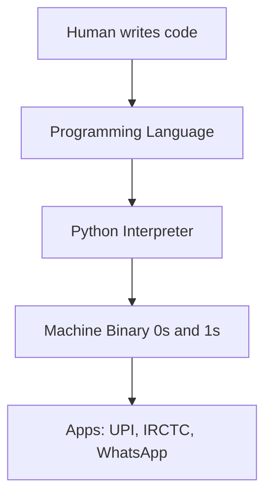
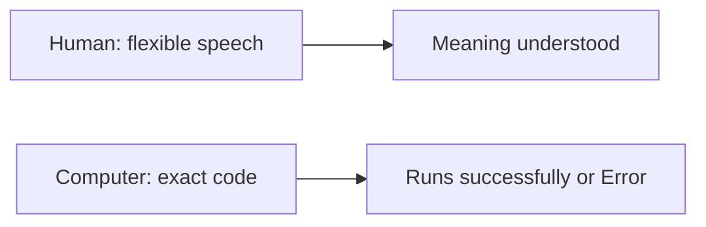
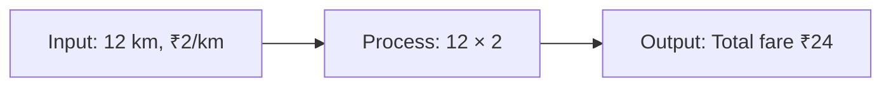
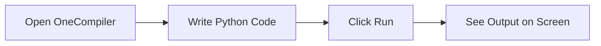
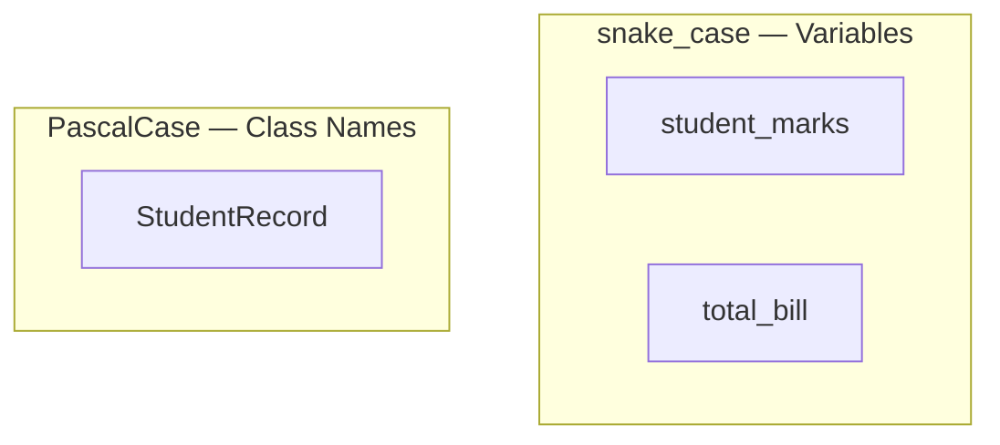
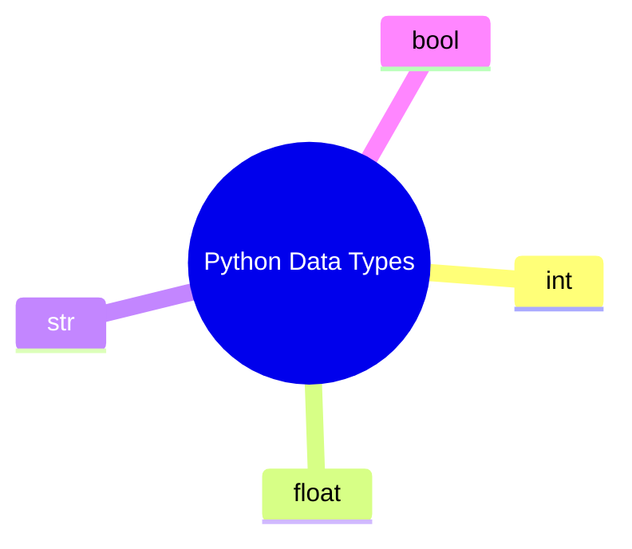
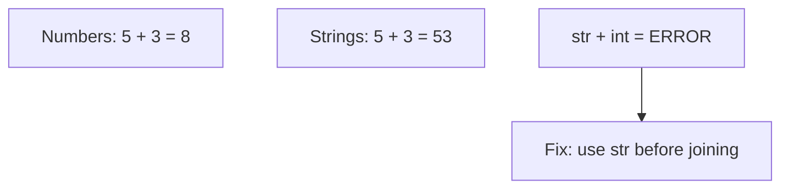
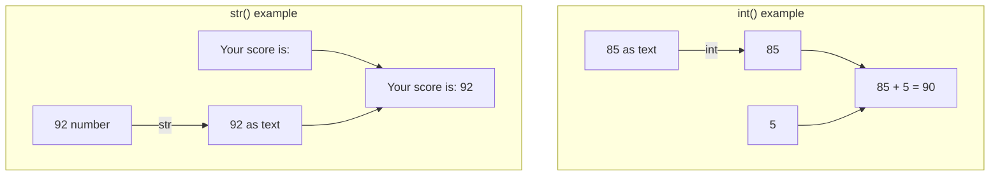

# Python Basics — Introduction to Programming, Python, Variables & Data Types
###### [Live PPT](https://coding-platform.s3.amazonaws.com/dev/lms/tickets/e1a19bdf-b863-43d0-8c69-5cda6a040e32/sFtSeZEYsN1MmSez.pdf)

## What You Will Learn in This Lesson

This is your first step into the world of programming. You do not need any prior coding experience to follow along.

In this lesson, you will understand what a **programming language** is and how it helps solve real-life problems using step-by-step logic. You will then meet **Python** — a beginner-friendly language — and learn how to write and run your first programs using an **online compiler** (local Python installation comes later). After that, you will learn how to store information using **variables** and how Python organises different kinds of data using **data types**.

By the end, you will be able to explain how a computer follows instructions, write small Python programs that store and display values, and identify whether a piece of data is a number, text, or true/false.

### A Real-Life Story — Why Programming Is Needed

Imagine you own a small hotel and your food is so tasty that customers keep coming every day. Soon, the dining area is always full, people are waiting in a long queue, and you are writing every bill by hand on paper.

- Each bill takes time — you add item names, quantities, and prices manually while the next customer keeps waiting.
- The queue grows longer and some customers leave without eating because they do not want to wait.
- At the end of the day, you have no clear idea how much business happened — how many bills were made, which dishes sold the most, or what your total earnings were.
- You cannot trace old records easily — if a customer asks about yesterday's bill, searching through handwritten pages is slow and confusing.

Now imagine a **billing system** — a program built using a programming language — running on a computer or tablet at your counter.

- The staff taps the dish name and quantity — the system calculates the total instantly and prints the bill.
- The queue moves faster because billing takes seconds, not minutes.
- Every sale is saved automatically — you can see today's total earnings, weekly sales, and which items are most popular.
- You can trace any past bill in seconds instead of flipping through notebooks.

This is exactly **why we need programming languages** — to build systems that handle repetitive, time-consuming tasks quickly, accurately, and without mistakes. A programming language is the tool that lets you tell the computer *how* to run such a system step by step.


---

## What Is a Programming Language?

- **Official Definition:** A **programming language** is a formal set of rules and symbols used to write instructions that a computer can read, understand, and execute.
- **In Simple Words:** A programming language is how humans talk to computers in a structured way — like giving step-by-step directions that the machine must follow exactly.
- **Real-Life Example:** Think of a programming language like the instruction manual for an automatic washing machine. You cannot say "please wash my clothes nicely" — you must press specific buttons in a specific order. The machine only understands those exact button presses, not your feelings.

- Without programming languages, we could not build billing systems, websites, or automation tools.



### Why Do We Use Programming Languages?

- Computers do not understand human languages like Kannada, Hindi, or English directly — they only understand **binary** (0s and 1s) at the deepest level.
- A programming language acts as a **translator** between human thinking and machine execution.
- Almost everything digital around you runs on code — UPI payments, train ticket booking, WhatsApp, online shopping, and even the apps on your phone.

### How Programming Solves Real-Life Problems

- Every real-world task can be broken into **small, clear steps** — that is the heart of programming.
- When you book a train ticket on IRCTC, the app follows a fixed sequence: ask for source and destination → check available trains → take payment → generate ticket. That sequence is **logic written in code**.
- Programming teaches you to think in an organised way — useful in studies, jobs, and daily decision-making.

### Human Language vs Computer Instructions

| Human Language | Computer Instructions |
|----------------|----------------------|
| Flexible — "Thumba chennagide" can mean many things depending on tone | Strict — every instruction must be exact and unambiguous |
| We understand context and fill gaps ourselves | Computers do only what is written — nothing more, nothing less |
| We can change our mind mid-sentence | Code runs line by line in a fixed order unless told otherwise |
| Mistakes are often forgiven ("meet me around 5") | A single spelling or punctuation error can stop the entire program |

- **Official Definition:** **Computer instructions** are precise, unambiguous commands written in a programming language that a machine executes without interpretation.
- **In Simple Words:** Telling a computer is like giving directions to someone who has never been to your city — you must mention every turn, not just "go that way."
- **Real-Life Example:** If you tell a friend "bring something nice from the shop," they will use their judgement. If you tell a computer `bring something nice`, it will show an error because it does not know what "nice" means.

**Human example:** You say *"Meet me around 5 pm near the bus stand"* — your friend understands even if you are vague about the exact minute.

**Computer example:** You write `print(Hello)` instead of `print("Hello")` — Python stops immediately with a **SyntaxError** because the instruction is not written exactly as required.

- Programming languages exist to **bridge this gap** — they let humans write logic in a structured way that the machine can follow step by step.
- You write code keywords in English (`print`, `if`, `else`), but you can store Kannada or any language text inside quotes: `name = "ನಮಸ್ಕಾರ"`.



### Common Doubts About Programming

- **"Do I need to be good at maths?"** — Basic arithmetic is enough to start. Programming is more about **logical thinking** than advanced mathematics.
- **"Will the computer understand Kannada?"** — You write code using English keywords (`print`, `if`, `else`), but you can store Kannada text inside your programs.
- **"What if I make a mistake?"** — Everyone makes mistakes while coding. Errors are normal — they help you learn what went wrong.

---

## The Input → Process → Output Model

Every program, no matter how big or small, follows a simple flow. Understanding this flow helps you design solutions before writing a single line of code.

- **Official Definition:** The **Input-Process-Output (IPO) model** describes how a program receives data, performs operations on it, and produces a result.
- **In Simple Words:** A program takes something in, does something with it, and gives something back.
- **Real-Life Example:** A kirana shop billing machine — you scan items (**input**), it calculates the total with GST (**process**), and prints the bill (**output**).

### Breaking Down the Three Steps

| Step | What Happens | Everyday Example | Programming Example |
|------|--------------|------------------|---------------------|
| **Input** | Data enters the system | You tell the shopkeeper how many kg of rice you want | A variable stores the value `quantity = 5` |
| **Process** | Calculations or logic happen | Shopkeeper multiplies price × quantity | `total = price * quantity` |
| **Output** | Result is shown or saved | You receive a printed bill | `print(total)` shows the amount on screen |


### Activity: Design a Bus Fare Calculator (On Paper)

Before writing code, practise breaking a problem into steps. Imagine you need to find the bus fare for a student travelling 12 km at ₹2 per km.

1. **Input:** Distance travelled = 12 km, Rate per km = ₹2
2. **Process:** Multiply distance × rate → 12 × 2 = 24
3. **Output:** Display "Total fare: ₹24"

Write similar steps for these situations on your notebook:

- Calculating the total cost of 3 notebooks at ₹45 each
- Finding how many hours are left before a 6 PM exam if the current time is 2 PM

This step-by-step thinking is called **algorithm design** — you will write the same logic in Python in the upcoming sections.



### Activity: IPO for a Simple Greeting

Even without a computer, you can practise the IPO model:

1. **Input:** Your name (for example, "Ananya")
2. **Process:** Combine the name with a greeting word
3. **Output:** Show "Hello, Ananya!"

Later in this lesson, you will write this exact logic using Python variables and `print()`.

---

## Introduction to Python

Now that you understand what programming is and how problems are broken into steps, it is time to meet the tool you will use — **Python**.

- **Official Definition:** **Python** is a high-level, general-purpose programming language known for its simple, readable syntax and wide use in software development, data science, and automation.
- **In Simple Words:** Python is a language that lets you write instructions for a computer in a way that almost reads like plain English.
- **Real-Life Example:** If programming languages were vehicles, Python is like an automatic scooter — easy to start, smooth to ride, and perfect for beginners before you move to something more complex.

### Why Python Is Beginner-Friendly

- The syntax is **clean and readable** — you spend less time memorising symbols and more time learning logic.
- Python is one of the **most popular languages** in the world — used by companies like Google, Netflix, and ISRO.
- **Fast and easy syntax** — programs are shorter and easier to read than many other languages.
- A **core language for AI/ML and data analytics** — widely used in machine learning, data science, and research.
- **Versatile** — powers web backends, automation scripts, APIs, and everyday tools beyond just data work.

### How to Run Python Code (Online vs Local)

- **Online compilers** like **OneCompiler** let you write and run Python in your browser — no download needed to start learning today.
- To **run Python locally** on your own computer, you need to **install Python software** — we will cover that in a later session.
- For this course's early lessons, an online compiler is enough to practise `print()`, variables, and data types.


### Where Python Is Used

- **Web development** — building websites and web applications
- **Data analysis** — studying sales data, exam results, and survey responses
- **Artificial Intelligence and Machine Learning** — the technology behind chatbots and recommendation systems
- **Automation** — sending bulk emails, renaming hundreds of files, generating reports

---

## Writing and Running Python Code

To run Python code, you need two things: a place to **write** the code (editor or notebook) and a way to **execute** it (interpreter or online compiler).

### What Is a Code Editor / Online Compiler?

- **Official Definition:** A **code editor** is a tool where you write and edit program files; an **online compiler** is a browser-based tool that runs code without local installation.
- **In Simple Words:** The editor is your notebook; the compiler is the button that makes the computer read and act on what you wrote.
- **Real-Life Example:** Think of it like a Google Doc for code — you type your program, click Run, and the result appears below.

### Getting Started with OneCompiler

For this course, we use **OneCompiler** — a free online tool at [https://onecompiler.com/](https://onecompiler.com/) where you can write and run Python instantly.

**Steps to set up:**

1. Open [https://onecompiler.com/](https://onecompiler.com/) in Chrome or any modern browser.
2. Click **Python** from the language list on the home page.
3. Sign up or sign in so you can save your work and share links with your instructor.
4. Type your Python code in the **editor** area (the main writing panel).
5. Click the **Run** button — the **output** appears in the panel below or beside the editor.
6. Use **Save** to store your program and come back to it later.

### Your First Python Program

Type the following in OneCompiler and click Run:

```python
# This is my very first Python program
# Comments start with # — Python ignores these lines
print("Hello, World!")  # This line displays a greeting on the screen
```

**How the code works:**

- Lines starting with `#` are **comments** — notes for humans that Python skips completely.
- `print()` is a built-in **function** that shows output on the screen.
- The text inside quotes `"Hello, World!"` is a **string** — a piece of text data.
- Python runs each line from top to bottom when you click Run.



### Common Beginner Mistakes

- **Forgetting to click Run** — typing code alone does nothing; you must press Run.
- **Spelling `print` wrong** — Python is case-sensitive; `Print` or `PRINT` will cause an error.
- **Using curly/smart quotes** — copy-pasting from WhatsApp or Word may change `"` to `"` — always use straight quotes from your keyboard.
- **Not saving your work** — use Save on OneCompiler so you do not lose progress.

### Activity: Print Your Name and City

Write a program that displays your name on the first line and your city on the second line:

```python
# Display my name on line 1
print("Ravi Kumar")  # Replace with your actual name

# Display my city on line 2
print("Mysuru")  # Replace with your actual city
```

**How the code works:**

- Each `print()` call produces one line of output.
- Python executes the first `print()` completely before moving to the second one.

---

## Python Syntax, Comments & Naming Style

Before you write more programs, you need to understand three building blocks — **syntax**, **comments**, and how to **name** things in Python.

### What Is Syntax?

- **Official Definition:** **Syntax** is the set of grammar rules that define how code must be written so Python can read and run it correctly.
- **In Simple Words:** Syntax is the spelling, punctuation, and structure of Python — one wrong character can stop your program.
- **Real-Life Example:** Syntax is like filling an exam OMR sheet — shade the right circle in the right row; one mark in the wrong place invalidates the answer.

- Python is **case-sensitive** — `print()` works but `Print()` or `PRINT()` will cause an error.
- Use **straight quotes** `"` or `'` from your keyboard — not curly quotes copied from WhatsApp or Word.
- Code runs **top to bottom** — the order of lines matters.
- Brackets, colons, and indentation must match Python's rules (indentation becomes more important when you learn `if` and loops).


### What Is a Comment?

- **Official Definition:** A **comment** is a note in your code that Python ignores — it is written for humans, not for the computer.
- **In Simple Words:** A comment is a sticky note on your code that only you and other programmers read.
- **Real-Life Example:** Like pencil notes in the margin of a textbook — they help you remember why you wrote something, but the teacher does not grade those notes.

- In Python, comments start with the `#` symbol.
- A **full-line comment** sits on its own line above or below code.
- An **inline comment** appears after code on the same line — everything after `#` on that line is ignored.

```python
# This is a full-line comment — Python skips this entirely
print("Hello, World!")  # This is an inline comment explaining the line

# Store the student's marks for later use
exam_marks = 85  # Marks out of 100
print(exam_marks)
```

**How the code works:**

- Lines 1 and 4 start with `#` — Python does not execute them.
- Line 2 runs `print()`; the text after `#` on the same line is only a note for humans.
- Line 5 stores `85` in `exam_marks`; the inline comment explains what the value means.

### Naming Style in Python — snake_case & PascalCase

Python has common naming styles. Using the right style makes your code readable and professional.

| Style | Looks Like | Used For | Example |
|-------|------------|----------|---------|
| **snake_case** | lowercase with underscores | Variables, functions | `student_marks`, `total_bill`, `bus_fare` |
| **PascalCase** | Each word starts with a capital letter | Class names (advanced topic) | `StudentRecord`, `BusTicket` |

- **snake_case** is the standard style for **variable names** in Python — use it from day one.
- **PascalCase** is used for **class names** when you build larger programs later — you do not need it for simple variables today, but it is good to recognise the pattern.
- Do **not** use spaces in names — `my name` is invalid; `my_name` is correct.
- Do **not** start a variable name with a number — `1score` is invalid; `score1` is valid.

```python
# snake_case variable names — recommended for variables
student_name = "Anita"
total_marks = 92
bus_fare = 24.50

# Display the values
print(student_name)
print(total_marks)
print(bus_fare)
```

**How the code works:**

- All three variable names use **snake_case** — lowercase words joined by underscores.
- This style is easy to read and is the convention most Python developers follow worldwide.



### Activity: Add Comments to Your Code

Take your Hello World program and add one full-line comment at the top explaining what the program does, plus one inline comment on the `print()` line.

```python
# My first program — prints a greeting message
print("Hello, World!")  # Shows greeting on the screen
```

---

## Variables — Storing Values in Your Program

A program that only prints fixed text cannot calculate your exam percentage or track a shopping bill. To work with changing data, you need **variables**.

- **Official Definition:** A **variable** is a named reference that holds a value in a program's memory so it can be used and changed later.
- **In Simple Words:** A variable is a labelled box — you write a name on the box and put a value inside it.
- **Real-Life Example:** At a ration shop, the shopkeeper writes "Rice — 5 kg" on a bag. The label is the variable name (`rice`), and `5 kg` is the value stored inside.


### Creating Variables and Assigning Values

```python
# Create a variable called age and store the number 21
age = 21  # The = sign assigns the value on the right to the name on the left

# Create a variable called name and store text
name = "Kavya"  # Text values must be wrapped in quotes

# Create a variable for a subject score
math_score = 88  # Whole number stored without quotes

# Display what is stored in each variable
print(age)         # Shows 21
print(name)        # Shows Kavya
print(math_score)  # Shows 88
```

**How the code works:**

- `age = 21` creates a name `age` and stores the value `21` in it.
- `name = "Kavya"` stores text — anything in quotes is treated as a string.
- The `=` sign means **assignment** ("store this value under this name"), not mathematical equality.
- `print(age)` displays the **current value** inside the variable, not the word "age."

### Changing a Variable (Reassignment)

```python
# Start with a wallet balance of 1000 rupees
balance = 1000  # Initial amount in the wallet

# Spend 250 rupees on groceries
balance = balance - 250  # Subtract 250 from the current balance

# Show the remaining balance
print(balance)  # Output: 750
```

**How the code works:**

- Variables are called "variable" because their value can **change** over time.
- `balance - 250` calculates the new amount, and `balance = ...` stores it back under the same name.
- The old value (1000) is replaced by the new value (750).

### Variable Naming Rules

- Names can use letters, numbers, and underscores — but **cannot start with a number** (`score1` ✓, `1score` ✗).
- Names are **case-sensitive** — `Age` and `age` are two different variables.
- Use **descriptive names** — `student_marks` is clearer than `x` when you are learning.
- Avoid spaces in names — use underscores instead (`my_name`, not `my name`).
- Do not use Python **reserved words** like `print`, `if`, `else`, `True`, `False` as variable names.
- Stick to **snake_case** for variable names — lowercase with underscores (`total_bill`, `bus_fare`). **PascalCase** is reserved for class names in advanced topics.

### Using print() with Variables

```python
# Store details about a product
product_name = "Notebook"  # Name of the product as text
product_price = 45         # Price as a whole number
quantity = 3                 # How many notebooks purchased

# Calculate total cost
total_cost = product_price * quantity  # 45 multiplied by 3

# Display the results
print(product_name)   # Shows Notebook
print(product_price)  # Shows 45
print(quantity)       # Shows 3
print(total_cost)     # Shows 135
```

**How the code works:**

- Variables let you store values once and reuse them in calculations.
- `product_price * quantity` uses the stored values — if the price changes, you only update one line.
- Each `print()` shows one piece of information on a separate line.

### Activity: Personal Information Card

Create variables for your name, age, and favourite subject. Print each one on a separate line:

```python
# Store personal details in variables
my_name = "Suresh"           # Your name as text
my_age = 20                  # Your age as a whole number
favourite_subject = "Physics"  # Your favourite subject as text

# Display each variable
print(my_name)              # Shows your name
print(my_age)               # Shows your age
print(favourite_subject)    # Shows your favourite subject
```

### Activity: Kirana Bill Calculation

A customer buys 2 kg of sugar at ₹42 per kg and 1 litre of oil at ₹120. Store each value in a variable, calculate the total, and print the result:

```python
# Store item details
sugar_kg = 2           # Kilograms of sugar purchased
sugar_rate = 42        # Price per kg of sugar
oil_litres = 1         # Litres of oil purchased
oil_rate = 120         # Price per litre of oil

# Calculate individual costs
sugar_cost = sugar_kg * sugar_rate  # 2 × 42 = 84
oil_cost = oil_litres * oil_rate    # 1 × 120 = 120

# Calculate and display total bill
total_bill = sugar_cost + oil_cost  # 84 + 120 = 204
print(total_bill)                   # Shows 204
```

**How the code works:**

- Each real-world piece of information gets its own variable.
- Calculations use variable names instead of magic numbers — making the code easy to read and update.
- `total_bill` stores the final answer, which `print()` displays.

---

## Data Types — What Kind of Information Are You Storing?

Not all data is the same. Your age is a number, your name is text, and whether you passed an exam is true or false. Python needs to know **what type** of data each value is so it can handle it correctly.

- **Official Definition:** A **data type** defines the kind of value a variable holds and determines which operations are valid on that value.
- **In Simple Words:** Data type is like labelling containers in your kitchen — "this jar has rice (numbers), that bottle has oil (decimals), this box has spice packets (text)."
- **Real-Life Example:** On an Aadhaar update form, the "Age" field expects a number and the "Name" field expects text. Swapping them causes errors — programming works the same way.

### Basic Python Data Types

| Data Type | Python Name | What It Holds | Example |
|-----------|-------------|---------------|---------|
| **Integer** | `int` | Whole numbers (no decimals) | `25`, `0`, `-10`, `1000` |
| **Float** | `float` | Numbers with decimal points | `3.14`, `99.5`, `36.6`, `-0.5` |
| **String** | `str` | Text — always written in quotes | `"Hello"`, `'Bengaluru'`, `"ನಮಸ್ಕಾರ"` |
| **Boolean** | `bool` | True or False values | `True`, `False` |


### Examples of Each Data Type

```python
# Integer — whole numbers without decimals
students_in_class = 35       # Number of students
exam_marks = 78              # Marks scored in an exam

# Float — numbers with decimal points
temperature = 36.6           # Body temperature in Celsius
item_price = 49.99           # Price with paise

# String — text wrapped in quotes
student_name = "Manjunath"   # A name as text
city = 'Hubballi'            # Single or double quotes both work for strings

# Boolean — only True or False (capital T and F)
is_passed = True             # Student has passed the exam
has_id_card = False          # Student does not have an ID card yet

# Display all values
print(students_in_class)  # Shows 35
print(temperature)        # Shows 36.6
print(student_name)       # Shows Manjunath
print(is_passed)          # Shows True
```

**How the code works:**

- Python automatically detects the type based on how you write the value.
- Numbers without a decimal point become `int`; numbers with a decimal become `float`.
- Anything in quotes becomes a `str`, even if it looks like a number (`"85"` is text, not a number).
- `True` and `False` are special boolean values — always written with a capital first letter.



### Checking Data Types with type()

When you are unsure what type a value is, use the built-in `type()` function:

```python
# Create variables of different types
age = 22                     # Whole number
height = 5.8                 # Decimal number
name = "Divya"               # Text
is_student = True            # Boolean value

# Check the data type of each variable
print(type(age))         # Shows <class 'int'>
print(type(height))      # Shows <class 'float'>
print(type(name))        # Shows <class 'str'>
print(type(is_student))  # Shows <class 'bool'>
```

**How the code works:**

- `type()` takes a value or variable and returns its data type.
- The output `<class 'int'>` means "this value belongs to the integer class."
- Use `type()` whenever your program behaves unexpectedly — a very common debugging habit.

### How Different Data Types Behave in Operations

Understanding how types interact prevents confusing errors.

**Numbers (int and float):**

```python
# Addition and multiplication work on numbers
apples = 5          # int
oranges = 3         # int
total_fruits = apples + oranges  # 5 + 3 = 8 (int)
print(total_fruits)

# Mixing int and float gives a float result
price = 99            # int
gst = 0.18            # float
total = price + (price * gst)  # Result is a float
print(total)          # Shows 116.82
```

**Strings (str):**

```python
# The + operator joins (concatenates) strings
first_name = "Raj"       # First part of the name
last_name = "Kumar"      # Last part of the name
full_name = first_name + last_name  # Joins without a space
print(full_name)         # Shows RajKumar

# Adding a space between strings
full_name_with_space = first_name + " " + last_name  # Space added in quotes
print(full_name_with_space)  # Shows Raj Kumar

# The * operator repeats a string
line = "-" * 20          # Repeats the dash 20 times
print(line)              # Shows --------------------
```

**Common type mistakes:**

- `"5" + "3"` gives `"53"` (text joined together), **not** `8` — because both are strings.
- `5 + 3` gives `8` — because both are integers.
- You **cannot** add a string and a number directly: `"Score: " + 85` will cause an error.



### Type Conversion

Sometimes you need to change a value from one type to another. Python provides built-in functions for this.

| Function | Converts To | Example |
|----------|-------------|---------|
| `int()` | Integer (whole number) | `int("42")` → `42` |
| `float()` | Float (decimal number) | `float("3.14")` → `3.14` |
| `str()` | String (text) | `str(85)` → `"85"` |
| `bool()` | Boolean (True/False) | `bool(1)` → `True` |

```python
# Convert a string number to an integer for calculation
marks_text = "85"            # This is text, not a number — stored as string
marks_number = int(marks_text)  # Convert text "85" to integer 85

# Now we can do maths with it
bonus = 5
final_marks = marks_number + bonus  # 85 + 5 = 90
print(final_marks)           # Shows 90

# Convert a number to string for display with text
score = 92                   # Integer score
message = "Your score is: " + str(score)  # Convert 92 to "92" before joining
print(message)               # Shows Your score is: 92

# Convert float to int (decimal part is removed)
price = 149.99               # Float value
whole_price = int(price)     # Converts to 149 — decimal part dropped
print(whole_price)           # Shows 149
```

**How the code works:**

- `int("85")` converts the text `"85"` into the number `85` so maths can be performed.
- `str(92)` converts the number `92` into the text `"92"` so it can be joined with other text.
- `int(149.99)` removes the decimal part — it does **not** round; it simply cuts off `.99`.
- Always convert **before** mixing types in an operation.

### Common Type Conversion Errors

```python
# ERROR 1 — joining text and number without conversion
# print("Score: " + 85)
# TypeError: can only concatenate str (not "int") to str
# Fix: print("Score: " + str(85))

# ERROR 2 — converting text that is not a valid number
# print(int("hello"))
# ValueError: invalid literal for int() with base 10: 'hello'
# Fix: only use int() on numeric text like "85"
```

**How these errors help you learn:**

- **TypeError** means you mixed incompatible types — convert first, then join or calculate.
- **ValueError** means the value cannot be converted — `"hello"` is text, but not a number in disguise.



### Activity: Type Detective

Create one variable of each data type, then use `type()` to verify each one:

```python
# Create one variable of each basic type
my_age = 19                  # int — whole number
my_height = 5.7              # float — decimal number
my_name = "Lakshmi"          # str — text in quotes
is_enrolled = True           # bool — True or False

# Check and display the type of each variable
print(type(my_age))       # Should show <class 'int'>
print(type(my_height))    # Should show <class 'float'>
print(type(my_name))      # Should show <class 'str'>
print(type(is_enrolled))  # Should show <class 'bool'>
```

### Activity: Bus Fare with Type Conversion

A bus conductor enters the distance as text `"15"` (km) and the rate is `2.5` (rupees per km). Convert the distance to a float, calculate the fare, and display it with a message:

```python
# Input values — distance comes as text from a form
distance_text = "15"         # Distance entered as string
rate_per_km = 2.5            # Rate is already a float

# Convert distance from string to float for calculation
distance = float(distance_text)  # "15" becomes 15.0

# Calculate total fare
total_fare = distance * rate_per_km  # 15.0 × 2.5 = 37.5

# Convert fare to string and build the display message
fare_message = "Total bus fare: Rs. " + str(total_fare)
print(fare_message)          # Shows Total bus fare: Rs. 37.5
```

**How the code works:**

- `distance_text` is a string because it came from text input — it cannot be multiplied directly.
- `float(distance_text)` converts `"15"` to `15.0` so the calculation works.
- `str(total_fare)` converts the result back to text so it can be joined with the message string.

---

## Key Takeaways

- A **programming language** is a structured way to give precise instructions to a computer — every step must be clear because machines do not guess or fill gaps like humans do.
- Every program follows the **Input → Process → Output** flow — break real-world problems into these three steps before writing code.
- **Python** is a beginner-friendly language — start with online compilers like OneCompiler; local Python installation comes in a later session — follow correct **syntax**, use **# comments**, and name variables in **snake_case**.
- Python organises data into types — **int**, **float**, **str**, and **bool** — and you can check any value using `type()` or convert between types using `int()`, `float()`, and `str()`.
- In the next lessons, you will build on these foundations to accept user input, perform more calculations, and make your programs respond to different conditions.

---

## Important Commands, Libraries & Terminologies

| Term / Command | What It Does |
|----------------|--------------|
| **Programming Language** | A formal set of rules for writing computer instructions |
| **Python** | A beginner-friendly, high-level programming language |
| **OneCompiler** | Free online compiler to write and run Python in a browser (no local install needed to start) |
| **Variable** | A named container that stores a value (`name = "Ravi"`) |
| **Assignment (`=`)** | Stores a value into a variable (not mathematical equality) |
| **`print()`** | Displays output on the screen |
| **`#` (Comment)** | A note for humans — Python ignores these lines |
| **Syntax** | Grammar rules for writing valid Python code |
| **snake_case** | Naming style for variables: `student_marks`, `total_bill` |
| **PascalCase** | Naming style for class names: `StudentRecord` |
| **`int`** | Data type for whole numbers (`25`, `0`, `-10`) |
| **`float`** | Data type for decimal numbers (`3.14`, `99.5`) |
| **`str`** | Data type for text (`"Hello"`, `'India'`) |
| **`bool`** | Data type for True or False values |
| **`type()`** | Returns the data type of a value |
| **`int()`** | Converts a value to an integer |
| **`float()`** | Converts a value to a float |
| **`str()`** | Converts a value to a string |
| **Input-Process-Output (IPO)** | The basic flow every program follows |
| **Algorithm** | A step-by-step procedure to solve a problem |
| **Concatenation** | Joining strings together using `+` |
| **Type Conversion** | Changing a value from one data type to another |
