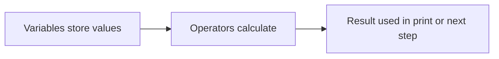
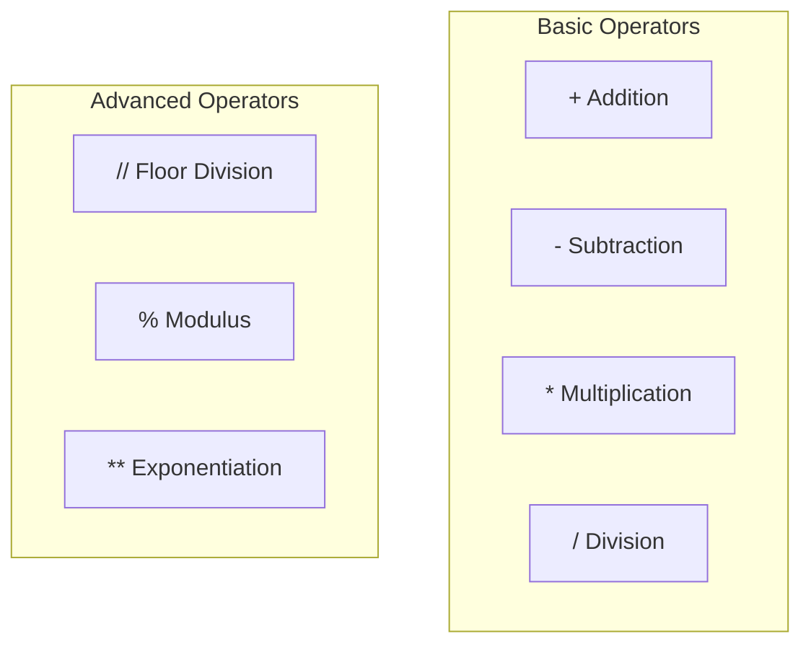
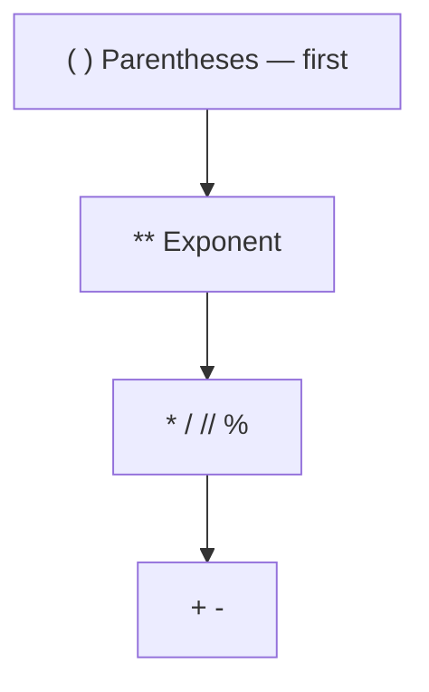
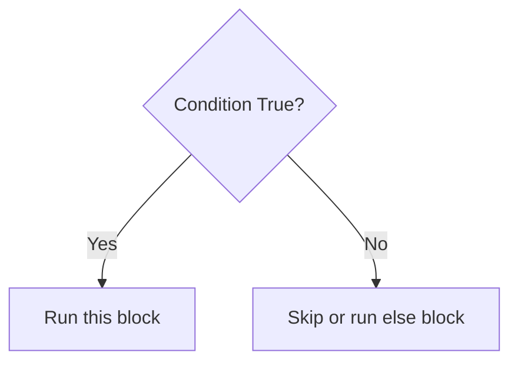
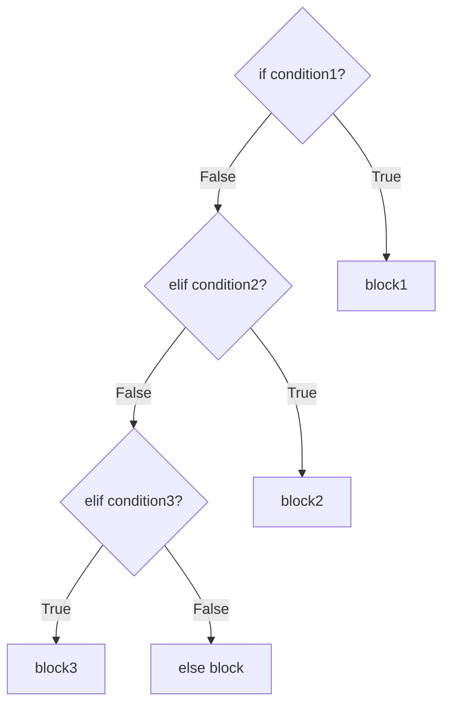
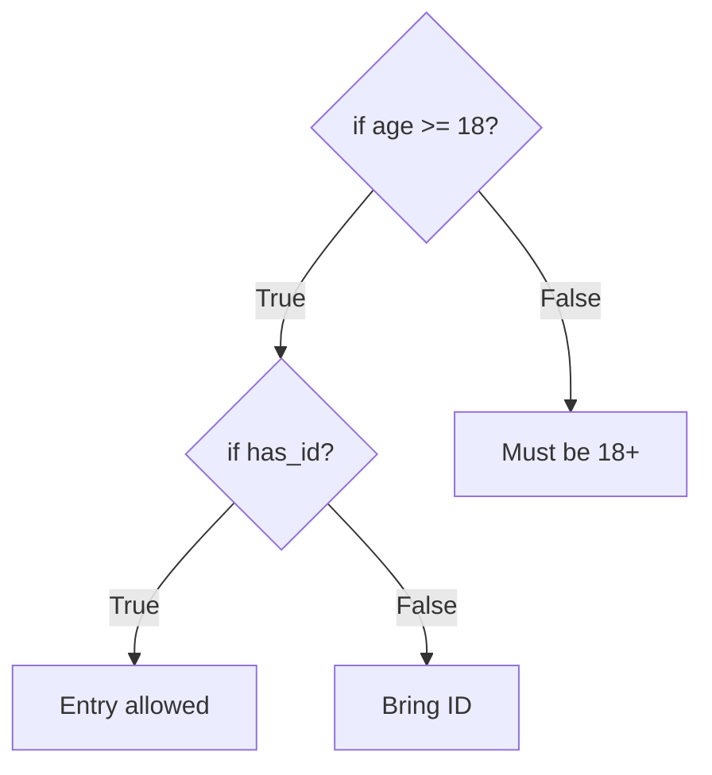
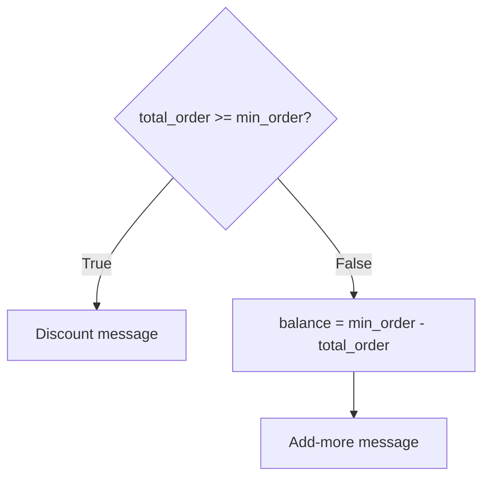

# Python Building Blocks — Operators and Conditional Statements

## What You Will Learn in This Lesson

You have already learnt how to write basic Python programs, store values in **variables**, and work with different **data types** like integers, floats, strings, and booleans. You also know how to use `print()` to display results and how to convert between types when needed.

In this lesson, you will take the next step — using **operators** to perform calculations inside your programs, and **conditional statements** to help your program make decisions, just like you choose different actions based on the situation in daily life.

By the end, you will be able to:

- Use **arithmetic operators** to add, subtract, multiply, divide, and perform advanced calculations in Python
- Understand **operator precedence** so Python calculates expressions in the correct order
- Solve real problems such as **marks calculation**, **bill totals**, and **area of shapes**
- Write **if**, **elif**, and **else** statements to run different code based on conditions
- Use **comparison operators** to check values and control which block of code runs
- Apply **indentation** correctly so Python knows which instructions belong inside a condition

---

## Why Programs Need Operators

So far, you have stored values in variables and displayed them. But a billing app does not just show the price of one item — it **calculates** the total when you buy three notebooks or two kilograms of rice.

- **Official Definition:** An **operator** is a special symbol in a programming language that performs an operation on one or more values (called **operands**).
- **In Simple Words:** Operators are the maths and logic symbols that tell Python to calculate, compare, or combine values.
- **Real-Life Example:** At a kirana shop, when the shopkeeper multiplies ₹42 × 2 kg to get ₹84, the "×" is doing the same job as the `*` operator in Python.

Without operators, your program can only store and show fixed values. With operators, it can **process** data — the "Process" step in the Input → Process → Output model you learnt earlier.




### Operators You Already Know

In the previous lessons, you used operators without always naming them:

- `balance = balance - 250` uses **subtraction** (`-`)
- `total_cost = product_price * quantity` uses **multiplication** (`*`)
- `full_name = first_name + " " + last_name` uses **addition** (`+`) to join text

Today you will learn the full set of **arithmetic operators** and how Python decides the order when many operators appear in one line.

---

## Arithmetic Operators in Python

Arithmetic operators work on **numbers** — integers (`int`) and floats (`float`). They are the tools you use whenever your program needs to calculate marks, bills, distances, or areas.

| Operator | Name | What It Does | Example | Result |
|----------|------|--------------|---------|--------|
| `+` | Addition | Adds two numbers | `10 + 3` | `13` |
| `-` | Subtraction | Subtracts the second number from the first | `10 - 3` | `7` |
| `*` | Multiplication | Multiplies two numbers | `10 * 3` | `30` |
| `/` | Division | Divides and gives a decimal answer | `10 / 3` | `3.333...` |
| `//` | Floor Division | Divides and drops the decimal part | `10 // 3` | `3` |
| `%` | Modulus | Gives the remainder after division | `10 % 3` | `1` |
| `**` | Exponentiation | Raises a number to a power | `2 ** 3` | `8` |

- **Official Definition:** **Arithmetic operators** are symbols that perform mathematical calculations on numeric operands.
- **In Simple Words:** They are the `+`, `-`, `*`, `/`, and related symbols you use for everyday maths — but written in Python code.
- **Real-Life Example:** Splitting a ₹500 bill among 3 friends — `500 / 3` tells each person's share; `500 // 3` tells how many full ₹3 chunks fit if you only deal in whole rupee notes without paise.


### Addition, Subtraction, and Multiplication

These three operators behave exactly like school maths. You can use them with fixed numbers or with variables that store numbers.

```python
# Store two exam scores in variables
math_marks = 78        # Marks in Mathematics
science_marks = 82     # Marks in Science

# Add both scores to get total marks
total_marks = math_marks + science_marks  # 78 + 82 = 160

# Subtract to find how many more marks are needed to reach 100
marks_needed = 100 - math_marks  # 100 - 78 = 22

# Multiply price by quantity for a shop bill
notebook_price = 45    # Price of one notebook in rupees
quantity = 4           # Number of notebooks bought
notebook_cost = notebook_price * quantity  # 45 * 4 = 180

# Display all results on screen
print(total_marks)     # Shows 160
print(marks_needed)    # Shows 22
print(notebook_cost)   # Shows 180
```

**How the code works:**

- `+` adds the values stored in `math_marks` and `science_marks`.
- `-` finds the difference between `100` and `math_marks`.
- `*` multiplies `notebook_price` by `quantity` to get the total cost.
- Each `print()` shows the calculated result — the variable holds the answer after the operator runs.

### Division (`/`)

Regular division in Python always gives a **float** (decimal number), even when the answer is a whole number.

```python
# Total sweets to share among students
total_sweets = 20      # Total number of sweets
students = 4           # Number of students sharing

# Divide sweets equally using regular division
sweets_per_student = total_sweets / students  # 20 / 4 = 5.0

# Display the result
print(sweets_per_student)  # Shows 5.0 (float, not integer 5)
print(type(sweets_per_student))  # Shows <class 'float'>
```

**How the code works:**

- `/` divides `total_sweets` by `students`.
- Even though 20 ÷ 4 is exactly 5, Python stores `5.0` as a float.
- `type()` confirms the result is a float — useful when you need a whole number later and must convert.

### Floor Division (`//`)

Floor division divides two numbers but **removes the decimal part** — it keeps only the whole number quotient.

```python
# A farmer has 17 apples and packs 5 per box
total_apples = 17      # Total apples available
apples_per_box = 5     # Maximum apples in one full box

# Floor division — how many FULL boxes can be filled
full_boxes = total_apples // apples_per_box  # 17 // 5 = 3

# Display the result
print(full_boxes)  # Shows 3 (2 apples are left over, not enough for another box)
```

**How the code works:**

- `17 // 5` is 3 because 5 fits into 17 only three whole times.
- The remaining 2 apples are ignored by floor division — use `%` when you need that remainder.

- **Common doubt:** "When should I use `/` vs `//`?" — Use `/` when you need an exact decimal answer (like price per person). Use `//` when you only care about complete groups (full boxes, full buses needed, whole hours).

### Modulus (`%`)

The modulus operator gives the **remainder** after division. It answers: "After dividing, what is left over?"

```python
# Check if a number is even or odd using remainder
number = 17            # Any whole number to check

# Modulus with 2 — remainder tells even or odd
remainder = number % 2  # 17 % 2 = 1 (remainder is 1, so 17 is odd)

# Display the remainder
print(remainder)  # Shows 1

# Another example — leftover apples from the box problem
leftover_apples = total_apples % apples_per_box  # 17 % 5 = 2
print(leftover_apples)  # Shows 2 apples left after filling 3 boxes
```

**How the code works:**

- `number % 2` divides 17 by 2 and returns the remainder `1`.
- If remainder is `0`, the number is even; if `1`, it is odd — you will use this idea with conditionals later in this lesson.
- `%` is widely used for cycling patterns, checking divisibility, and finding leftovers.


### Exponentiation (`**`)

Exponentiation raises one number to the power of another — like squaring or cubing.

```python
# Calculate area of a square — side length squared
side = 5               # Side of square in metres
area_square = side ** 2  # 5 ** 2 = 25 (5 squared)

# Calculate volume of a cube — side length cubed
volume_cube = side ** 3  # 5 ** 3 = 125 (5 cubed)

# Display results
print(area_square)   # Shows 25
print(volume_cube)   # Shows 125
```

**How the code works:**

- `**` is Python's power operator — `side ** 2` means side × side.
- `side ** 3` means side × side × side.
- This is faster and clearer than writing `side * side` when the power is large.



### Activity: Quick Operator Practice

Open OneCompiler and predict the output before you run each line. Write this program and check your answers:

```python
# Practice arithmetic operators — predict before running
a = 15                 # First number
b = 4                  # Second number

print(a + b)           # Addition: 15 + 4
print(a - b)           # Subtraction: 15 - 4
print(a * b)           # Multiplication: 15 * 4
print(a / b)           # Division: 15 / 4
print(a // b)          # Floor division: 15 // 4
print(a % b)           # Modulus: 15 % 4
print(a ** b)          # Exponentiation: 15 ** 4
```

**How the code works:**

- Each `print()` shows the result of one operator applied to `a` and `b`.
- Compare `/` (3.75) with `//` (3) — same numbers, different operators, different answers.
- `15 % 4` is 3 because 4 × 3 = 12 and 15 − 12 = 3 remainder.

---

## Using Operators with Variables

Real programs rarely use only fixed numbers. They store data in variables and let operators work on those stored values — so when the input changes, the output updates automatically.

- **Official Definition:** An **expression** is a combination of values, variables, and operators that Python evaluates to produce a single result.
- **In Simple Words:** An expression is a maths line in code — like `price * quantity` — that Python calculates into one answer.
- **Real-Life Example:** A bus conductor's fare chart stores distance and rate in variables; changing the passenger's distance automatically changes the fare without rewriting the formula.

### Building Expressions Step by Step

```python
# Kirana shop bill — store each item's details
rice_kg = 3            # Kilograms of rice purchased
rice_rate = 55         # Price per kg of rice
dal_kg = 1             # Kilograms of dal purchased
dal_rate = 90          # Price per kg of dal

# Calculate cost of each item using multiplication
rice_cost = rice_kg * rice_rate  # 3 * 55 = 165
dal_cost = dal_kg * dal_rate      # 1 * 90 = 90

# Add both costs to get total bill using addition
total_bill = rice_cost + dal_cost  # 165 + 90 = 255

# Display the final bill amount
print(total_bill)  # Shows 255
```

**How the code works:**

- Variables hold the changing data — if `rice_kg` becomes 5, only that line needs updating.
- `*` calculates each item's cost; `+` combines them into `total_bill`.
- The same pattern works for any number of items — add more variables and `+` them together.

### Updating Variables with Operators

You can use operators to **change** a variable's current value — common for counters, wallet balance, and running totals.

```python
# Student's wallet starts with 500 rupees
wallet = 500           # Initial balance

# Spend 120 rupees on lunch
wallet = wallet - 120  # Subtract 120 from current wallet value

# Receive 50 rupees from a friend
wallet = wallet + 50   # Add 50 to the updated balance

# Display remaining money
print(wallet)  # Shows 430 (500 - 120 + 50)
```

**How the code works:**

- `wallet = wallet - 120` reads the current value (500), subtracts 120, and stores 380 back in `wallet`.
- The next line reads the **updated** value (380), adds 50, and stores 430.
- Python always uses the **latest** value stored in the variable.

### Mixing int and float in Calculations

When you combine integers and floats, Python usually gives a **float** result.

```python
# Bus fare calculation with decimal rate
distance_km = 12       # Distance as integer
rate_per_km = 2.5      # Rate as float (rupees per km)

# Multiply — result becomes float
total_fare = distance_km * rate_per_km  # 12 * 2.5 = 30.0

# Display fare and its type
print(total_fare)              # Shows 30.0
print(type(total_fare))        # Shows <class 'float'>
```

**How the code works:**

- `distance_km` is an int and `rate_per_km` is a float.
- Multiplying them produces `30.0` — a float — which is correct for money with paise.

- **Common mistake:** Trying to use `+` between a string and a number — `"Total: " + 255` causes a **TypeError**. Convert the number with `str()` first: `"Total: " + str(255)`.

### Activity: Monthly Pocket Money Tracker

Track how pocket money changes over a week:

```python
# Starting pocket money for the month
pocket_money = 1000    # Amount received at the start

# Expenses during the week
pocket_money = pocket_money - 150  # Spent on stationery
pocket_money = pocket_money - 80   # Spent on snacks
pocket_money = pocket_money + 200  # Received as gift from relative

# Show final balance
print(pocket_money)  # Shows 970
```

---

## Operator Precedence — Order of Calculation

When one line has many operators, Python does not calculate from left to right blindly. It follows **operator precedence** — a fixed priority list, similar to BODMAS rules you learnt in school.

- **Official Definition:** **Operator precedence** defines the order in which operators are evaluated when multiple operators appear in a single expression.
- **In Simple Words:** Precedence tells Python which calculation to do first when several operators are in the same line.
- **Real-Life Example:** In the expression "2 + 3 × 4", you multiply first (12) then add (14) — not add first (20) then multiply. Python follows the same logic.

### Precedence Rules (Highest to Lowest)

| Priority | Operators | Description |
|----------|-----------|-------------|
| 1 (Highest) | `**` | Exponentiation — power is calculated first |
| 2 | `*`, `/`, `//`, `%` | Multiplication, division, floor division, modulus |
| 3 (Lowest) | `+`, `-` | Addition and subtraction |

- Operators at the **same priority level** are evaluated **left to right**.
- Use **parentheses** `()` to force a specific order — whatever is inside brackets is calculated first.




### Examples of Precedence in Action

```python
# Without parentheses — multiplication happens before addition
result1 = 10 + 2 * 3   # 2 * 3 = 6 first, then 10 + 6 = 16
print(result1)           # Shows 16

# With parentheses — addition inside brackets happens first
result2 = (10 + 2) * 3  # 10 + 2 = 12 first, then 12 * 3 = 36
print(result2)           # Shows 36

# Exponent before multiplication
result3 = 2 * 3 ** 2    # 3 ** 2 = 9 first, then 2 * 9 = 18
print(result3)           # Shows 18

# Modulus and floor division at same level — left to right
result4 = 20 // 3 % 2   # 20 // 3 = 6 first, then 6 % 2 = 0
print(result4)           # Shows 0
```

**How the code works:**

- In `10 + 2 * 3`, `*` has higher precedence than `+`, so `2 * 3` becomes 6 before adding 10.
- Parentheses `(10 + 2)` override the default order — always use them when you want to make the order obvious.
- `**` beats `*` — so `2 * 3 ** 2` is `2 * 9`, not `6 ** 2`.

### A Full Marks Calculation with Precedence

```python
# Exam marks — internal assessment and final exam
internal = 25          # Marks out of 30 for internal assessment
final_exam = 68        # Marks out of 70 for final exam

# Wrong order without thinking — always use brackets for clarity
# total = internal + final_exam / 2  # This would divide final_exam by 2 FIRST

# Correct — add both marks, then find average
total = internal + final_exam        # 25 + 68 = 93
average = total / 2                  # 93 / 2 = 46.5

# Or in one line with parentheses for clarity
average_clear = (internal + final_exam) / 2  # Same result: 46.5

print(average)         # Shows 46.5
print(average_clear)   # Shows 46.5
```

**How the code works:**

- `(internal + final_exam) / 2` makes the intention clear — sum first, then divide by 2.
- Without parentheses, `internal + final_exam / 2` would wrongly compute `25 + 34 = 59` because `/` runs before `+`.
- **Good habit:** When writing formulas, use parentheses even when not strictly required — it prevents mistakes and helps others read your code.

### Activity: Predict the Output

Before running, write your predicted answer for each expression:

```python
# Operator precedence challenge — predict each result
print(5 + 10 * 2)        # Multiplication first: 5 + 20 = ?
print((5 + 10) * 2)      # Brackets first: 15 * 2 = ?
print(100 - 20 / 4)      # Division first: 100 - 5 = ?
print(100 - 20 // 4)     # Floor division first: 100 - 5 = ?
print(2 ** 3 + 1)        # Power first: 8 + 1 = ?
print(2 ** (3 + 1))      # Brackets first: 2 ** 4 = ?
```

---

## Solving Real Problems with Operators

Now you will combine variables, operators, and `print()` to solve practical problems — the same way real apps calculate bills, marks, and measurements.


### Problem 1: Student Marks Calculation

A student scored 42 in Physics, 38 in Chemistry, and 45 in Biology. Find the total marks and average.

```python
# Store marks for three subjects
physics = 42           # Marks in Physics
chemistry = 38         # Marks in Chemistry
biology = 45           # Marks in Biology

# Calculate total marks by adding all three
total_marks = physics + chemistry + biology  # 42 + 38 + 45 = 125

# Calculate average — total divided by number of subjects
number_of_subjects = 3
average_marks = total_marks / number_of_subjects  # 125 / 3 = 41.666...

# Display results
print(total_marks)     # Shows 125
print(average_marks)   # Shows 41.666666666666664
```

**How the code works:**

- Three variables store subject-wise marks.
- `+` adds them into `total_marks`.
- `/` divides total by 3 to get the average — result is a float because `/` always produces decimals.

### Problem 2: Kirana Shop Bill Calculation

A customer buys 2 kg sugar at ₹48/kg, 3 packets of biscuits at ₹15 each, and 1 litre oil at ₹130.

```python
# Item 1 — Sugar
sugar_kg = 2             # Kilograms of sugar
sugar_rate = 48          # Price per kg

# Item 2 — Biscuits
biscuit_packets = 3      # Number of packets
biscuit_rate = 15        # Price per packet

# Item 3 — Oil
oil_litres = 1           # Litres of oil
oil_rate = 130           # Price per litre

# Calculate cost of each item
sugar_cost = sugar_kg * sugar_rate          # 2 * 48 = 96
biscuit_cost = biscuit_packets * biscuit_rate  # 3 * 15 = 45
oil_cost = oil_litres * oil_rate            # 1 * 130 = 130

# Add all costs for final bill
final_bill = sugar_cost + biscuit_cost + oil_cost  # 96 + 45 + 130 = 271

# Display the total bill
print(final_bill)  # Shows 271
```

**How the code works:**

- Each product has its own quantity and rate variables.
- `*` finds each line item's cost; `+` sums them into `final_bill`.
- If prices change next month, you only update the rate variables — the formula stays the same.

### Problem 3: Area of a Rectangle and Circle

Calculate the area of a rectangular field and a circular pond.

```python
# Rectangle — length and breadth in metres
length = 12            # Length of rectangular field
breadth = 8            # Breadth of rectangular field

# Area of rectangle = length × breadth
area_rectangle = length * breadth  # 12 * 8 = 96

# Circle — radius in metres
radius = 7             # Radius of circular pond

# Area of circle = π × r² (using 3.14 for π)
pi = 3.14              # Approximate value of pi
area_circle = pi * radius ** 2  # 3.14 * 7 * 7 = 153.86

# Display both areas
print(area_rectangle)  # Shows 96
print(area_circle)     # Shows 153.86
```

**How the code works:**

- Rectangle area uses simple multiplication.
- Circle area uses `**` for squaring the radius and `*` to multiply by pi.
- `radius ** 2` is evaluated before multiplication because `**` has higher precedence.

### Activity: Design Your Own Bill

Create a program for a tiffin centre order: 2 plates of meals at ₹80 each and 1 bottle of water at ₹20. Store each value in a variable, calculate the total, and print it.

```python
# Tiffin centre order
meal_plates = 2        # Number of meal plates ordered
meal_rate = 80         # Price per plate
water_bottles = 1      # Number of water bottles
water_rate = 20        # Price per bottle

# Calculate and display total
meal_cost = meal_plates * meal_rate      # 2 * 80 = 160
water_cost = water_bottles * water_rate    # 1 * 20 = 20
order_total = meal_cost + water_cost       # 160 + 20 = 180
print(order_total)                       # Shows 180
```

---

## Introduction to Conditional Statements

You have learnt how to calculate values. But real programs also need to **decide** — should this student pass or fail? Is the person old enough to vote? Is the bus ticket price different for seniors?

- **Official Definition:** A **conditional statement** is a programming construct that runs a block of code only when a specified condition is **True**.
- **In Simple Words:** A conditional is an "if this happens, then do that" instruction for the computer.
- **Real-Life Example:** At a cinema counter — **if** you are under 12, you get a child ticket; **else** you pay the adult price. The decision depends on age.

Without conditionals, every program would do the same thing every time. Conditionals let your code **react** to different inputs and situations.




### Everyday Decisions vs Program Decisions

| Real Life | Python Equivalent |
|-----------|-------------------|
| "If it rains, take an umbrella" | `if is_raining:` |
| "If marks are 35 or above, pass" | `if marks >= 35:` |
| "If balance is low, show warning" | `if balance < 100:` |

- The condition is always a question that Python answers with **True** or **False**.
- Only the code **indented** under a true condition runs — other lines are skipped.

---

## The if Statement

The simplest form of a decision is the **`if`** statement — when one condition is true, run a specific block of code.

- **Official Definition:** The **`if` statement** executes an indented block of code only when its condition evaluates to `True`.
- **In Simple Words:** "If this is true, do these lines. If not, skip them."
- **Real-Life Example:** **If** the traffic signal is red, you stop. **If** it is green, you go. One check, one action.

### Syntax of if

```python
if condition:
    # Lines indented here run only when condition is True
    statement
```

- The line starts with `if`, followed by the **condition**, then a **colon** `:`.
- The next lines must be **indented** (usually 4 spaces) — they belong to the `if` block.
- Python uses indentation instead of curly braces `{}` used in some other languages.

### Example: Checking Voting Eligibility

```python
# Store the person's age
age = 20               # Age in years

# Check if age is 18 or above — eligible to vote
if age >= 18:
    print("You are eligible to vote.")  # This line runs only if age >= 18 is True

# This line always runs — it is not inside the if block
print("Thank you for checking.")
```

**How the code works:**

- `age >= 18` is the condition — it asks "is age greater than or equal to 18?"
- Since `20 >= 18` is **True**, Python runs the indented `print()` inside the `if`.
- The last `print()` is **not indented** under `if`, so it runs every time.

### Example: Pass or Fail (Single Check)

```python
# Student's exam marks
marks = 28             # Marks scored out of 100

# If marks are 35 or more, display pass message
if marks >= 35:
    print("Congratulations! You have passed.")  # Runs only when marks >= 35

# Message after the check — always displayed
print("Result processing complete.")
```

**How the code works:**

- `marks >= 35` checks if the student crossed the pass mark.
- With `marks = 28`, the condition is **False** — the congratulation message is **skipped**.
- "Result processing complete." still prints because it is outside the `if` block.

- **Common mistake:** Forgetting the **colon** `:` at the end of the `if` line — Python will show a **SyntaxError**.
- **Common mistake:** Forgetting to **indent** the lines inside `if` — Python will show an **IndentationError**.

### Activity: Rain and Umbrella

Write a program where `is_raining` is `True`. If it is raining, print a message to carry an umbrella:

```python
# Weather condition stored as boolean
is_raining = True      # True means it is raining right now

# If raining, remind to carry umbrella
if is_raining:
    print("Carry an umbrella today.")  # Runs because is_raining is True

print("Have a good day.")  # Always runs
```

---

## The if-else Statement

Sometimes you want one action when the condition is true and a **different** action when it is false. The **`else`** block handles the "otherwise" case.

- **Official Definition:** The **`else` clause** provides an alternative block of code that runs when the `if` condition is **False**.
- **In Simple Words:** "If this is true, do A. Otherwise, do B."
- **Real-Life Example:** **If** you have a bus pass, travel free; **else**, pay the fare.

### Syntax of if-else

```python
if condition:
    # Runs when condition is True
    statement_for_true
else:
    # Runs when condition is False
    statement_for_false
```

### Example: Pass or Fail with else

```python
# Student marks for pass/fail decision
marks = 42             # Marks out of 100

# Check pass mark and show appropriate message
if marks >= 35:
    print("Pass")      # Runs when marks are 35 or above
else:
    print("Fail")      # Runs when marks are below 35
```

**How the code works:**

- Python checks `marks >= 35` once.
- If **True**, it runs the `if` block and **skips** `else`.
- If **False**, it **skips** the `if` block and runs `else`.
- Exactly **one** of the two blocks runs — never both.

### Example: Even or Odd Number

```python
# Number to check
number = 17            # Any whole number

# Use modulus — even numbers have remainder 0 when divided by 2
if number % 2 == 0:
    print(number, "is even.")   # Runs when remainder is 0
else:
    print(number, "is odd.")    # Runs when remainder is not 0
```

**How the code works:**

- `number % 2 == 0` checks if the remainder after dividing by 2 is zero.
- `17 % 2` is `1`, so `1 == 0` is **False** — the `else` block runs.
- Change `number` to `16` and the `if` block runs instead.

### Example: Senior Citizen Bus Discount

```python
# Passenger age for ticket pricing
passenger_age = 65     # Age in years

# Seniors aged 60 and above get discount
if passenger_age >= 60:
    print("Senior citizen discount applied.")  # Age 65 qualifies
else:
    print("Regular ticket price.")             # Would run for age below 60
```

### Activity: Minimum Balance Alert

A bank account should warn when balance drops below ₹500:

```python
# Current account balance
balance = 350          # Balance in rupees

# Check if balance is below minimum
if balance < 500:
    print("Warning: Low balance! Please add money.")  # Runs for balance 350
else:
    print("Balance is healthy.")  # Would run if balance >= 500
```

---

## The if-elif-else Statement

When there are **more than two possibilities**, use **`elif`** (short for "else if") to check additional conditions one after another.

- **Official Definition:** The **`elif` clause** checks another condition only if all previous `if`/`elif` conditions were **False**.
- **In Simple Words:** "If A, do this. Else if B, do that. Else if C, do this other thing. Otherwise, do the default."
- **Real-Life Example:** Exam grades — **if** marks ≥ 90, Grade A; **elif** marks ≥ 75, Grade B; **elif** marks ≥ 60, Grade C; **else**, Grade D.

### Syntax of if-elif-else

```python
if condition1:
    # Runs when condition1 is True
    block1
elif condition2:
    # Runs when condition1 is False and condition2 is True
    block2
elif condition3:
    # Runs when condition1 and condition2 are False and condition3 is True
    block3
else:
    # Runs when all conditions above are False
    default_block
```

- Python checks conditions **from top to bottom** and stops at the **first True** one.
- Only **one** block runs — the first matching condition wins.

### The if–elif–else Ladder

Think of one complete conditional block like a **train**: the engine is `if`, the middle carriages are `elif`, and the last carriage is `else`.

In one **if–elif–else family**, we can have **one** `if`, **one** `else`, but we can have **multiple** `elif` statements if needed:

- **`if`** — only one
- **`elif`** — multiple as required
- **`else`** — only one




### Example: Grade Based on Marks

```python
# Student's total marks out of 100
marks = 78             # Marks scored

# Assign grade based on mark ranges
if marks >= 90:
    print("Grade: A")      # 90 to 100
elif marks >= 75:
    print("Grade: B")      # 75 to 89
elif marks >= 60:
    print("Grade: C")      # 60 to 74
elif marks >= 35:
    print("Grade: D")      # 35 to 59 — pass
else:
    print("Grade: F — Fail")  # Below 35
```

**How the code works:**

- `marks = 78` — first check `>= 90`? **False**. Second check `>= 75`? **True** — prints "Grade: B" and **stops**.
- Remaining `elif` and `else` blocks are **not checked** once a match is found.
- **Important:** Order matters — put higher ranges first. If you wrote `>= 35` before `>= 90`, everyone with 90+ would get Grade D.

### Example: Comparing Two Numbers

```python
# Two numbers to compare
num1 = 45              # First number
num2 = 45              # Second number

# Find which is greater, or if they are equal
if num1 > num2:
    print(num1, "is greater than", num2)
elif num1 < num2:
    print(num1, "is less than", num2)
else:
    print(num1, "and", num2, "are equal.")
```

**How the code works:**

- Three outcomes: greater, less, or equal.
- When `num1` and `num2` are both 45, the first two conditions are **False**, so `else` runs.
- Change `num2` to `60` and the second `elif` block runs.

### Example: Temperature Advice

```python
# Temperature in Celsius
temperature = 32       # Current temperature

# Suggest action based on temperature
if temperature > 40:
    print("Extreme heat — stay indoors and drink water.")
elif temperature > 30:
    print("Hot day — carry water and avoid midday sun.")
elif temperature > 20:
    print("Pleasant weather — good day to go out.")
else:
    print("Cool weather — carry a light jacket.")
```

### Activity: Traffic Signal Logic

Write a program where `signal` is `"red"`, `"yellow"`, or `"green"` and print the correct action:

```python
# Current traffic signal colour
signal = "yellow"      # Can be "red", "yellow", or "green"

# Tell the driver what to do
if signal == "red":
    print("Stop.")           # Red means stop
elif signal == "yellow":
    print("Slow down and get ready.")  # Yellow means caution
elif signal == "green":
    print("Go.")             # Green means proceed
else:
    print("Invalid signal.")   # Safety fallback for wrong input
```

**How the code works:**

- `signal == "yellow"` is **True**, so the second block runs.
- `else` catches any value that is not red, yellow, or green — good defensive programming.

---

## Comparison Operators

Conditions inside `if`, `elif`, and `else` use **comparison operators**. They compare two values and always return **True** or **False**.

- **Official Definition:** **Comparison operators** evaluate the relationship between two values and produce a boolean result.
- **In Simple Words:** They ask questions like "are these equal?", "is this bigger?", "is this different?"
- **Real-Life Example:** Checking if your exam hall ticket number **matches** the list at the door — same idea as `==`.

| Operator | Meaning | Example | Result |
|----------|---------|---------|--------|
| `==` | Equal to | `5 == 5` | `True` |
| `!=` | Not equal to | `5 != 3` | `True` |
| `>` | Greater than | `10 > 3` | `True` |
| `<` | Less than | `10 < 3` | `False` |
| `>=` | Greater than or equal to | `10 >= 10` | `True` |
| `<=` | Less than or equal to | `5 <= 3` | `False` |

- **Critical distinction:** `=` is **assignment** (stores a value). `==` is **comparison** (checks equality).
- `age = 18` stores 18 in `age`. `age == 18` asks "is age equal to 18?" and gives True or False.


### Examples of Each Comparison Operator

```python
# Variables for comparison examples
a = 10                 # First value
b = 20                 # Second value

# Equal to — checks if both values are the same
print(a == 10)         # True — a is 10
print(a == b)          # False — 10 is not equal to 20

# Not equal to — checks if values are different
print(a != b)          # True — 10 and 20 are different
print(a != 10)         # False — a is equal to 10

# Greater than and less than
print(b > a)           # True — 20 is greater than 10
print(a < b)           # True — 10 is less than 20

# Greater than or equal to, less than or equal to
print(a >= 10)         # True — 10 is equal to 10
print(a <= 5)          # False — 10 is not less than or equal to 5
```

**How the code works:**

- Each `print()` shows `True` or `False` — the result of the comparison.
- These boolean results are exactly what you place inside `if` conditions.

### Comparison with Strings

Comparisons also work with **strings** — usually checking equality.

```python
# User's entered password and correct password
entered_password = "mypassword123"   # What the user typed
correct_password = "mypassword123"   # Stored correct password

# Check if passwords match
if entered_password == correct_password:
    print("Login successful.")       # Runs when both strings match exactly
else:
    print("Wrong password. Try again.")
```

**How the code works:**

- `==` compares character by character — spacing and capital letters matter.
- `"Hello" == "hello"` is **False** because Python is **case-sensitive**.

- **Common mistake:** Using `=` inside an `if` condition — `if marks = 50:` causes a **SyntaxError**. Always use `==` for comparison.

### Combining Comparisons in Real Conditions

```python
# Student attendance percentage
attendance = 82        # Attendance in percentage

# Eligible for exam only if attendance is at least 75%
if attendance >= 75:
    print("You are eligible to write the exam.")
else:
    print("Attendance too low. Not eligible.")
```

### Activity: Number Comparison Tool

Write a program that compares two numbers and tells which is larger, smaller, or if they are equal — use the full if-elif-else pattern from the earlier example with your own values.

---

## Indentation — Controlling the Execution Block

Indentation is not just for appearance in Python — it **defines** which lines belong to which `if`, `elif`, or `else` block. Wrong indentation changes what your program does or causes errors.

- **Official Definition:** **Indentation** is the leading whitespace at the start of a code line that Python uses to group statements into blocks.
- **In Simple Words:** The spaces at the beginning of a line tell Python "this line belongs inside the if block above."
- **Real-Life Example:** Like outlining an answer in an exam — main points stay at the margin; sub-points are indented underneath to show they belong to that point.

### Rules of Indentation in Conditionals

- Use **4 spaces** per indentation level (OneCompiler does this automatically when you press Tab).
- All lines at the **same indentation level** inside an `if` belong to that `if`.
- Lines with **less indentation** end the block and run after the conditional finishes.
- **`else`** and **`elif`** must align with their matching **`if`** — same indentation column.

### Correct vs Incorrect Indentation

```python
# CORRECT indentation
marks = 50             # Marks for demonstration

if marks >= 35:
    print("Pass")          # 4 spaces — inside if
    print("Well done!")      # 4 spaces — still inside if

print("Program finished.")   # No extra indent — outside if, always runs
```

```python
# WRONG — will cause IndentationError
# if marks >= 35:
# print("Pass")   # Missing indent — Python expects indented block after if
```

**How correct indentation works:**

- After `if marks >= 35:`, Python expects an indented block.
- Both `print()` lines with 4 spaces run together when the condition is True.
- `print("Program finished.")` has zero extra indent — it is **outside** the `if`.

### Nested Decisions (if Inside if)

You can place an `if` inside another `if` when a decision depends on two levels of checks.

```python
# Age and whether the person has an ID card
age = 20               # Person's age
has_id = True          # Whether ID card is available

# Outer check — must be 18 or older
if age >= 18:
    # Inner check — must also have ID (indented further inside outer if)
    if has_id:
        print("Entry allowed.")       # Both age and ID are valid
    else:
        print("Please bring your ID card.")  # Old enough but no ID
else:
    print("You must be 18 or older.")  # Too young — outer else
```

**How the code works:**

- The **outer** `if age >= 18` runs first.
- Only if that is True does Python check the **inner** `if has_id`.
- Inner `if`/`else` is indented **8 spaces** (two levels); outer `else` is at **4 spaces**.



### Activity: Fix the Indentation

Study this broken structure, then rewrite it with correct indentation in OneCompiler:

```python
# Fix indentation — age check with message
age = 16

if age >= 18:
    print("Adult ticket.")
else:
    print("Child ticket.")
print("Enjoy the show.")
```

---

## Solving Problems with Conditional Statements

You will now combine comparison operators, `if`/`elif`/`else`, and indentation to solve everyday decision problems in code.

### Problem 1: Exam Eligibility Check

A student needs at least 75% attendance **and** at least 35 marks to be eligible for the final exam. Check attendance first.

```python
# Student records
attendance = 80        # Attendance percentage
marks = 42             # Exam marks out of 100

# First check — attendance requirement
if attendance >= 75:
    # Inside attendance check — now verify marks
    if marks >= 35:
        print("Eligible for final exam.")   # Both conditions met
    else:
        print("Marks too low. Not eligible.")  # Good attendance, low marks
else:
    print("Attendance too low. Not eligible.")  # Failed attendance first
```

**How the code works:**

- Nested `if` checks two requirements in order.
- With `attendance = 80` and `marks = 42`, both inner and outer conditions are True.
- If attendance were 70, the outer `else` would run without even checking marks.

### Problem 2: Pass or Fail Status

```python
# Student marks for result
marks = 33             # Marks out of 100
passing_marks = 35     # Minimum to pass

# Display pass or fail based on comparison
if marks >= passing_marks:
    print("Result: PASS")    # Marks meet or exceed passing_marks
else:
    print("Result: FAIL")    # Marks below passing_marks
```

**How the code works:**

- Storing `passing_marks` in a variable makes the program easy to update if the rule changes.
- `marks >= passing_marks` compares 33 >= 35, which is **False** — prints FAIL.

### Problem 3: Comparing Three Numbers — Find the Largest

```python
# Three numbers to compare
a = 15                 # First number
b = 28                 # Second number
c = 22                 # Third number

# Check which number is the largest using elif chain
if a >= b and a >= c:
    print(a, "is the largest.")   # a is biggest or tied for biggest
elif b >= a and b >= c:
    print(b, "is the largest.")   # b is biggest
else:
    print(c, "is the largest.") # c is biggest
```

**How the code works:**

- `and` combines two conditions — both must be True (you will learn more about `and` in a future lesson).
- `a >= b and a >= c` means "a is greater than or equal to both b and c."
- With a=15, b=28, c=22, the second `elif` matches — prints "28 is the largest."

### Problem 4: Discount Based on Purchase Amount

```python
# Total purchase amount at a shop
purchase_amount = 1200  # Bill total in rupees

# Apply discount tiers based on amount
if purchase_amount >= 5000:
    print("You get 20% discount!")    # Premium tier
elif purchase_amount >= 2000:
    print("You get 10% discount!")      # Mid tier
elif purchase_amount >= 1000:
    print("You get 5% discount!")       # Basic tier — 1200 qualifies here
else:
    print("No discount on this purchase.")
```

**How the code works:**

- `purchase_amount = 1200` fails the first two checks but passes `>= 1000`.
- "You get 5% discount!" is printed; lower tiers are never checked after a match.

### Problem 5: Discount Eligibility — Operators + Conditionals

Real programs often **calculate first** with operators, then **decide** with `if`/`else` what message to show:

```python
# Discount eligibility example
user_name = "Anita"    # Customer name
total_order = 800      # Bill total in rupees
min_order = 1000       # Minimum to qualify
discount = 10          # Discount percentage

if total_order >= min_order:
    print("Hurray " + user_name + ", " + str(discount) +
          "% discount applied!")
else:
    balance = min_order - total_order  # Operator: amount still needed
    print("Dear " + user_name + ", add Rs." + str(balance) +
          " more to qualify.")
```

**How the code works:**

- `total_order >= min_order` compares 800 >= 1000 → **False**, so the `else` block runs.
- `balance = min_order - total_order` uses subtraction to get **200**.
- `str(balance)` converts the number to text so it can join with the string (same rule as in Session 1).
- With `total_order = 1200`, the `if` branch would run and show the discount message instead.



### Activity: Movie Ticket Pricing

Children under 12 pay ₹100, seniors 60 and above pay ₹120, everyone else pays ₹180:

```python
# Movie ticket pricing based on age
age = 8                # Person's age in years

# Decide ticket price by age group
if age < 12:
    print("Child ticket: Rs. 100")     # Under 12
elif age >= 60:
    print("Senior ticket: Rs. 120")    # 60 and above
else:
    print("Regular ticket: Rs. 180")   # Ages 12 to 59
```

**How the code works:**

- `age = 8` matches `age < 12` first — child ticket is printed.
- Try changing `age` to 65 or 25 to see different branches run.

### Activity: Complete Student Report Card

Combine operators and conditionals in one program:

```python
# Student performance data
name = "Anita"         # Student name
math = 45              # Maths marks
science = 38           # Science marks
english = 52           # English marks

# Calculate total and average using operators
total = math + science + english           # 45 + 38 + 52 = 135
average = total / 3                          # 135 / 3 = 45.0

# Display marks summary
print("Student:", name)
print("Total marks:", total)
print("Average marks:", average)

# Decide pass or fail using conditional
if average >= 35:
    print("Status: PASS")
else:
    print("Status: FAIL")
```

**How the code works:**

- Arithmetic operators calculate `total` and `average`.
- The conditional uses `average >= 35` to decide pass or fail.
- This combines everything from this lesson in one practical program.

---

## Key Takeaways

- **Operators** let your program perform calculations — `+`, `-`, `*`, `/`, `//`, `%`, and `**` work on numbers and variables to solve real problems like bills, marks, and area.
- **Operator precedence** follows BODMAS-like rules — `**` first, then `*`/`/`/`//`/`%`, then `+`/`-`; use **parentheses** `()` to make your intended order clear.
- **Conditional statements** (`if`, `elif`, `else`) let programs make decisions — only the block matching a **True** condition runs.
- **Comparison operators** (`==`, `!=`, `>`, `<`, `>=`, `<=`) produce True or False results; remember `==` checks equality while `=` assigns a value.
- **Indentation** (4 spaces) defines which lines belong inside a conditional block — wrong indentation causes errors or wrong behaviour.
- In upcoming lessons, you will build on these ideas to accept **user input**, repeat actions with **loops**, and combine multiple conditions for more powerful programs.

---

## Important Commands, Operators & Terminologies

| Term / Symbol | What It Does |
|---------------|--------------|
| **Operator** | A symbol that performs an operation on values (`+`, `==`, etc.) |
| **`+`** | Addition — adds two numbers |
| **`-`** | Subtraction — subtracts the second number from the first |
| **`*`** | Multiplication — multiplies two numbers |
| **`/`** | Division — divides and returns a float result |
| **`//`** | Floor division — divides and keeps only the whole number part |
| **`%`** | Modulus — returns the remainder after division |
| **`**`** | Exponentiation — raises a number to a power |
| **Expression** | A combination of values, variables, and operators evaluated to one result |
| **Operator Precedence** | Rules that decide which operation runs first in a multi-operator expression |
| **`()` Parentheses** | Forces the enclosed expression to be evaluated first |
| **Conditional Statement** | Runs code only when a condition is True |
| **`if`** | Executes a block when its condition is True |
| **`elif`** | Checks another condition if previous conditions were False |
| **`else`** | Runs when all preceding conditions are False |
| **`==`** | Equal to — checks if two values are the same |
| **`!=`** | Not equal to — checks if two values are different |
| **`>`** | Greater than |
| **`<`** | Less than |
| **`>=`** | Greater than or equal to |
| **`<=`** | Less than or equal to |
| **Indentation** | Leading spaces that group lines into a block (4 spaces per level) |
| **Boolean** | True or False value returned by comparisons |
| **SyntaxError** | Error from missing colon or wrong grammar in `if` statements |
| **IndentationError** | Error from incorrect or missing indentation after `if`/`else` |
