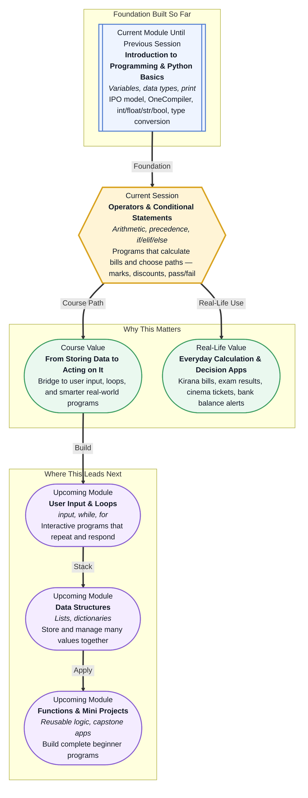

```mermaid
%%{init: {"flowchart": {"nodeSpacing": 45, "rankSpacing": 65, "diagramPadding": 20}} }%%
flowchart TB
    subgraph Foundation["Foundation Built So Far"]
        C1[["Current Module Until Previous Session<br/><b>Introduction to Programming &amp; Python Basics</b><br/><i>Variables, data types, print</i><br/>IPO model, OneCompiler, int/float/str/bool, type conversion"]]
    end

    CS{{"Current Session<br/><b>Operators &amp; Conditional Statements</b><br/><i>Arithmetic, precedence, if/elif/else</i><br/>Programs that calculate bills and choose paths — marks, discounts, pass/fail"}}

    subgraph Value["Why This Matters"]
        CV(["Course Value<br/><b>From Storing Data to Acting on It</b><br/>Bridge to user input, loops, and smarter real-world programs"])
        RV(["Real-Life Value<br/><b>Everyday Calculation &amp; Decision Apps</b><br/>Kirana bills, exam results, cinema tickets, bank balance alerts"])
    end

    subgraph Future["Where This Leads Next"]
        F1(["Upcoming Module<br/><b>User Input &amp; Loops</b><br/><i>input, while, for</i><br/>Interactive programs that repeat and respond"])
        F2(["Upcoming Module<br/><b>Data Structures</b><br/><i>Lists, dictionaries</i><br/>Store and manage many values together"])
        F3(["Upcoming Module<br/><b>Functions &amp; Mini Projects</b><br/><i>Reusable logic, capstone apps</i><br/>Build complete beginner programs"])
    end

    C1 ==>|&nbsp;Foundation&nbsp;| CS
    CS ==>|&nbsp;Course Path&nbsp;| CV
    CS ==>|&nbsp;Real-Life Use&nbsp;| RV
    CV ==>|&nbsp;Build&nbsp;| F1
    F1 ==>|&nbsp;Stack&nbsp;| F2
    F2 ==>|&nbsp;Apply&nbsp;| F3

    classDef previous fill:#eef4ff,stroke:#4f7ccf,color:#111827,stroke-width:2px;
    classDef current fill:#fff4d6,stroke:#d9a321,color:#111827,stroke-width:3px;
    classDef value fill:#eaf8ef,stroke:#3f9f63,color:#111827,stroke-width:2px;
    classDef future fill:#f4ecff,stroke:#8a61d1,color:#111827,stroke-width:2px;

    class C1 previous;
    class CS current;
    class CV,RV value;
    class F1,F2,F3 future;
    linkStyle default stroke-width:3px;
```
