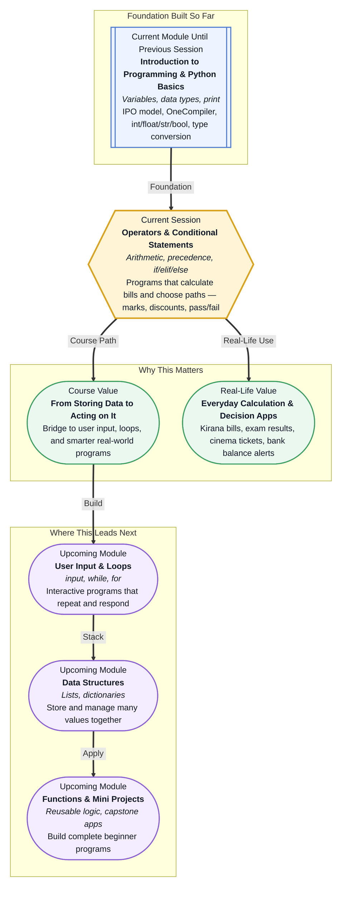

# Pre-read: Python Building Blocks — Operators and Conditional Statements

## Context of This Session in the Course

---

It is Saturday evening at your neighbourhood **kirana shop**. A family walks in with a long list — three kilograms of rice, one kilogram of dal, two packets of biscuits, and a bottle of cooking oil. The shopkeeper does not guess the total. He multiplies quantity by rate for each item, adds everything together, and tells the customer the final amount in seconds.

Now imagine the same shop during a festival rush. Twenty customers are waiting. Each bill has different items, different quantities, and sometimes a discount for bulk purchase. If every total had to be calculated by hand on paper, mistakes would creep in — someone might add before multiplying, or forget the oil while counting biscuits.

This is where your program needs a new skill. In the previous session, you learnt to **store** information in variables and **display** it on screen. That is like writing item names and prices in a notebook. But a useful billing system must also **calculate** totals and **decide** what message to show — pass or fail, child ticket or adult ticket, discount or no discount.

---

## When storing values is not enough

Picture a college office on result day. Hundreds of students want to know their status. For each student, someone must add marks from three subjects, find the average, check whether attendance crossed 75%, and then say **Pass** or **Fail**. If they passed, which **grade** do they get — A, B, C, or D?

You could handle one student with a calculator and a chart on the wall. But what if the same checks had to run for **every student in the college**, one after another, without a single error? Doing it manually would be slow, tiring, and risky — especially when rules overlap, like needing both good marks **and** good attendance to be eligible for the final exam.

This is the challenge we tackle in this session. Your programs will learn two powerful abilities:

- **Operators** — the maths and logic symbols that tell Python to add, subtract, multiply, divide, and perform advanced calculations on the values stored in variables.
- **Conditional statements** — the decision rules that let a program choose different actions based on a situation, just like a cinema counter charges a different price for a child, an adult, or a senior citizen.

An **operator** is simply a special symbol that performs an action on values — the same way the "×" sign helps a shopkeeper find the cost of two kilograms of rice. **Conditional statements** are the "if this, then do that" instructions that make software feel intelligent instead of mechanical.

---

## From school maths to smart decisions

Think back to your school exam paper. When you saw an expression like **2 + 3 × 4**, you did not add first — you multiplied first because of **BODMAS** rules. Python follows a similar **operator precedence** — a fixed order that decides which calculation runs first when many operators appear on one line. Getting this order wrong can change a student's average marks completely, which is why understanding precedence matters as much as knowing the symbols themselves.

Beyond basic addition and subtraction, you will meet operators that solve everyday puzzles:

- **Division** that gives exact decimal answers — useful when splitting a ₹500 bill among three friends.
- **Floor division** — when you only care about complete groups, like how many full boxes of five apples fit into seventeen apples.
- **Modulus** — the remainder after division, which tells you whether a number is even or odd, or how many apples are left after packing boxes.
- **Exponentiation** — raising a number to a power, like finding the area of a square field when you know the side length.

Once your program can calculate, it is ready to **decide**. At a cinema ticket counter, the price changes based on age — under twelve, regular adult, or senior discount. That is not one fixed path; it is a **fork in the road**. Python uses **if** for a single check, **else** for the opposite outcome, and **elif** when there are several possibilities checked one after another, like a train where the engine is the first condition and each carriage is the next option until the final **else** carriage at the end.

**Comparison operators** are the questions behind every decision — is the age greater than or equal to eighteen? Are the marks at least thirty-five? Is the account balance below five hundred rupees? Each question gives a **boolean** answer: either **True** or **False**, like a yes or no reply. Remember that a single equals sign **stores** a value, while double equals **checks** whether two values match — a small difference that saves beginners from many confusing errors.

**Indentation** — the spaces at the start of a line — tells Python which instructions belong inside a decision block. It works like outlining an exam answer: main points stay at the margin, and sub-points sit indented underneath to show they belong to that point. Wrong indentation can make the wrong message appear, or stop the program entirely.

---

**In this pre-read, you'll discover:**

- How **operators** turn stored variables into real calculations — marks totals, kirana bills, pocket money tracking, and area of shapes.
- Why **operator precedence** works like school **BODMAS**, and how brackets make your intention clear.
- How **if**, **elif**, and **else** let programs make decisions — pass or fail, even or odd, voting eligibility, and tiered shop discounts.
- Why **comparison operators**, **booleans**, and **indentation** are the hidden rules that make conditional logic work correctly.

---

When you combine operators with conditionals, your program can both **calculate** and **react**. A shop can find how much more a customer needs to spend to unlock a discount. A student report can show total marks, average, and pass/fail status in one flow. That is the **Process** step in the Input → Process → Output model you learnt earlier — but now the process includes maths **and** judgement.

---

## What's Next

After this session, you will be able to:

- Build expressions that calculate marks, bills, and measurements using variables and operators.
- Predict how Python evaluates multi-step calculations using precedence rules.
- Write decision logic with **if**, **elif**, and **else** for real scenarios like grade bands, ticket pricing, and balance warnings.
- Read and write conditional blocks with correct **indentation** and comparison checks.
- Combine calculation and decision-making in practical programs such as a student report card or discount eligibility checker.

---

## Questions we will solve together in the live class

1. **A kirana customer buys 2 kg sugar at ₹48 per kg, 3 biscuit packets at ₹15 each, and 1 litre of oil at ₹130.** How can one program calculate each item's cost and the full bill using only stored variables and operators?

2. **A student scores 78 out of 100.** How should a program assign grades — A for 90 and above, B for 75–89, C for 60–74, D for 35–59, and Fail below 35 — without putting everyone in the wrong band? Why does the **order** of checks matter as much as the numbers?

3. **An online order totals ₹800, but the shop offers a 10% discount only on orders of ₹1,000 or more.** How can a program first calculate the shortfall and then show a helpful message telling the customer exactly how much more to add?

Bring your curiosity. Every payment alert, result portal, and ticket counter you use runs on the same calculation and decision logic you are about to learn. The live session turns these everyday situations into programs you can write, test, and trust.
