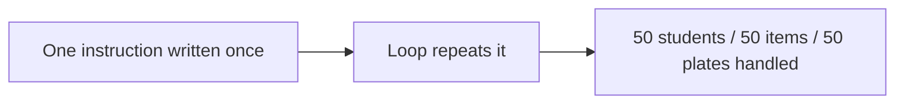
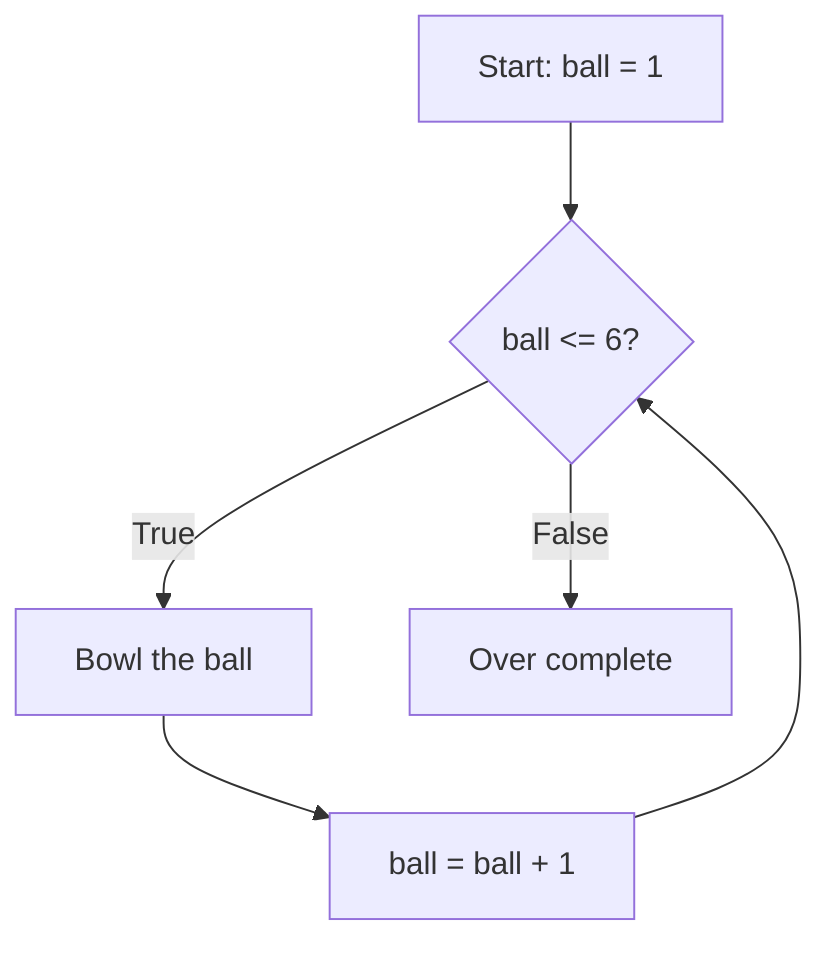
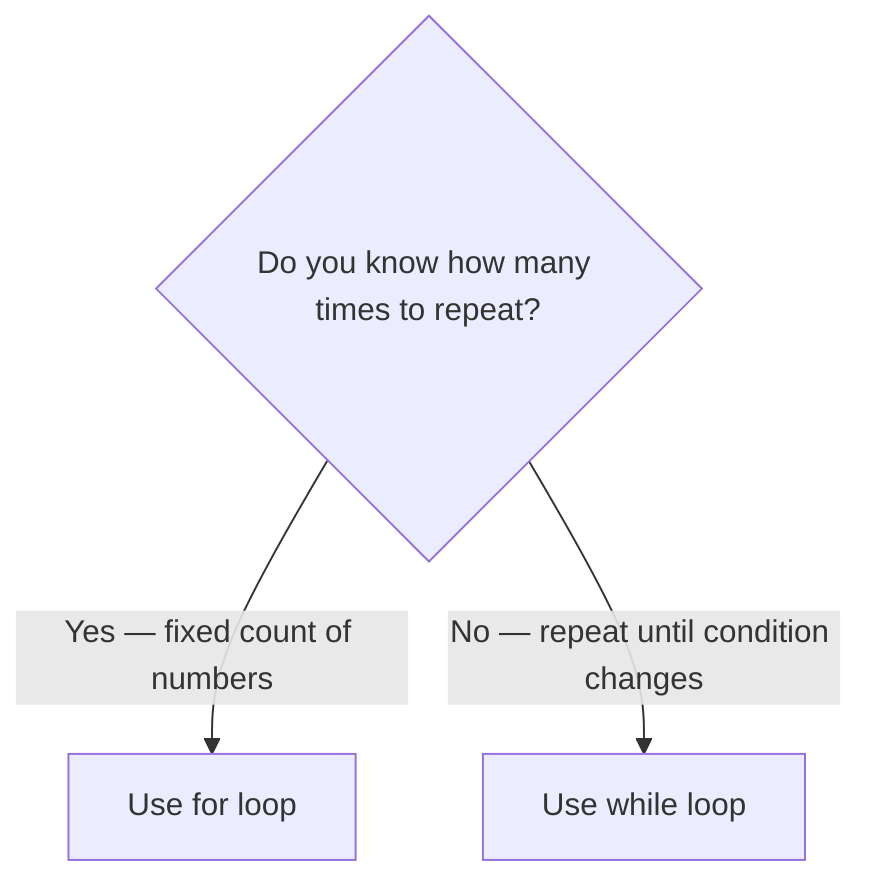
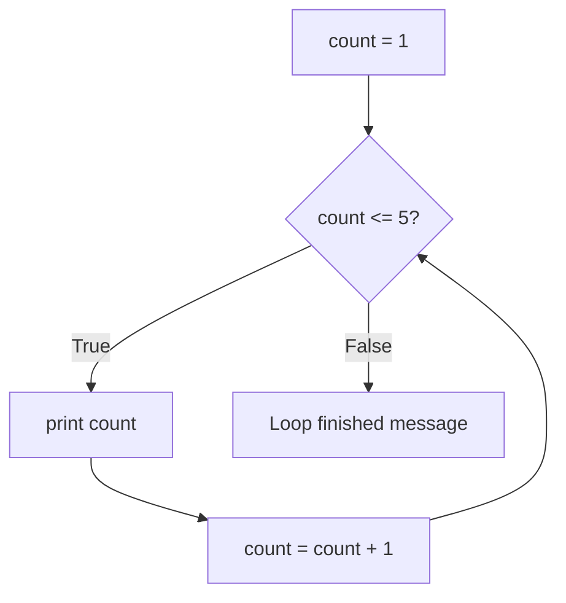
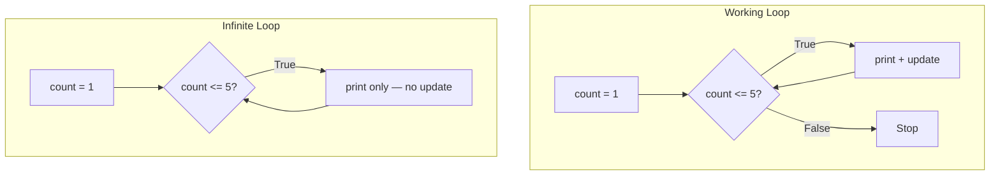
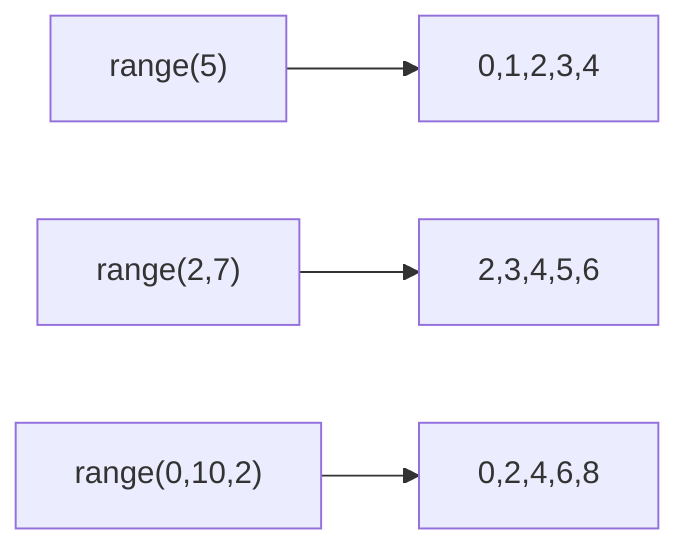
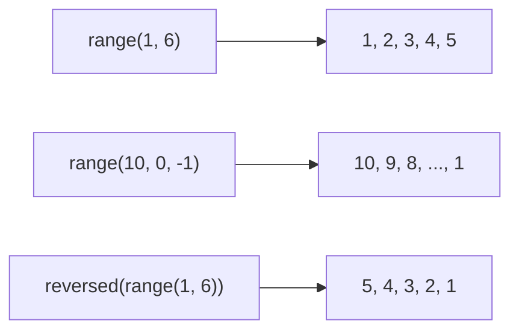
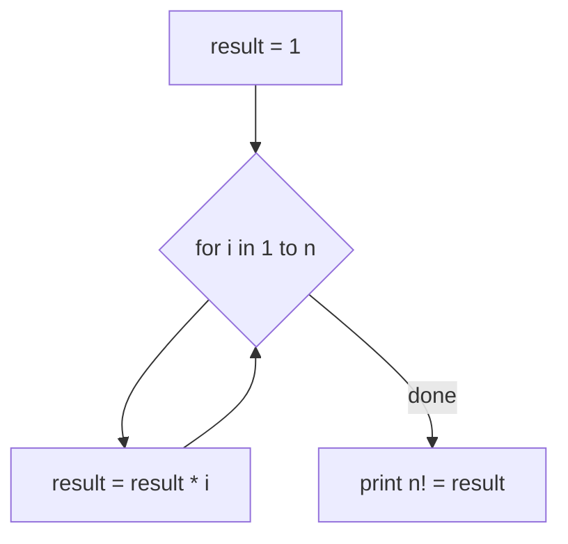

# Mastering Control Flow: Conditional and Loop in Python

## What You Will Learn in This Lesson

You have already learnt how to store values in **variables**, perform calculations using **operators**, and make decisions with **conditional statements** (`if`, `elif`, `else`). Your programs can now calculate a bill total and decide pass or fail — but each instruction still runs only **once** from top to bottom.

In this lesson, you will learn how to **repeat actions automatically** using **loops**. You will understand why loops are needed, how **incrementing** and **decrementing** values control repetition, and how to write **`while`** and **`for`** loops with correct syntax.

By the end, you will be able to:

- Explain why loops are essential for automating repetitive tasks
- Write **`while` loops** with clear start, stop, and update conditions
- Recognise and fix **infinite loops**
- Use **`for` loops** with the **`range()`** function — including start, stop, step, and reversed counting
- Solve practical problems such as **summation**, **multiplication tables**, and **factorial** calculation

---

## Why Do Programs Need Loops?

Imagine you are the owner of a small **dosa tiffin centre** in Bengaluru. Every morning, you prepare 50 plates of masala dosa. If you had to write a separate instruction for each plate — "flip dosa 1," "flip dosa 2," up to "flip dosa 50" — your recipe book would be endless and impossible to maintain.

- A real billing system must process **every item** on a long kirana list, not just the first one.
- An exam result program must check **every student's marks**, not copy the same `if` block fifty times.
- A bus conductor must collect fare from **every passenger** on a full bus — the same action repeats for each person.

This is exactly why programs need **loops**.

- **Official Definition:** A **loop** (also called an **iteration**) is a control structure that executes a block of code repeatedly until a condition is no longer met or a fixed count of repetitions is complete.
- **In Simple Words:** A loop tells Python, "Do this again and again" instead of copying the same lines hundreds of times.
- **Real-Life Example:** At a temple **prasad counter**, the volunteer gives one laddu to **each person** in the queue. The action repeats for every person — that is a loop in real life.

Without loops, you would copy-paste the same code for every student, every item, or every plate. Loops make programs **clean, scalable, and error-free**.




### How Loops Connect to What You Already Know

In the previous lessons, you learnt that programs follow **Input → Process → Output**. You also learnt that **conditionals** decide **what** to do based on a situation. Loops decide **how many times** to do it.

- **Conditionals** answer: "Should I run this block?" — pass or fail, discount or no discount.
- **Loops** answer: "How many times should I run this block?" — for every student, for every number from 1 to 10, until the savings goal is reached.

Together, conditionals and loops form the heart of **control flow** — your program can now **think** and **repeat**.

---

## Incrementing and Decrementing — Controlling Repetition

Before writing loops, you need to understand how values **go up** and **go down** inside a program. Almost every loop uses this idea to know when to stop.

- **Official Definition:** **Incrementing** means increasing a variable's value (usually by 1); **decrementing** means decreasing it (usually by 1).
- **In Simple Words:** Incrementing is counting **up** — 1, 2, 3, 4. Decrementing is counting **down** — 10, 9, 8, 7.
- **Real-Life Example:** Riding a lift in an apartment building — you start at the **ground floor (0)**, press the button, and the floor number **increments** as you go up: 1, 2, 3, 4. On the way down, the floor number **decrements**: 4, 3, 2, 1, 0.


### Incrementing in Python

```python
# Start at floor 0 (ground floor)
current_floor = 0  # The lift is on the ground floor

# Move up one floor — increment by 1
current_floor = current_floor + 1  # Now on floor 1
print(current_floor)  # Shows 1

# Move up two more floors
current_floor = current_floor + 1  # Now on floor 2
current_floor = current_floor + 1  # Now on floor 3
print(current_floor)  # Shows 3
```

**How the code works:**

- `current_floor = current_floor + 1` reads the **current value**, adds 1, and stores the **new value** back in the same variable.
- This is the same pattern used inside loops — each round increases a counter so the loop knows when to stop.
- **Shorthand:** Many programmers write `current_floor += 1` — it means the same as `current_floor = current_floor + 1`.

### Decrementing in Python

```python
# Rocket launch countdown — start at 10
countdown = 10  # Seconds remaining before launch
print("Countdown starts at:", countdown)  # Shows 10

# Count down one second at a time
countdown = countdown - 1  # 10 becomes 9
print(countdown)  # Shows 9

countdown = countdown - 1  # 9 becomes 8
print(countdown)  # Shows 8

# Shorthand for decrement: countdown -= 1 means countdown = countdown - 1
```

**How the code works:**

- Decrementing subtracts 1 (or more) from the current value each time.
- A countdown stops when the value reaches 0 — loops use the same idea with a **stop condition** like `while countdown > 0`.
- **Common mistake:** Forgetting to update the counter inside a loop — the value never changes, so the loop never ends.

### Real-Life Analogy — Cricket Overs

Think of a cricket bowler delivering balls in one over:

| Ball Number | Action | Counter Change |
|-------------|--------|----------------|
| Ball 1 | Bowl | Increment: 0 → 1 |
| Ball 2 | Bowl | Increment: 1 → 2 |
| ... | ... | ... |
| Ball 6 | Bowl | Increment: 5 → 6 |
| Over complete | Stop | Condition `ball <= 6` becomes False |

- The bowler repeats the **same action** (bowling) but the **ball counter increments** after each delivery.
- When the counter crosses 6, the over ends — that is the **stop condition**.
- Every `while` loop works on this same principle: **start value**, **repeated action**, **update counter**, **stop when condition fails**.



Now that you understand how values move up and down, you are ready to meet the two main loop types in Python.

---

## Types of Loops in Python

Python gives you two primary ways to repeat code. Both achieve repetition, but they suit different situations.

| Loop Type | Keyword | Best When | Simple Idea |
|-----------|---------|-----------|-------------|
| **`while` loop** | `while` | You repeat **until a condition changes** | "Keep doing this **while** something is true." |
| **`for` loop** | `for` | You repeat **for each number** in a known count | "Do this **for every** number from 1 to 10." |

- **Official Definition:** **Loop selection** is choosing the loop type whose condition model best matches the problem — repeating until a state changes versus counting through a known range of numbers.
- **In Simple Words:** Ask yourself: "Do I know **how many times**?" → use `for`. "Do I repeat **until something happens**?" → use `while`.
- **Real-Life Example:** Printing a fixed menu of 5 thali items is a **`for`** job — you know exactly how many items. Waiting until the pressure cooker **whistles** is a **`while`** job — you do not know exactly how many seconds it will take.




### Quick Comparison — Same Output, Two Approaches

Both snippets below print the numbers 1, 2, 3, 4, 5 — but they use different loop styles.

```python
# Approach 1 — while loop (you manage the counter)
count = 1  # Start value — where counting begins
while count <= 5:  # Stop condition — keep going while count is 5 or less
    print(count)  # Action — print the current number
    count = count + 1  # Update — increment so the loop can eventually stop

# Approach 2 — for loop with range (Python manages the counter)
for num in range(1, 6):  # range(1, 6) gives 1, 2, 3, 4, 5
    print(num)  # Action — print each number automatically
```

**How the code works:**

- The **`while` loop** needs three parts you write yourself: **start** (`count = 1`), **condition** (`count <= 5`), and **update** (`count = count + 1`).
- The **`for` loop** with `range()` handles the counting automatically — cleaner when you know exactly how many times to repeat.
- Prefer **`for`** when counting or iterating a fixed range; prefer **`while`** when the exit depends on a **changing condition**.

---

## The `while` Loop — Repeat While a Condition Is True

The **`while` loop** is your tool when you need to keep doing something **until a condition becomes False**.

- **Official Definition:** A **`while` loop** repeatedly executes a block of code as long as its condition evaluates to `True`. The condition is checked **before** each repetition.
- **In Simple Words:** `while` means "keep going until the check fails."
- **Real-Life Example:** "While the traffic signal is **red**, wait." You keep waiting until the light turns green — the condition changes.

### Syntax of a `while` Loop

```python
while condition:  # Condition checked before each round — must end with a colon
    # Indented code runs again and again while condition is True
    # Something inside must eventually make condition False
```

| Part | What It Means | Example |
|------|---------------|---------|
| **`while`** | Keyword that starts the loop | `while` |
| **condition** | A boolean check — `True` keeps looping, `False` stops | `count <= 5` |
| **`:`** | Colon at the end of the line — required, same as `if` | `while count <= 5:` |
| **Indented body** | Lines with 4-space indent that repeat | `print(count)` |

- The condition uses **comparison operators** you learnt earlier — `>`, `<`, `>=`, `<=`, `==`, `!=`.
- Lines **not indented** under `while` run only **once** — after the loop finishes.
- **Critical rule:** Something inside the loop must **change** so the condition can eventually become `False`. Otherwise you get an **infinite loop**.

### Start, Stop, and Update — The Three Parts of Every `while` Loop

Every working `while` loop has three logical parts. Think of them as the **start line**, **finish line**, and **steps** of a race.

| Part | Role | Example |
|------|------|---------|
| **Start** | Initial value before the loop begins | `count = 1` |
| **Stop (condition)** | The check that decides whether to continue | `while count <= 5` |
| **Update** | Changes the value inside the loop so the condition can eventually fail | `count = count + 1` |


```python
# Print numbers from 1 to 5 using a while loop
count = 1  # START — begin at 1
while count <= 5:  # STOP condition — continue while count is 5 or less
    print(count)  # Action performed each round
    count = count + 1  # UPDATE — move to the next number
print("Loop finished!")  # Runs once after the loop ends
```

**How the code works:**

- **Round 1:** `count` is 1 → `1 <= 5` is `True` → prints 1 → `count` becomes 2.
- **Round 2:** `count` is 2 → prints 2 → `count` becomes 3.
- This continues until **Round 5** prints 5 and `count` becomes 6.
- **Round 6:** `count` is 6 → `6 <= 5` is `False` → loop stops → "Loop finished!" prints.
- **Common mistake:** Forgetting `count = count + 1` — the loop prints `1` forever because `count` never changes.



### Example: Countdown Using Decrement

```python
# Rocket countdown from 5 to 1
countdown = 5  # START — begin at 5 seconds
while countdown > 0:  # STOP — continue while countdown is greater than 0
    print("T-minus", countdown)  # Announce current second
    countdown = countdown - 1  # UPDATE — decrement by 1 each round
print("Liftoff!")  # Runs after countdown reaches 0
```

**How the code works:**

- Each round prints the current countdown value, then subtracts 1.
- When `countdown` becomes 0, the condition `0 > 0` is `False` and the loop stops.
- "Liftoff!" prints only **after** all countdown numbers are shown — it sits outside the loop.

### Example: Monthly Savings Goal

A student saves ₹500 every month starting from ₹0. Track the balance each month until it reaches at least ₹3000.

```python
# Savings tracker — add ₹500 each month until goal is met
balance = 0  # START — no savings yet
monthly_saving = 500  # Amount saved each month
goal = 3000  # Target savings amount

while balance < goal:  # STOP — keep saving while below the goal
    balance = balance + monthly_saving  # UPDATE — add this month's saving
    print("Current balance: Rs.", balance)  # Show progress after each month

print("Goal reached! Final balance: Rs.", balance)  # Message after loop ends
```

**How the code works:**

- **Month 1:** balance 0 → adds 500 → prints 500.
- **Month 2:** balance 500 → adds 500 → prints 1000.
- **Month 6:** balance 2500 → adds 500 → balance becomes 3000 → prints 3000.
- Next check: `3000 < 3000` is `False` → loop stops → goal message prints.

### Activity: Print Even Numbers from 2 to 10

Use a `while` loop to print only even numbers: 2, 4, 6, 8, 10. Hint: start at 2 and increment by 2 each round.

```python
# Print even numbers from 2 to 10
number = 2  # START — first even number
while number <= 10:  # STOP — continue while number is 10 or less
    print(number)  # Print the current even number
    number = number + 2  # UPDATE — jump to next even number (add 2)
```

**How the code works:**

- Starting at 2 and adding 2 each time gives 2, 4, 6, 8, 10 — all even numbers in range.
- When `number` becomes 12, the condition `12 <= 10` is `False` and the loop stops.

---

## Infinite Loops — When a Loop Never Stops

An **infinite loop** is a loop that runs forever because its condition never becomes `False`. Understanding this concept helps you write safer programs and debug faster.

- **Official Definition:** An **infinite loop** is a loop whose exit condition is never satisfied, causing the program to repeat indefinitely.
- **In Simple Words:** The program is stuck in a circle — it keeps going round and round and never reaches the end.
- **Real-Life Example:** A fan that has no off switch — it keeps spinning until someone pulls the plug. In programming, you must build the "off switch" into your loop logic.


### Accidental Infinite Loop — Missing the Update

```python
# WARNING: This code runs forever — do not run without stopping the program
count = 1  # Start at 1
while count <= 5:  # Condition will always be True because count never changes
    print(count)  # Prints 1 again and again forever
    # BUG: forgot count = count + 1 — the update step is missing
```

**How the code works:**

- `count` stays at 1 forever because nothing inside the loop changes it.
- `1 <= 5` is always `True`, so Python keeps printing 1 without stopping.
- **How to fix:** Add `count = count + 1` inside the loop body.
- **How to stop a runaway program:** In OneCompiler, click the **Stop** button or refresh the page.

### Accidental Infinite Loop — Wrong Update Direction

```python
# WARNING: This also runs forever — count goes up instead of down
countdown = 10  # Start at 10
while countdown > 0:  # We want to stop when countdown reaches 0
    print(countdown)
    countdown = countdown + 1  # BUG: should be countdown - 1, not + 1
    # countdown becomes 11, 12, 13... — always greater than 0
```

**How the code works:**

- The stop condition expects `countdown` to **decrease** toward 0, but the update **increases** it instead.
- `countdown` moves away from 0 — 11, 12, 13 — so `countdown > 0` stays `True` forever.
- **Fix:** Change to `countdown = countdown - 1`.

### Stopping a Runaway Program

If your loop never ends and the same output keeps repeating on screen, do not panic — this means you have an **infinite loop**.

- Click the **Stop** button in OneCompiler, or refresh the page to halt the program.
- Then review your **start value**, **stop condition**, and **update line** using the checklist below.
- In an upcoming lesson, you will learn **`break`** and **`continue`** — two special statements that let you exit a loop or skip a round from inside the code itself.

### How to Avoid Infinite Loops

| Check | Question to Ask Yourself |
|-------|--------------------------|
| **Start value** | Did I set the counter correctly before the loop? |
| **Condition** | Will this condition eventually become `False`? |
| **Update** | Am I incrementing or decrementing inside the loop? |
| **Direction** | Is the update moving **toward** the stop condition? |

- If your program seems frozen and output keeps repeating the same value, check whether the **update line** is missing or wrong.
- Test loops with **small numbers** first — count from 1 to 3 before counting to 100.



You have now seen how `while` loops repeat based on a condition. The next tool — the **`for` loop** — handles repetition when you already know **what** to count or **which items** to visit.

---

## The `for` Loop — Repeat for Each Number in a Range

The **`for` loop** is your go-to choice when you know **how many times** to repeat — especially when counting through numbers using **`range()`**.

- **Official Definition:** A **`for` loop** iterates over each number produced by **`range()`** and executes the loop body once per number.
- **In Simple Words:** `for` means "do this once for every number in the range."
- **Real-Life Example:** A bus conductor calls out stop numbers — "Stop 1, Stop 2, Stop 3…" One instruction covers every stop on the route.


### Syntax of a `for` Loop

```python
for num in range(1, 6):  # num takes each value from range(), one at a time
    # Indented code runs once per number
```

| Part | What It Means | Example |
|------|---------------|---------|
| **`for`** | Keyword that starts the loop | `for` |
| **variable** | A name that holds the current number each round | `num`, `i`, `count` |
| **`in`** | Connects the variable to the range | `in` |
| **`range()`** | Generates the numbers to loop over | `range(1, 6)` |
| **`:`** | Colon at the end — required | `for num in range(1, 6):` |
| **Indented body** | Code that runs once per number | `print(num)` |

### Example: Print Numbers 1 to 4

```python
# Print bus stop numbers from 1 to 4
for stop_number in range(1, 5):  # stop_number takes 1, then 2, then 3, then 4
    print("Arriving at stop:", stop_number)  # Print a message for each stop
```

**How the code works:**

- The loop body runs **four times** — once for each number from `range(1, 5)`.
- `stop_number` automatically gets the next value each round — no manual counter needed.
- **Common mistake:** Expecting `print(stop_number)` **outside** the loop to print all stops — it only shows the **last** value (`4`).

### Review: `while` vs `for` — Side by Side

```python
# TASK: Print numbers 1, 2, 3, 4, 5

# --- while loop version ---
count = 1  # You set the start
while count <= 5:  # You write the stop condition
    print(count)  # Action
    count = count + 1  # You must update manually

# --- for loop version ---
for num in range(1, 6):  # Python handles start, stop, and update via range()
    print(num)  # Action only — cleaner for fixed counting
```

**How the code works:**

| Feature | `while` loop | `for` loop |
|---------|-------------|------------|
| **Counter management** | You write start, condition, and update | Python handles it via `range()` |
| **Best for** | Unknown repetitions, condition-based stopping | Known count and fixed number ranges |
| **Risk** | Easier to create infinite loops if update is forgotten | Safer for counting — `range()` always ends |
| **Lines of code** | Usually more lines | Usually fewer lines for counting tasks |

- Both produce the same output here — choose based on which style fits the problem better.

### Activity: Print Bus Fare for Each Kilometre

A bus charges ₹2 per km. Print the fare for distances 1 km through 5 km using a `for` loop.

```python
# Bus fare calculation — Rs. 2 per km
rate_per_km = 2  # Fare charged for each kilometre

# Print fare for distances 1 km to 5 km
for distance in range(1, 6):  # distance takes 1, 2, 3, 4, 5
    fare = distance * rate_per_km  # Multiply distance by rate
    print(distance, "km → Rs.", fare)  # Display fare for each distance
```

**How the code works:**

- The loop calculates fare for each distance without writing five separate `print()` statements.
- `distance * rate_per_km` uses the **multiplication operator** you learnt earlier — the loop repeats the same formula for each number.

---

## The `range()` Function — Counting Made Easy

To count numbers in a `for` loop — 1 to 10, 0 to 4, or every second number — Python provides a built-in helper called **`range()`**.

- **Official Definition:** The **`range()`** function generates a sequence of integers, commonly used with `for` loops to repeat a block a specific number of times.
- **In Simple Words:** `range()` gives you numbers one by one — like a token counter at a bank that calls 1, 2, 3… without writing each number yourself.
- **Real-Life Example:** A cricket over has 6 balls — `range(1, 7)` gives you ball numbers 1 through 6.

### Three Forms of `range()`

| Form | Meaning | Numbers Generated |
|------|---------|-------------------|
| `range(stop)` | From **0** up to **stop − 1** | `range(5)` → 0, 1, 2, 3, 4 |
| `range(start, stop)` | From **start** up to **stop − 1** | `range(2, 7)` → 2, 3, 4, 5, 6 |
| `range(start, stop, step)` | From **start** to **stop − 1**, jumping by **step** | `range(0, 10, 2)` → 0, 2, 4, 6, 8 |

- **`range()` always stops before the second number** — `range(5)` does **not** include 5.
- To get numbers 1 through 5 inclusive, write `range(1, 6)` — the stop value is **one more** than your last desired number.
- **Common mistake:** Writing `range(1, 5)` when you want 1 to 5 — you will only get 1, 2, 3, 4.




### Example: `range(stop)` — Count from 0

```python
# range(5) generates 0, 1, 2, 3, 4
for i in range(5):  # No start given — defaults to 0; stops before 5
    print(i)  # Prints 0, then 1, then 2, then 3, then 4
```

**How the code works:**

- When you pass only one argument to `range()`, it is the **stop** value.
- Counting starts at **0** by default — useful when you need to count from zero in later problems.

### Example: `range(start, stop)` — Count from 1 to 5

```python
# range(1, 6) generates 1, 2, 3, 4, 5
for num in range(1, 6):  # Start at 1, stop before 6
    print(num)  # Prints each number on its own line
```

**How the code works:**

- `range(1, 6)` produces 1 through 5 — the number 6 is **not** included.
- This is the most common form when you want to count from 1 to N — use `range(1, N + 1)`.

### Example: `range(start, stop, step)` — Count by Steps

```python
# Print even numbers from 0 to 8 using step of 2
for num in range(0, 10, 2):  # Start 0, stop before 10, jump by 2
    print(num)  # Prints 0, 2, 4, 6, 8

# Print odd numbers from 1 to 9
for num in range(1, 10, 2):  # Start 1, stop before 10, jump by 2
    print(num)  # Prints 1, 3, 5, 7, 9
```

**How the code works:**

- The third argument **step** controls the gap between numbers.
- `step = 2` skips every alternate number — useful for even/odd patterns.
- **Common mistake:** Using `range(1, 10, 2)` when you want all numbers 1 to 10 — the step changes which numbers appear.

### Reversed Loops — Counting Backwards

Sometimes you need to count **down** instead of up — a countdown or printing numbers from high to low.

**Method 1 — `range()` with a negative step:**

```python
# Countdown from 10 to 1
for num in range(10, 0, -1):  # Start 10, stop before 0, step -1 (go down)
    print("T-minus", num)  # Prints 10, 9, 8, 7, 6, 5, 4, 3, 2, 1
print("Liftoff!")  # Prints after countdown finishes
```

**How the code works:**

- A **negative step** (`-1`) makes `range()` count backwards.
- `range(10, 0, -1)` starts at 10 and decreases until it reaches 1 — it stops **before** 0.
- To count down from N to 1, use `range(N, 0, -1)`.

**Method 2 — `reversed()` with `range()`:**

```python
# Print numbers 1 to 5 in reverse order: 5, 4, 3, 2, 1
for num in reversed(range(1, 6)):  # range(1,6) gives 1-5, reversed flips the order
    print(num)  # Prints 5, 4, 3, 2, 1
```

**How the code works:**

- `range(1, 6)` creates the forward sequence 1, 2, 3, 4, 5.
- `reversed()` flips it to 5, 4, 3, 2, 1 — useful when you already have a forward range and need backward output.
- Both methods produce the same result here — choose whichever reads clearer to you.



### Activity: Multiplication Table for 6

Print the table of 6 from `6 × 1` to `6 × 10` using a `for` loop and `range()`.

```python
# Multiplication table for 6
number = 6  # The number whose table we want to print

for i in range(1, 11):  # Multipliers 1 through 10
    result = number * i  # Multiply 6 by the current multiplier
    print(number, "x", i, "=", result)  # Print one line of the table
```

**How the code works:**

- One small loop replaces ten separate `print()` statements.
- Change `number = 6` to any other value to print a different table.
- `range(1, 11)` gives multipliers 1 to 10 — remember the stop value is 11, not 10.

---

## Solving Problems with `for` Loops and `range()`

Now you will combine `for`, `range()`, and the **operators** you learnt earlier to solve real counting problems.

### Example: Sum of Numbers from 1 to N

Find the total of all numbers from 1 to 100.

```python
# Sum of first 100 natural numbers
n = 100  # Upper limit
total = 0  # Running sum starts at zero — this is called an accumulator

for num in range(1, n + 1):  # Loop from 1 to 100 inclusive
    total = total + num  # Add current number to the running total

print("Sum from 1 to", n, "is:", total)  # Shows 5050
```

**How the code works:**

- **`total`** starts at 0 and **accumulates** each number inside the loop — this pattern is called an **accumulator**.
- `range(1, n + 1)` gives 1 through 100 — using `n + 1` as the stop ensures 100 is included.
- The final `print()` sits **outside** the loop — it runs only once after all numbers are added.

### Example: Print Multiples of 5

Print all multiples of 5 from 5 to 50.

```python
# Print multiples of 5: 5, 10, 15, ..., 50
for num in range(5, 51, 5):  # Start 5, stop before 51, step 5
    print(num)  # Prints 5, 10, 15, 20, 25, 30, 35, 40, 45, 50
```

**How the code works:**

- Using `step = 5` jumps directly to each multiple — no `if` check needed inside the loop.
- `range(5, 51, 5)` stops before 51, so 50 is the last number printed.

### Example: Check Even or Odd for Numbers 1 to 10

Combine a `for` loop with **conditionals** to classify each number as even or odd.

```python
# Check whether each number from 1 to 10 is even or odd
for num in range(1, 11):  # num takes 1, 2, 3, ..., 10
    if num % 2 == 0:  # Remainder 0 when divided by 2 means even
        print(num, "→ EVEN")  # Number is even
    else:
        print(num, "→ ODD")  # Number is odd
```

**How the code works:**

- The **loop** handles repetition — one `if-else` block replaces ten separate copies.
- The **conditional** handles the decision for each number using the **modulus operator** (`%`) you learnt earlier.
- Output: `1 → ODD`, `2 → EVEN`, `3 → ODD`, … up to `10 → EVEN`.

### Activity: Print Squares of Numbers 1 to 5

Print the square of each number from 1 to 5 — that is, multiply each number by itself.

```python
# Print squares of numbers 1 through 5
for num in range(1, 6):  # num takes 1, 2, 3, 4, 5
    square = num * num  # Multiply the number by itself
    print(num, "squared =", square)  # Display the result
```

**How the code works:**

- Number 1: `1 * 1` → 1
- Number 2: `2 * 2` → 4
- Number 5: `5 * 5` → 25
- The same loop structure works for any range — change `range(1, 6)` to `range(1, 11)` for squares up to 10.

---

## Calculating Factorial Using a `for` Loop

**Factorial** is a classic problem that shows the power of loops. It also appears in permutations, probability, and many maths formulas.

- **Official Definition:** The **factorial** of a non-negative integer `n` (written as `n!`) is the product of all positive integers from 1 to `n`. For example, `5! = 5 × 4 × 3 × 2 × 1 = 120`.
- **In Simple Words:** Factorial means multiply all whole numbers from 1 up to `n`.
- **Real-Life Example:** Arranging 4 books on a shelf — the number of different orders is `4! = 24` ways. Factorial counts how many ways you can arrange items.

| n | Calculation | n! |
|---|-------------|-----|
| 3 | 3 × 2 × 1 | 6 |
| 4 | 4 × 3 × 2 × 1 | 24 |
| 5 | 5 × 4 × 3 × 2 × 1 | 120 |
| 0 | (special rule) | 1 |

- **Special rule:** `0!` is defined as **1** — you will see this in advanced maths, but for now focus on positive numbers.


### Step-by-Step Logic Before Coding

To find `5!`:

1. **Start** with `result = 1` (multiplication identity — multiplying by 1 changes nothing).
2. **Multiply** by 1 → `result = 1`
3. **Multiply** by 2 → `result = 2`
4. **Multiply** by 3 → `result = 6`
5. **Multiply** by 4 → `result = 24`
6. **Multiply** by 5 → `result = 120`

Each step repeats the same action — multiply the running result by the next number. That is a perfect job for a `for` loop.

### Full Program — Factorial of a Number

```python
# Calculate factorial of 5
n = 5  # The number whose factorial we want
result = 1  # Start with 1 — multiplying by 1 keeps the value unchanged initially

# Multiply result by each number from 1 to n
for i in range(1, n + 1):  # i takes 1, 2, 3, 4, 5
    result = result * i  # Update result: 1×1, then ×2, then ×3, then ×4, then ×5
    print("After multiplying by", i, "→ result =", result)  # Show each step

print(n, "! =", result)  # Final answer: 5! = 120
```

**How the code works:**

- **Round 1:** `result = 1 * 1` → 1
- **Round 2:** `result = 1 * 2` → 2
- **Round 3:** `result = 2 * 3` → 6
- **Round 4:** `result = 6 * 4` → 24
- **Round 5:** `result = 24 * 5` → 120
- The `print()` inside the loop shows each intermediate step — helpful for debugging. Remove it for a cleaner final program.



### Factorial with a `while` Loop — Alternative Approach

The same factorial can be solved with a `while` loop — useful for comparing both loop types.

```python
# Calculate factorial of 5 using a while loop
n = 5  # Number whose factorial we want
result = 1  # Running product starts at 1
counter = 1  # Start multiplying from 1

while counter <= n:  # Continue while counter has not passed n
    result = result * counter  # Multiply result by current counter
    counter = counter + 1  # Move to the next number

print(n, "! =", result)  # Shows 5! = 120
```

**How the code works:**

- `counter` plays the same role as `i` in the `for` loop — it tracks which number to multiply next.
- `result = result * counter` is the **accumulator** pattern, but with multiplication instead of addition.
- Both approaches give the same answer — `for` with `range()` is shorter for this type of problem.

### Activity: Factorial Calculator

Change the value of `n` and run the factorial program for these values. Verify your answers on paper first.

```python
# Factorial calculator — change n to test different values
n = 4  # Try 4, 6, 7 after verifying on paper
result = 1  # Running product

for i in range(1, n + 1):  # Multiply by each number from 1 to n
    result = result * i  # Update the running product

print(n, "! =", result)  # Display the final factorial
```

**Paper check before running:**

- `4!` = 4 × 3 × 2 × 1 = **24**
- `6!` = 6 × 5 × 4 × 3 × 2 × 1 = **720**
- `7!` = 7 × 6 × 5 × 4 × 3 × 2 × 1 = **5040**

**How the code works:**

- Only the value of `n` needs to change — the loop structure stays the same.
- Large factorials grow very fast — `10!` is already 3,628,800. Loops handle this easily; copying individual multiply lines would be impractical.

---

## Debugging Loop Programs — Common Issues and Fixes

When a loop program behaves unexpectedly, use these checks before rewriting everything.

| Problem | Likely Cause | Fix |
|---------|--------------|-----|
| Same number prints forever | Missing update inside `while` loop | Add `count = count + 1` or `count = count - 1` |
| Loop runs one time too few or too many | Off-by-one error in `range()` | Remember `range()` stops **before** the stop value |
| Output shows only the last value | `print()` is outside the loop when it should be inside | Move `print()` inside the indented block |
| Final total is wrong | Accumulator update is outside the loop | Keep `total = total + num` **inside** the loop |
| Program never stops | Update moves away from stop condition | Check increment vs decrement direction |

### Activity: Trace a Loop on Paper

Before running code, trace this loop by hand and write the expected output:

```python
total = 0  # Running sum
for i in range(1, 5):  # What numbers does range(1, 5) produce?
    total = total + i  # Add each number to total
print(total)  # What is the final total?
```

**Tracing steps:**

| Round | i | total before | total after |
|-------|---|--------------|-------------|
| 1 | 1 | 0 | 1 |
| 2 | 2 | 1 | 3 |
| 3 | 3 | 3 | 6 |
| 4 | 4 | 6 | 10 |

- Expected output: **10** (sum of 1 + 2 + 3 + 4).
- `range(1, 5)` gives 1, 2, 3, 4 — **not** 5. This is a very common off-by-one mistake.

---

## Key Takeaways

- **Loops** let your program repeat actions without copying code — essential for bills, marks, tables, and any task that happens more than once.
- **`while` loops** repeat as long as a condition is `True` — always include a **start value**, **stop condition**, and **update** inside the loop to avoid infinite loops.
- **`for` loops** visit each number from **`range()`** — ideal when you know how many times to repeat.
- **`range(start, stop, step)`** generates number sequences — remember it stops **before** `stop`, and a **negative step** counts backwards.
- **Factorial** and **summation** problems use the **accumulator pattern** — start with 0 (for addition) or 1 (for multiplication), then update inside the loop.
- In upcoming lessons, you will learn **`break`**, **`continue`**, and **nested loops** for finer control over repetition, along with **user input** and more data-handling tools.

---

## Important Commands, Libraries & Terminologies

| Term / Command | What It Does |
|----------------|--------------|
| **Loop / Iteration** | Repeating a block of code multiple times |
| **`while`** | Repeats a block while a condition is `True` |
| **`for`** | Repeats a block once for each number in a `range()` |
| **Increment** | Increase a variable's value (`count = count + 1` or `count += 1`) |
| **Decrement** | Decrease a variable's value (`count = count - 1` or `count -= 1`) |
| **Infinite loop** | A loop that never ends because its condition never becomes `False` |
| **`range(stop)`** | Generates numbers from 0 to stop − 1 |
| **`range(start, stop)`** | Generates numbers from start to stop − 1 |
| **`range(start, stop, step)`** | Generates numbers with a custom step — negative step counts down |
| **`reversed()`** | Reverses the order of numbers from `range()` |
| **Accumulator** | A variable (starting at 0 or 1) that builds a total inside a loop |
| **Counter** | A variable that increases or decreases each iteration to track progress |
| **Control flow** | How a program decides which lines run and how many times — includes conditionals and loops |
| **Factorial (n!)** | Product of all integers from 1 to n — e.g., `5! = 120` |
| **Off-by-one error** | A common mistake where the loop runs one time too many or too few |
