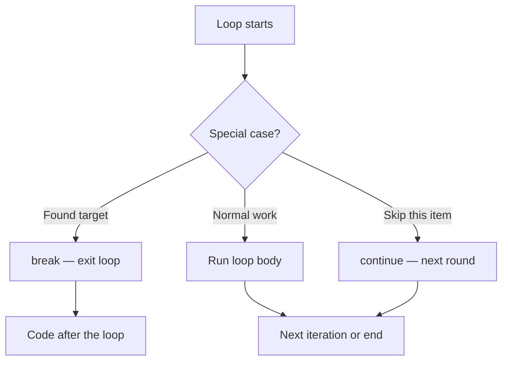
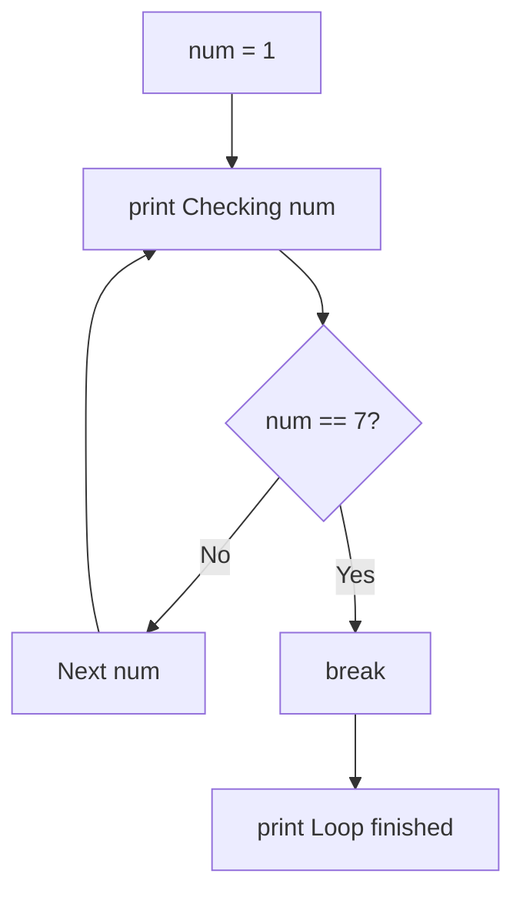
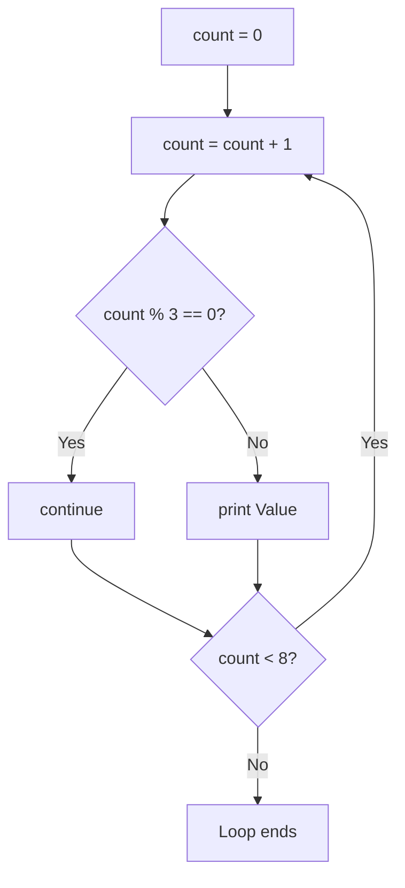
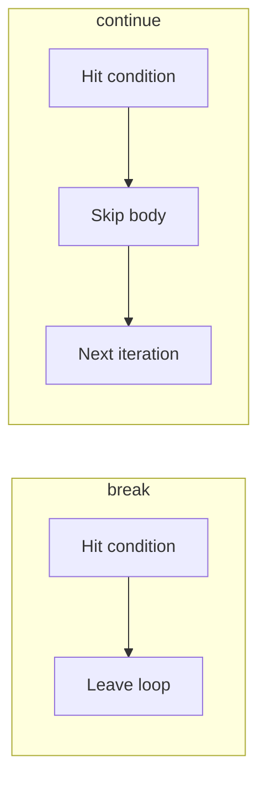
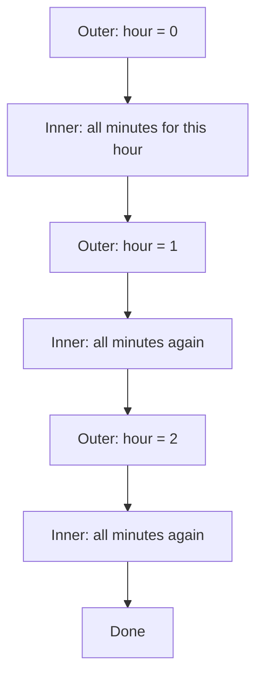
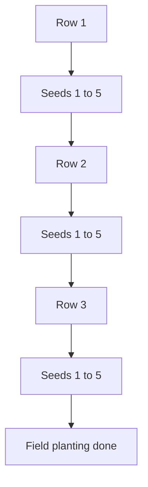

# Understanding break, continue, and Nested Loops

## What You Will Learn in This Lesson

You have already learnt how **loops** repeat actions using **`while`** and **`for`**. You know how to set a **start**, a **stop condition**, and an **update**, and how **`range()`** generates numbers for counting. Your programs can print tables, add totals, and calculate factorial — but so far, each loop either runs fully to the end or stops only when its main condition becomes `False`.

In this lesson, you will learn finer control inside loops. You will use **`break`** to exit early, **`continue`** to skip one round, and **nested loops** (a loop inside another loop) to handle multi-level tasks such as hours-and-minutes on an alarm clock or rows-and-seeds in a farm field.

By the end, you will be able to:

- Stop a loop immediately with **`break`** when a condition is met
- Skip one iteration with **`continue`** and keep the loop running
- Combine **`break`** or **`continue`** with **`if`** inside **`while`** and **`for`** loops
- Write **nested loops** with clear outer and inner roles
- Control nested counting using **start**, **stop**, and **step** in **`range()`**
- Solve practical patterns such as alarm-clock timing and field-and-seed planting

---

## Why Loops Sometimes Need Early Control

A normal loop is like a full bus route — it visits every stop until the route ends. Real life is not always like that.

- You search for your house keys in five bags. The moment you find them in bag 2, you **stop searching** the remaining bags.
- A quality checker on a biscuit packing line **skips** one broken packet and continues checking the rest.
- An alarm clock does not only count hours — for **each hour**, it also counts **every minute**.

These three ideas map directly to programming:

| Real-Life Need | Python Tool |
|----------------|-------------|
| Stop the whole repetition early | **`break`** |
| Skip one item, continue with the rest | **`continue`** |
| Repeat something inside another repetition | **Nested loops** |

- **Official Definition:** **Loop control statements** change how a loop runs from inside the loop body — exiting early, skipping an iteration, or coordinating more than one loop level.
- **In Simple Words:** `break` means "stop the loop now," `continue` means "skip this round," and nested loops mean "for each outer step, finish a full inner cycle."
- **Real-Life Example:** Finding keys is `break`. Skipping a bad biscuit packet is `continue`. Checking every seat in every row of a classroom is a nested loop.



You already know how loops start and stop. Now you will learn how to steer them from the **inside**.

---

## The `break` Statement — Exit a Loop Early

Sometimes you do not need every remaining iteration. When the goal is already achieved, continuing wastes time and can print unwanted output.

- **Official Definition:** The **`break`** statement immediately terminates the **innermost** loop that contains it. Execution continues with the first statement **after** that loop.
- **In Simple Words:** `break` is the emergency exit door of a loop — once you take it, you leave the loop completely.
- **Real-Life Example:** At a kirana shop, you search for a particular brand of oil on the shelf. The moment you find it, you **stop scanning** the remaining bottles.


### Why `break` Is Useful

- Searching for a number — stop as soon as it is found.
- Stopping a countdown early when a safety check fails.
- Leaving a long counting process when a limit or error appears.
- Writing clearer logic than forcing every exit into one complex loop condition.

### Syntax Pattern

```python
# break inside a for loop
for num in range(1, 11):  # Count from 1 to 10
    if num == 5:  # Special condition checked each round
        break  # Leave the loop immediately when num is 5
    print(num)  # This line is skipped once break runs
```

| Part | Role |
|------|------|
| **Loop** | `for` or `while` that is currently running |
| **`if` condition** | Decides when early exit is needed |
| **`break`** | Stops that loop at once |
| **Code after the loop** | Runs only after exit (normal end or `break`) |

- `break` does **not** need parentheses — write `break`, not `break()`.
- After `break`, the remaining numbers in the range are **never** visited.
- **Common doubt:** Does `break` stop the whole program? No — only the current loop. Lines after the loop still run.

### Example: Stop Printing When the Target Is Reached

```python
# Print numbers from 1 upward, but stop when 7 appears
for num in range(1, 15):  # Could go up to 14, but we may leave early
    print("Checking:", num)  # Show the current number
    if num == 7:  # Target found
        print("Found 7 — stopping the loop.")  # Confirm the find
        break  # Exit immediately — numbers 8 to 14 are skipped
print("Loop finished. Program continues here.")  # Runs after break
```

**How the code works:**

- The loop starts checking from 1 and prints each number.
- When `num` becomes 7, the `if` condition is `True`, so `break` runs.
- Numbers 8 through 14 are never checked — that is the power of early exit.
- The final message prints once, because it sits **outside** the loop.



### Example: `break` Inside a `while` Loop with `if`

A student plans to save money month by month. They stop tracking as soon as the balance reaches or crosses ₹2000 — even if more months were planned.

```python
# Track savings until the goal is reached, then exit early with break
balance = 0  # START — no money saved yet
month = 1  # Month counter
monthly_saving = 400  # Amount added each month

while month <= 12:  # Plan allows up to 12 months
    balance = balance + monthly_saving  # Add this month's saving
    print("Month", month, "→ balance Rs.", balance)  # Show progress
    if balance >= 2000:  # Goal check using if
        print("Goal reached early. Stopping the loop.")  # Success message
        break  # Exit the while loop immediately
    month = month + 1  # UPDATE — move to next month only if still looping

print("Final balance: Rs.", balance)  # Runs after normal end or break
```

**How the code works:**

- Each round adds ₹400 and prints the new balance.
- After month 5, balance becomes 2000 — the `if` triggers `break`.
- Months 6 to 12 never run — the planned 12-month loop exits early on purpose.
- **Reason for `break` here:** The main `while` condition allows 12 months, but the **real** stop reason is "goal reached," which is clearer with `if` + `break`.

### Example: Find the First Multiple of 13 Between 1 and 100

```python
# Search for the first multiple of 13 in the range 1 to 100
found = 0  # Will store the answer when discovered; 0 means not found yet

for num in range(1, 101):  # Check every number from 1 to 100
    if num % 13 == 0:  # Remainder 0 means num is divisible by 13
        found = num  # Store the first multiple
        break  # Stop searching — no need to check further numbers

print("First multiple of 13 is:", found)  # Shows 13
```

**How the code works:**

- Without `break`, the loop would keep going and might overwrite `found` with later multiples (26, 39, …).
- With `break`, the **first** match wins and the search ends.
- This is the classic "search and stop" pattern used in many programs.

---

## The `continue` Statement — Skip One Iteration

`break` leaves the loop. Sometimes you only want to **ignore one round** and keep going. That is what **`continue`** does.

- **Official Definition:** The **`continue`** statement skips the remaining statements in the **current** iteration and jumps to the next iteration of the enclosing loop.
- **In Simple Words:** `continue` means "skip this item, move to the next one" — the loop itself does **not** stop.
- **Real-Life Example:** While checking exam answer sheets, a teacher finds one blank sheet, **skips** it for now, and continues checking the rest of the pile.


### Why `continue` Is Useful

- Skip even numbers and print only odds — or the reverse.
- Ignore values that fail a rule, but process valid ones.
- Avoid deep nesting of `if` blocks by handling the "skip case" first.
- Keep loop structure clean when most items are processed the same way.

### Syntax Pattern

```python
# continue inside a for loop
for num in range(1, 8):  # Numbers 1 to 7
    if num == 4:  # Condition for skipping
        continue  # Jump to next number — skip print for 4
    print(num)  # Runs for every number except 4
```

| Statement | Effect on Loop |
|-----------|----------------|
| **`break`** | Exit the loop completely |
| **`continue`** | Skip rest of **this** round; start next round |
| Neither | Finish the body, then move to next round normally |

- After `continue`, any code **below** it in the same loop body is skipped for that round.
- The loop condition / next `range()` value still continues.
- **Common mistake:** Placing the update line **after** `continue` in a `while` loop — the counter may never change, causing an infinite loop.

### Example: Print Odd Numbers Using `continue`

```python
# Print only odd numbers from 1 to 10 by skipping evens
for num in range(1, 11):  # Numbers 1 through 10
    if num % 2 == 0:  # Even number check
        continue  # Skip the print step for even numbers
    print(num)  # Prints only odd numbers: 1, 3, 5, 7, 9
```

**How the code works:**

- When `num` is 2, 4, 6, 8, or 10, `continue` jumps to the next number.
- The `print(num)` line never runs for those even values.
- The loop still completes all ten checks — it does not stop early like `break` would.

### Example: `continue` Inside a `while` Loop

```python
# Count from 1 to 8, but skip printing multiples of 3
count = 0  # START — counter begins at 0

while count < 8:  # Continue while count is below 8
    count = count + 1  # UPDATE first — important before continue
    if count % 3 == 0:  # Multiple of 3?
        continue  # Skip the print for 3 and 6
    print("Value:", count)  # Prints 1, 2, 4, 5, 7, 8
```

**How the code works:**

- `count` is updated **before** the `continue` check — so the loop can still move forward.
- When `count` is 3 or 6, printing is skipped, but counting continues.
- **Critical rule for `while` + `continue`:** Always update the counter **before** `continue`, or the same value repeats forever.




### Example: Skip Multiples of 4 While Printing Squares

```python
# Print squares of 1 to 12, but skip any multiple of 4
for num in range(1, 13):  # Numbers 1 through 12
    if num % 4 == 0:  # Skip 4, 8, 12
        continue  # Do not calculate or print for these values
    square = num * num  # Calculate square only for allowed numbers
    print(num, "squared =", square)  # Display result
```

**How the code works:**

- Numbers 4, 8, and 12 never reach the square calculation.
- Output includes 1→1, 2→4, 3→9, 5→25, … but not 4→16.
- `continue` filters unwanted cases without rewriting the whole loop condition.

### Activity: Skip Numbers Ending with Digit 0

Print numbers from 1 to 30, but skip any number that is a multiple of 10.

```python
# Print 1 to 30, skipping multiples of 10
for num in range(1, 31):  # Numbers 1 through 30
    if num % 10 == 0:  # 10, 20, 30 should be skipped
        continue  # Jump to the next number
    print(num)  # Print all other numbers
```

**How the code works:**

- Multiples of 10 are filtered out with `continue`.
- The loop still visits every number from 1 to 30 — it only skips the print for three values.

---

## `break` vs `continue` — Side-by-Side Comparison

Both statements sit inside loops, but they answer different questions.

| Question | Use |
|----------|-----|
| "Should I stop the entire loop now?" | **`break`** |
| "Should I ignore only this round?" | **`continue`** |

```python
# Same starting loop — different control statements

# Version A — break at 5
print("Using break:")  # Label for clarity
for num in range(1, 8):  # Numbers 1 to 7
    if num == 5:  # Stop completely at 5
        break  # Exit loop
    print(num)  # Output: 1 2 3 4

# Version B — continue at 5
print("Using continue:")  # Label for clarity
for num in range(1, 8):  # Numbers 1 to 7
    if num == 5:  # Skip only number 5
        continue  # Go to next number
    print(num)  # Output: 1 2 3 4 6 7
```

**How the code works:**

- With **`break`**, once 5 appears, numbers 6 and 7 never print.
- With **`continue`**, 5 is skipped, but 6 and 7 still print.
- Choose based on whether the remaining work is still useful.




### Activity: Predict the Output on Paper

Before running the code, write the expected output for both snippets.

```python
# Snippet 1
for i in range(1, 6):  # 1, 2, 3, 4, 5
    if i == 3:  # Special case at 3
        break  # What prints?
    print(i)

# Snippet 2
for i in range(1, 6):  # 1, 2, 3, 4, 5
    if i == 3:  # Special case at 3
        continue  # What prints?
    print(i)
```

**Expected answers:**

- Snippet 1 (`break`): `1` then `2` — then the loop ends.
- Snippet 2 (`continue`): `1`, `2`, `4`, `5` — `3` is skipped.

You now have precise control over a **single** loop. Next, you will place one loop **inside** another for multi-level problems.

---

## Nested Loops — A Loop Inside a Loop

Many real tasks have **two levels**. One loop alone is not enough when each outer step needs its own full inner cycle.

- **Official Definition:** A **nested loop** is a loop placed inside the body of another loop. The **inner loop** runs to completion once for **each** iteration of the **outer loop**.
- **In Simple Words:** Nested loops mean "for every outer item, finish all inner items."
- **Real-Life Example — Alarm Clock:** An alarm clock does not only count hours. For **each hour**, it also counts **minutes** from 0 to 59. Hours are the outer loop; minutes are the inner loop.

### Why Nested Loops Are Needed

| Situation | Outer Level | Inner Level |
|-----------|-------------|-------------|
| Alarm clock | Each hour | Each minute inside that hour |
| Classroom attendance | Each row of benches | Each student in that row |
| Farm planting | Each field row | Each seed position in that row |
| Exam timetable | Each day | Each subject slot that day |

- Without nesting, you would write separate loops for every hour or every row — messy and hard to change.
- With nesting, one clear structure handles **all combinations**.
- **Total iterations** ≈ (outer count) × (inner count). Example: 3 outer × 4 inner = 12 prints.

### Real-Life Walkthrough — Alarm Clock

Imagine setting a simple digital clock display for 3 hours, showing minutes in steps of 15 for practice:

1. Hour becomes 0 → show minutes 0, 15, 30, 45
2. Hour becomes 1 → again minutes 0, 15, 30, 45
3. Hour becomes 2 → again minutes 0, 15, 30, 45

The **hour** changes slowly. For **each** hour, the **minute** cycle runs fully. That is nested looping.




---

## Syntax of Nested Loops — Outer and Inner Working Together

Nested loops follow the same indentation rules you already know. The inner loop is indented one level deeper than the outer loop.

```python
# Basic nested for-loop structure
for outer in range(1, 4):  # Outer loop — runs 3 times (1, 2, 3)
    for inner in range(1, 3):  # Inner loop — runs 2 times for EACH outer value
        print("outer =", outer, "| inner =", inner)  # Runs 3 × 2 = 6 times
```

**How the code works:**

| Outer | Inner values | Prints |
|-------|--------------|--------|
| 1 | 1, then 2 | two lines |
| 2 | 1, then 2 | two lines |
| 3 | 1, then 2 | two lines |

- When `outer` is 1, the inner loop finishes **completely** (inner = 1 and 2) before `outer` becomes 2.
- The inner loop **restarts from the beginning** for every new outer value.
- **Common mistake:** Wrong indentation — if the inner `for` is not indented under the outer `for`, Python treats them as separate loops, not nested.

### Full Trace Example

```python
# Trace outer and inner values carefully
for row in range(1, 4):  # Outer: row 1, 2, 3
    print("--- Starting row", row, "---")  # Marks each outer round
    for seat in range(1, 5):  # Inner: seat 1, 2, 3, 4
        print("Row", row, "Seat", seat)  # One print per combination
```

**How the code works:**

- Outer runs 3 times; inner runs 4 times per outer round → **12** seat checks.
- This matches classroom attendance: finish every seat in row 1 before moving to row 2.
- Reading the `---` markers in the output helps you see when the outer loop advances.

---

## Nested Loops with start, stop, and step

Because nested loops often use **`range()`**, you can control each level with **start**, **stop**, and **step** — the same tools you learnt earlier, now applied at two levels.

- Outer `range()` controls how many major cycles run.
- Inner `range()` controls how many sub-steps run inside each major cycle.
- Different steps on each level create useful patterns (for example, hours with minute jumps).

### Example: Alarm Clock with Step Minutes

```python
# Simulate 0 to 2 hours, showing minutes every 20 minutes
for hour in range(0, 3):  # Outer: hours 0, 1, 2
    for minute in range(0, 60, 20):  # Inner: 0, 20, 40 for each hour
        print("Alarm check →", hour, ":", minute)  # Display time pair
```

**How the code works:**

- Outer `range(0, 3)` gives hours 0, 1, 2.
- Inner `range(0, 60, 20)` gives minutes 0, 20, 40 — step of 20 skips in-between minutes.
- For each hour, all three minute values print before the next hour starts.
- Output pairs: `(0,0) (0,20) (0,40) (1,0) (1,20) (1,40) (2,0) (2,20) (2,40)`.

### Example: Nested Counting with Different Ranges

```python
# Outer counts by 1; inner counts by 2
for group in range(1, 4):  # Groups 1, 2, 3
    print("Group", group)  # Label for the outer cycle
    for item in range(2, 9, 2):  # Items 2, 4, 6, 8
        print("  Item number:", item)  # Indented print for readability
```

**How the code works:**

- Each group prints four item numbers because `range(2, 9, 2)` produces 2, 4, 6, 8.
- Changing the inner **step** changes how dense the inner cycle is — without rewriting the outer loop.
- This shows how start/stop/step give independent control at each nesting level.

### Activity: Two-Level Countdown Display

Print a small timer display for hours `1` and `2`. For each hour, print minutes `50, 55` only (use step carefully or a short range).

```python
# Two hours; two minute marks each
for hour in range(1, 3):  # Hours 1 and 2
    for minute in range(50, 56, 5):  # Minutes 50 and 55
        print("Time", hour, ":", minute)  # Show each pair
```

**How the code works:**

- `range(50, 56, 5)` produces 50, then 55 — stop is 56 so 55 is included, next would be 60 which is excluded.
- Total prints: 2 hours × 2 minutes = 4 lines.

---

## Applying Nested Loops Across Multiple Ranges

Nested loops shine when you need **all pairs** from two ranges — combinations, tables, and grids of numbers.

### Example: Tiny Multiplication Grid

```python
# Print products for rows 1..3 and columns 1..4
for row in range(1, 4):  # Outer: row numbers 1, 2, 3
    for col in range(1, 5):  # Inner: column numbers 1, 2, 3, 4
        product = row * col  # Multiply current row by current column
        print(row, "x", col, "=", product)  # Show one product line
    print("----")  # Separator after each outer row finishes
```

**How the code works:**

- For `row = 1`, products with columns 1–4 print, then the separator.
- Then `row = 2` repeats a full inner cycle, and so on.
- Total product lines: 3 × 4 = 12, plus separators after each row.

### Example: Number Pairs Within a Limit

```python
# List pairs (a, b) where a runs 1..3 and b runs 1..a
for a in range(1, 4):  # Outer value a
    for b in range(1, a + 1):  # Inner depends on current a
        print("Pair:", a, b)  # Print the pair
```

**How the code works:**

- When `a` is 1, `b` only becomes 1.
- When `a` is 2, `b` becomes 1 and 2.
- When `a` is 3, `b` becomes 1, 2, and 3.
- The inner **stop** uses `a + 1`, so the inner range **depends** on the outer variable — a common and powerful pattern.

### Activity: Sum Each Outer Group

For each group from 1 to 3, add the numbers 1 through 4 and print the group total.

```python
# Running total inside nested loops
for group in range(1, 4):  # Three groups
    total = 0  # Reset accumulator for each new group
    for num in range(1, 5):  # Add 1+2+3+4
        total = total + num  # Accumulate inside the inner loop
    print("Group", group, "sum =", total)  # Print after inner loop ends
```

**How the code works:**

- `total = 0` sits inside the **outer** loop so each group starts fresh.
- The inner loop always adds 1+2+3+4 = 10, so each group prints sum 10.
- If `total = 0` were outside both loops, totals would keep growing across groups — a common nesting bug.

---

## Practical Nested Example — Field and Seed Planting

A farmer plants seeds in a rectangular field. Each **row** of the field must receive several **seeds**. This is a natural nested-loop story.

- **Outer loop:** move to the next field row.
- **Inner loop:** plant each seed position in that row.
- After all seeds in a row are planted, move to the next row.


```python
# Plant seeds in a field with 3 rows and 5 seed positions per row
field_rows = 3  # Number of rows in the field
seeds_per_row = 5  # Seed positions in each row

for row in range(1, field_rows + 1):  # Outer: rows 1, 2, 3
    print("Walking to field row", row)  # Outer action — reach the row
    for seed in range(1, seeds_per_row + 1):  # Inner: seeds 1 to 5
        print("  Planting seed", seed, "in row", row)  # Inner action
    print("Row", row, "complete.\n")  # Message after inner loop finishes
```

**How the code works:**

- For row 1, seeds 1–5 are planted before row 2 begins.
- Total planting actions: 3 × 5 = **15** — same formula as other nested loops.
- Changing `field_rows` or `seeds_per_row` scales the whole pattern without rewriting loops.



### Field Pattern with Step — Plant Every Second Spot

Sometimes the farmer plants only every second position to leave space between seeds.

```python
# Plant on odd positions only: 1, 3, 5 in each of 2 rows
for row in range(1, 3):  # Two field rows
    for position in range(1, 6, 2):  # Positions 1, 3, 5 using step 2
        print("Row", row, "→ seed at position", position)  # Plant action
```

**How the code works:**

- Inner `range(1, 6, 2)` produces 1, 3, 5 — even positions are skipped by **step**, not by `continue`.
- You can combine ideas later: use `continue` inside nested loops when the skip rule is more complex than a fixed step.

### Activity: Design Your Own Mini Field

Create a field with **4 rows** and **3 seeds** per row. Print a short label for every planting action. Then change to **2 rows** and **6 seeds** and observe how total actions change (4×3=12 vs 2×6=12 — same total, different shape).

```python
# Mini field — change the two numbers and re-run
rows = 4  # Try 4, then try 2
seeds = 3  # Try 3, then try 6

for r in range(1, rows + 1):  # Outer loop over rows
    for s in range(1, seeds + 1):  # Inner loop over seeds
        print("R", r, "S", s)  # Compact planting label
```

**How the code works:**

- Total lines printed always equal `rows * seeds`.
- Nested loops separate **shape** (rows vs seeds) from **total work**.

---

## Nested Loops with `break` and `continue` (Careful Use)

`break` and `continue` inside nested loops affect **only the innermost loop** that directly contains them.

```python
# break stops the inner loop only — outer loop continues
for outer in range(1, 4):  # Outer values 1, 2, 3
    print("Outer starts:", outer)  # Shows outer progress
    for inner in range(1, 6):  # Inner values 1 to 5
        if inner == 3:  # Stop inner early
            break  # Leaves inner loop; outer still runs next value
        print("  Inner:", inner)  # Prints 1 and 2 only each time
```

**How the code works:**

- For every outer value, inner prints 1 and 2, then `break` ends the **inner** loop.
- Outer still continues for 1, 2, and 3 — `break` did **not** stop the outer loop.
- **Common doubt:** "I used `break`, why is the program still looping?" — because an outer loop is still active.

```python
# continue skips one inner round; inner and outer both continue
for outer in range(1, 3):  # Outer 1, 2
    for inner in range(1, 5):  # Inner 1, 2, 3, 4
        if inner == 2:  # Skip only when inner is 2
            continue  # Next inner value
        print("outer", outer, "inner", inner)  # Missing pairs where inner=2
```

**How the code works:**

- Pairs like `(1,2)` and `(2,2)` are skipped.
- All other pairs still print — `continue` never stops the outer loop by itself.

---

## Debugging Nested and Controlled Loops

| Problem | Likely Cause | Fix |
|---------|--------------|-----|
| Loop stops too early | Accidental `break` | Check the `if` condition guarding `break` |
| One value missing in output | Accidental `continue` | Confirm which values should be skipped |
| `while` + `continue` runs forever | Counter updated after `continue` | Move update **above** `continue` |
| Nested output looks "flat" | Inner loop not indented under outer | Fix indentation so inner sits inside outer |
| Totals wrong across groups | Accumulator not reset per outer cycle | Set `total = 0` inside the outer loop |
| Thought `break` stopped everything | `break` only exits innermost loop | Redesign logic if outer must stop too |

### Activity: Trace Nested Output on Paper

Predict the full output before running:

```python
for a in range(1, 3):  # a = 1, 2
    for b in range(1, 4):  # b = 1, 2, 3
        if b == 2:  # Skip when b is 2
            continue
        print(a, b)
```

**Expected output:**

- `1 1`
- `1 3`
- `2 1`
- `2 3`

Pairs with `b = 2` are skipped by `continue`.

---

## Key Takeaways

- **`break`** exits the current loop immediately — use it for search-and-stop, early goals, and clear emergency exits inside `while` or `for`.
- **`continue`** skips the rest of one iteration and moves to the next — use it to filter values without stopping the whole loop; in `while` loops, update the counter before `continue`.
- **Nested loops** place an inner loop inside an outer loop — the inner cycle completes fully for each outer value, which matches alarm clocks, classroom rows, and field-and-seed planting.
- **`range(start, stop, step)`** still controls counting at each nesting level, so outer and inner loops can use different starts, stops, and steps.
- In upcoming lessons, you will combine these loop tools with more input handling and richer data structures to build larger programs.

---

## Important Commands, Libraries & Terminologies

| Term / Command | What It Does |
|----------------|--------------|
| **`break`** | Exits the innermost enclosing loop immediately |
| **`continue`** | Skips the rest of the current iteration and starts the next one |
| **Nested loop** | A loop written inside another loop |
| **Outer loop** | The enclosing loop that controls major cycles |
| **Inner loop** | The enclosed loop that runs fully once per outer iteration |
| **Early exit** | Stopping a loop before its natural end — typically with `break` |
| **Skip iteration** | Ignoring one round of a loop — typically with `continue` |
| **`range(start, stop, step)`** | Generates numbers for nested counting with independent control per level |
| **Loop control statement** | A statement (`break` / `continue`) that changes loop flow from inside the body |
| **Combination / pair iteration** | Using nested loops to visit all pairs from two ranges |
| **Innermost loop rule** | `break` and `continue` affect only the loop that directly contains them |
