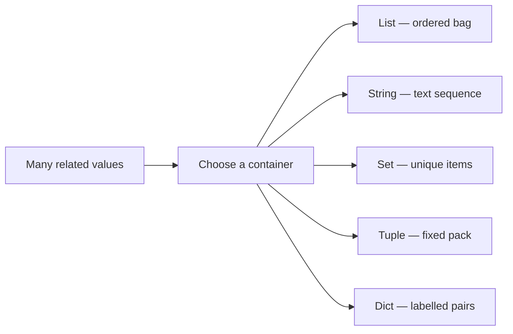
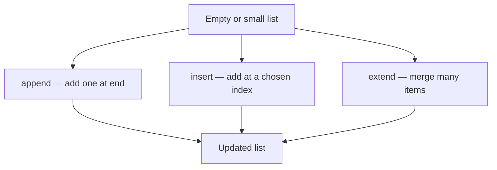
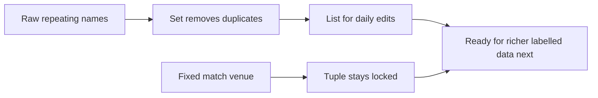
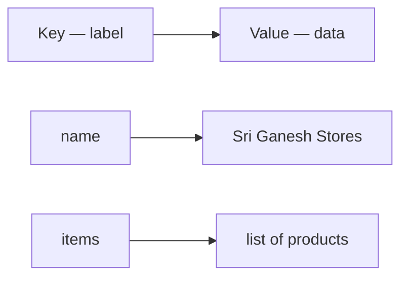

# Data Structures in Python

## What You Will Learn in This Lesson

You have already learnt how to **repeat actions** with **`while`** and **`for`**, and how to steer loops from the inside using **`break`**, **`continue`**, and **nested loops**. Your programs can count, search, skip values, and handle multi-level tasks — but so far you mostly work with **one value at a time** in a single variable.

In this lesson, you will learn how Python stores **many values together** using **data structures**. You will work with **lists**, **strings**, **sets**, **tuples**, and **dictionaries** — each suited to a different everyday need, just like different containers in a kitchen.

By the end, you will be able to:

- Create and update **lists**, and access items with **indexing**, **negative indexing**, and loops
- Work with **strings** using indexing, **slicing**, concatenation, and common string methods
- Use **sets** for unique values and **tuples** for fixed collections that should not change
- Store and retrieve related information with **dictionaries** using **key–value pairs**
- Choose the right structure for the job — ordered list, text, unique set, fixed tuple, or labelled dictionary

---

## Why Programs Need Data Structures

A single variable is like one tiffin box — it holds **one** lunch. Real programs need shelves, menus, and address books that hold **many** related items.

- A kirana shop bill has many item names and prices, not one product.
- A student's marksheet stores marks for many subjects under clear labels.
- A festival guest list should not print the same name twice.

- **Official Definition:** A **data structure** is a way of organising and storing data so that it can be accessed and modified efficiently.
- **In Simple Words:** A data structure is a smart container that holds many values in a useful shape.
- **Real-Life Example:** A **school bag** holds books in order (list), a **name badge** holds fixed text (string/tuple idea), a **unique ticket stub pile** drops duplicates (set), and a **contacts app** finds a number by name (dictionary).




You already know how to **loop** over numbers. Data structures give you something richer to loop over — and new ways to **find**, **add**, and **change** values.

---

## Lists — Ordered Collections of Items

When you need an ordered bag of items that you can change later, Python gives you a **list**.

- **Official Definition:** A **list** is a mutable, ordered sequence of elements enclosed in square brackets `[]`, where each element has an index starting from `0`.
- **In Simple Words:** A list is a numbered row of boxes. You can add, remove, or replace items anytime.
- **Real-Life Example:** A **vegetable shopping list** on your phone — tomato, onion, potato — in order, and you can add "coriander" at the end.

### Creating a List and Storing Multiple Elements

```python
# Create a list of festival snacks
snacks = ["mysore pak", "chakkuli", "kodubale", "obbattu"]  # Four items in one list
print(snacks)  # Show the full list
print(type(snacks))  # Confirm the data type is list
```

**How the code works:**

- Square brackets `[]` create the list.
- Items are separated by commas.
- One variable name (`snacks`) now holds **four** values together.
- **Why lists help:** Without a list, you would need `snack1`, `snack2`, `snack3`… — hard to manage when the count grows.

### Mixed Data Types and Length

A list can hold **different types** in the same container — numbers, text, and even `True`/`False`.

```python
# One student record stored as a mixed list
student = ["Ananya", 18, True, 87.5]  # name, age, is_passed, average marks
print(student)  # Print all values
print(len(student))  # Count how many elements are stored
```

**How the code works:**

- `"Ananya"` is a **string**, `18` is an **integer**, `True` is a **boolean**, `87.5` is a **float**.
- **`len()`** returns the number of elements — here `4`.
- **Common doubt:** Does `len()` count characters inside the name? No — for a list it counts **items**, not letters inside a string item.
- **Need:** Mixed lists are useful for small records, but for labelled fields you will later prefer dictionaries.

### Indexing — Access One Element

Python numbers list positions from the **left**, starting at **0**.

| Index | 0 | 1 | 2 | 3 |
|-------|---|---|---|---|
| Value | mysore pak | chakkuli | kodubale | obbattu |


```python
# Access items by index
snacks = ["mysore pak", "chakkuli", "kodubale", "obbattu"]  # Same festival list
print(snacks[0])  # First item — index 0
print(snacks[2])  # Third item — index 2
print(snacks[3])  # Last item — index 3
```

**How the code works:**

- `snacks[0]` is always the **first** element.
- The last index is **`len(list) - 1`**.
- **Common error:** Using `snacks[4]` on a 4-item list raises **IndexError** because valid indexes are `0` to `3`.

### Iteration — Visit Every Element with a Loop

You already know `for` loops. Lists are a natural partner for them.

```python
# Print every snack with its position
snacks = ["mysore pak", "chakkuli", "kodubale", "obbattu"]  # Festival snacks
index = 0  # Start counting from 0
for item in snacks:  # Visit each element one by one
    print("Index", index, "→", item)  # Show index and value together
    index = index + 1  # Move to the next index number
```

**How the code works:**

- `for item in snacks` assigns each list value to `item` in order.
- A separate `index` counter helps print positions.
- You can also use `for i in range(len(snacks)):` and then `snacks[i]`.

### Negative Indexing and Reverse Iteration

Negative indexes count from the **right**.

| Negative index | -4 | -3 | -2 | -1 |
|----------------|----|----|----|----|
| Value | mysore pak | chakkuli | kodubale | obbattu |

- `-1` is always the **last** item.
- `-2` is the second-last item.

```python
# Use negative indexes and walk the list backwards
snacks = ["mysore pak", "chakkuli", "kodubale", "obbattu"]  # Festival snacks
print(snacks[-1])  # Last item
print(snacks[-2])  # Second-last item

# Reverse iteration using negative step in range
for i in range(len(snacks) - 1, -1, -1):  # Start at last index, stop before -1, step -1
    print(snacks[i])  # Print from end to start
```

**How the code works:**

- `snacks[-1]` is a quick way to get the latest or last value without calculating length.
- `range(len(snacks) - 1, -1, -1)` starts at the last valid index and moves left.
- **Why negative indexing helps:** You often need "the last bill item" or "the latest score" without knowing the list length by heart.

### Changing Lists — `append()`, `insert()`, and `extend()`

Lists are **mutable** — you can change them after creation.

- **`append(x)`** — add `x` at the **end**.
- **`insert(i, x)`** — place `x` at index `i` (other items shift right).
- **`extend(iterable)`** — add **many** items from another list (or similar sequence) to the end.

```python
# Build a market basket step by step
basket = ["rice", "dal"]  # Start with two items
basket.append("oil")  # Add oil at the end
print(basket)  # ['rice', 'dal', 'oil']

basket.insert(1, "salt")  # Put salt at index 1
print(basket)  # ['rice', 'salt', 'dal', 'oil']

extras = ["sugar", "tea"]  # More items to add
basket.extend(extras)  # Attach all extras at the end
print(basket)  # ['rice', 'salt', 'dal', 'oil', 'sugar', 'tea']
print(len(basket))  # Now 6 items
```

**How the code works:**

- `append` grows the list by **one** item.
- `insert(1, "salt")` pushes `"dal"` and everything after it one step to the right.
- `extend` is better than writing many `append` calls when you already have a second list.
- **Common doubt:** What is the difference between `append(extras)` and `extend(extras)`?
  - `append(extras)` adds the **whole list as one nested item**.
  - `extend(extras)` adds **each item separately**.



### Activity: Your Weekend Plan List

1. Create a list called `weekend` with three plans (for example: `"market"`, `"temple"`, `"movie"`).
2. Print the first and last plans using indexes (`0` and `-1`).
3. Use `append()` to add one more plan.
4. Use `insert(0, ...)` to put a morning plan at the start.
5. Print `len(weekend)` and then loop to print every plan.

---

## Strings — Text as a Sequence of Characters

You have used strings as single values like `"Ananya"`. Now treat a string as a **sequence** you can index and slice — similar to a list of characters, but with special rules.

- **Official Definition:** A **string** is an immutable sequence of characters enclosed in quotes (`'...'` or `"..."`).
- **In Simple Words:** A string is a line of text where every letter (and space) has a position number.
- **Real-Life Example:** The word **BENGALURU** on a railway board — each letter sits in its own slot from left to right.


### Indexing Characters in a String

```python
# Index letters in a city name
city = "Mysuru"  # Six characters
print(city[0])  # First character — M
print(city[3])  # Fourth character — u
print(city[-1])  # Last character — u
print(len(city))  # Length is 6
```

**How the code works:**

- Indexes work like lists: start at `0` from the left, `-1` from the right.
- Spaces and punctuation also count as characters if present.
- **Common error:** `city[6]` on `"Mysuru"` causes **IndexError** because valid indexes are `0` to `5`.

### Characters at Even Positions

"Even positions" usually means indexes `0, 2, 4, ...` — every second character starting from the first.

```python
# Print characters at even indexes
word = "KANNADA"  # Sample word
for i in range(0, len(word), 2):  # Start 0, stop at length, step 2
    print("Index", i, "→", word[i])  # Show even-position characters
```

**How the code works:**

- `range(0, len(word), 2)` visits only even indexes.
- For `"KANNADA"`, you get `K` (0), `N` (2), `A` (4), `A` (6).
- **Why this matters:** Patterns like every second letter appear in puzzles, simple codes, and text cleaning tasks.

### Immutability and Concatenation

Strings cannot be changed **in place**. To "change" text, you build a **new** string.

- **Official Definition:** **Immutability** means an object's value cannot be altered after it is created.
- **In Simple Words:** You cannot edit one letter inside a string the way you replace one item in a list.
- **Real-Life Example:** A printed **bus ticket** with a wrong seat number is not erased with a pen in the system — you issue a **new** ticket.

```python
# Strings cannot be edited by index assignment
name = "rama"  # Original string
# name[0] = "R"  # This would cause TypeError — do not uncomment
# Correct approach: build a new string
name = "R" + name[1:]  # New string with capital R
print(name)  # Rama

# Concatenation joins strings
first = "Good"  # First word
second = "Morning"  # Second word
greeting = first + " " + second  # Join with a space
print(greeting)  # Good Morning
```

**How the code works:**

- `+` between strings **concatenates** (joins) them.
- Assigning back to `name` replaces the whole variable with a new string object.
- **Common doubt:** If strings are immutable, why can I write `name = name + "!"`? Because you create a **new** string and point `name` to it — you do not edit the old one.

### String Slicing

**Slicing** extracts a part of a string using `string[start:stop]` or `string[start:stop:step]`.

- `start` is included.
- `stop` is **excluded** (same idea as `range`).
- `step` controls the jump size.

```python
# Slice parts of a phrase
phrase = "PythonBasics"  # Sample text
print(phrase[0:6])  # Python — indexes 0 to 5
print(phrase[6:])  # Basics — from index 6 to the end
print(phrase[:6])  # Python — from start up to (not including) 6
print(phrase[-6:])  # Basics — last six characters
print(phrase[::2])  # PtoBsc — every second character from start to end
print(phrase[::-1])  # scisaBnohtyP — full reverse
```

**How the code works:**

- Omitting `start` means "from the beginning."
- Omitting `stop` means "till the end."
- `step` of `2` picks even-style jumps; `step` of `-1` reverses the string.
- Slicing never crashes for out-of-range edges the way a single bad index can — it simply returns what fits.

### Useful String Methods

Methods are built-in actions you call with a **dot**.

| Method | What it does | Example idea |
|--------|--------------|--------------|
| **`upper()`** | All letters CAPITAL | `"rama".upper()` → `"RAMA"` |
| **`lower()`** | all letters small | useful before comparing text |
| **`title()`** | Each Word Capitalised | names and titles |
| **`capitalize()`** | Only first character capital | sentence start |
| **`islower()`** | `True` if all letters are lowercase | validation |
| **`isupper()`** | `True` if all letters are uppercase | validation |

```python
# Practise common string methods
text = "bengaluru city"  # Original text
print(text.upper())  # BENGALURU CITY
print(text.title())  # Bengaluru City
print(text.capitalize())  # Bengaluru city

print("HELLO".isupper())  # True — all letters are uppercase
print("Hello".isupper())  # False — mixed case
print("hello".islower())  # True — all letters are lowercase
print("Hello".islower())  # False — mixed case
print("OTP123".isupper())  # True — every letter is uppercase (digits are ignored for this check)
```

**How the code works:**

- These methods **return a new string** (or a boolean). They do not permanently change the original unless you assign the result back.
- `islower()` / `isupper()` look at **letter** characters; digits do not make `isupper()` fail if all letters are already uppercase.
- **Need:** Clean display of names on certificates (`title()`), or force comparison in one case (`upper()` / `lower()`).

### Activity: Clean a Name Badge

1. Store your full name in a string variable in lowercase.
2. Print characters at even indexes.
3. Print a slice of only the first name (choose suitable `start:stop`).
4. Print the name in `title()` form and check `islower()` on the original.

---

## Sets and Tuples — Unique Bags and Fixed Packs

Lists change easily. Sometimes you need either **unique values only** or a collection that must **stay fixed**. That is where **sets** and **tuples** help.

### Mutability vs Immutability

- **Official Definition:** A **mutable** object can be changed after creation; an **immutable** object cannot.
- **In Simple Words:** Mutable means "editable later." Immutable means "locked after creation."
- **Real-Life Example:** A **whiteboard** timetable is mutable (you can wipe and rewrite). A **printed hall ticket** is immutable for that exam day.

| Structure | Mutable? | Ordered? | Allows duplicates? |
|-----------|----------|----------|--------------------|
| **List** | Yes | Yes | Yes |
| **String** | No | Yes | Yes (characters) |
| **Set** | Yes (contents) | No guaranteed order | No |
| **Tuple** | No | Yes | Yes |

You already saw string immutability. Sets are mutable bags of **unique** items. Tuples are immutable ordered packs.


### Sets — Only Unique Values

- **Official Definition:** A **set** is an unordered collection of unique elements written with curly braces `{}` or created with `set()`.
- **In Simple Words:** A set is like a bag that automatically throws away duplicates.
- **Real-Life Example:** A temple **prasadam token** desk that accepts each devotee ID only once.

```python
# Create a set of unique city names
cities = {"Mysuru", "Bengaluru", "Mysuru", "Hubballi"}  # Duplicate Mysuru is ignored
print(cities)  # Shows unique cities only (order may vary)
print(type(cities))  # <class 'set'>
print(len(cities))  # 3 unique values
```

**How the code works:**

- Writing the same value twice still stores it **once**.
- Sets do **not** support indexing like `cities[0]` because they are unordered.
- Empty set must be written as `set()`, not `{}` — because `{}` creates an empty **dictionary**.

### Set Operations — `add()`, `remove()`, `discard()`, and List Conversion

```python
# Manage unique roll numbers
rolls = {101, 102, 103}  # Starting set
rolls.add(104)  # Add a new unique value
print(rolls)  # Includes 104

rolls.add(102)  # Already present — set stays the same size
print(rolls)

rolls.remove(101)  # Remove 101 — error if missing
print(rolls)

rolls.discard(999)  # Safe remove — no error if 999 is absent
print(rolls)

# Convert list to set to drop duplicates
marks_list = [80, 90, 80, 70, 90]  # List with duplicates
unique_marks = set(marks_list)  # Convert to set
print(unique_marks)  # Unique scores only
clean_list = list(unique_marks)  # Convert back to list if needed
print(clean_list)
```

**How the code works:**

- **`add()`** inserts one element if it is new.
- **`remove(x)`** deletes `x` and raises **KeyError** if `x` is not found.
- **`discard(x)`** deletes `x` if present; otherwise does nothing — safer when unsure.
- `set(list)` is a quick way to **deduplicate** data.
- **Common doubt:** Will the list after conversion keep original order? Not guaranteed — sets are unordered.

### Tuples — Ordered and Immutable

- **Official Definition:** A **tuple** is an immutable ordered sequence written with parentheses `()`.
- **In Simple Words:** A tuple is like a sealed packet — order is fixed, contents should not change.
- **Real-Life Example:** A train's **(train number, coach, berth)** for a booked ticket stays fixed after confirmation.

```python
# Create and inspect a tuple
point = (10, 20)  # x and y coordinates
print(point)  # (10, 20)
print(type(point))  # <class 'tuple'>
print(point[0])  # 10 — indexing works
print(len(point))  # 2
# point[0] = 99  # TypeError — tuples do not support item assignment
```

**How the code works:**

- Parentheses `()` create a tuple (commas are what really define it).
- Indexing and `len()` work like lists.
- You **cannot** use `append` or assign `point[0] = ...`.
- **Why use tuples?** For values that must remain constant — RGB colours, lat-long pairs, days of the week as a fixed pack.

| Feature | List | Tuple |
|---------|------|-------|
| Brackets | `[]` | `()` |
| Change later? | Yes | No |
| Methods like append | Yes | No |
| Can be dictionary keys? | No | Yes (if contents are hashable) |

### Tuple Slicing and Conversions

```python
# Slice a tuple and convert between list and tuple
days = ("Mon", "Tue", "Wed", "Thu", "Fri", "Sat", "Sun")  # Full week
print(days[0:5])  # Weekdays — Mon to Fri
print(days[-3:])  # Last three — Fri, Sat, Sun
print(days[::2])  # Even indexes — Mon, Wed, Fri, Sun
print(days[::-1])  # Reverse order of the week

# List to tuple and tuple to list
temp_list = ["red", "green", "blue"]  # Mutable list of colours
colour_tuple = tuple(temp_list)  # Lock into a tuple
print(colour_tuple)
unlocked = list(colour_tuple)  # Convert back if editing is needed
unlocked.append("yellow")  # Now mutation is allowed on the list
print(unlocked)
```

**How the code works:**

- Slicing rules match strings and lists: `start` included, `stop` excluded, optional `step`.
- Negative slicing reads from the end.
- Even-index slicing uses `step=2`.
- Convert with `tuple(...)` and `list(...)` when you need to lock or unlock edit rights.

### Activity: Unique Guests and Fixed Seat

1. Make a list of guest names that accidentally repeats one name.
2. Convert it to a **set**, print the unique guests, then convert back to a **list**.
3. Create a tuple `seat = ("Sleeper", "B3", 42)` and print coach and berth with indexes.
4. Try slicing `seat[0:2]` and explain why `seat[0] = "AC"` would fail.

---

## Practical Use Cases — List, Set, and Tuple Together

You now know three containers: an editable ordered **list**, a unique **set**, and a fixed **tuple**. Real programs often use them **side by side** in one small workflow.

- **Official Definition:** A **practical use case** is a real problem where you pick the data structure that matches the job — order and edits, uniqueness, or locked values.
- **In Simple Words:** Use a list when the sequence can grow, a set when duplicates must go, and a tuple when details should stay sealed.
- **Real-Life Example:** A college fest desk keeps a changing volunteer **list**, a unique **set** of entry wristband codes, and a fixed **tuple** for each stall's (stall_id, location).

| Need in daily work | Best fit | Why |
|--------------------|----------|-----|
| Shopping cart / to-do that grows | **List** | Order matters; you append and insert freely |
| Remove repeat names or IDs | **Set** | Stores each value only once |
| Bus ticket / GPS point / RGB colour | **Tuple** | Values should not change after booking or setup |

### Use Case 1: Kirana Bill Items (List)

A shopkeeper adds items one by one during billing. Order and easy updates matter more than uniqueness.

```python
# Build a kirana bill using a list
bill_items = []  # Start with an empty editable list
bill_items.append("rice 5kg")  # Customer first picks rice
bill_items.append("toor dal")  # Then adds dal
bill_items.insert(0, "carry bag")  # Put carry bag at the top of the bill
bill_items.extend(["sugar", "tea powder"])  # Add two more items in one step
print("Bill order:")  # Header for clarity
for item in bill_items:  # Walk the list in purchase-friendly order
    print("-", item)  # Print each line item
print("Total lines on bill:", len(bill_items))  # Count how many rows were billed
```

**How the code works:**

- The list grows with `append`, `insert`, and `extend` as the customer decides.
- Looping prints the bill in the same order items were arranged.
- **Why not a set here?** A customer may buy the same product twice as separate lines; a set would collapse them.

### Use Case 2: Unique Event Registrations (Set)

An event desk must accept each phone number only once, even if someone submits the form twice.

```python
# Keep only unique phone numbers for a workshop
raw_numbers = [9876501111, 9876502222, 9876501111, 9876503333, 9876502222]  # Raw list with duplicates
registered = set(raw_numbers)  # Convert to set — duplicates disappear
registered.add(9876504444)  # New student registers successfully
registered.discard(9876509999)  # Safe if this number was never registered
print("Unique registrations:", len(registered))  # How many distinct people
print(registered)  # Show the unique numbers (order may vary)
clean_list = list(registered)  # Convert back to list if you need indexing later
print("As a list for further work:", clean_list)  # Now you can use indexes if required
```

**How the code works:**

- `set(raw_numbers)` cleans duplicates in one step.
- `add()` brings in a genuinely new registration.
- Converting back to a **list** is useful when a later step needs indexing or a fixed display order you control yourself.
- **Why not only a list?** Checking duplicates manually with loops is longer and easier to get wrong.

### Use Case 3: Confirmed Train Seat (Tuple)

After booking, coach and berth should stay fixed. A tuple protects that pack of values.

```python
# Store a confirmed seat as an immutable tuple
ticket = ("12628", "Sleeper", "S5", 43)  # train_no, class, coach, berth
print("Train:", ticket[0])  # Read train number
print("Coach and berth:", ticket[2], ticket[3])  # Read coach and berth
print("Travel class info:", ticket[1:3])  # Slice class and coach together
# ticket[3] = 44  # Would raise TypeError — booking details stay locked
seat_as_list = list(ticket)  # Only convert if a correction workflow truly needs edits
seat_as_list[3] = 44  # Edit is possible only on the list copy
corrected = tuple(seat_as_list)  # Lock again after the rare correction
print("Corrected locked ticket:", corrected)  # New tuple with updated berth
```

**How the code works:**

- Indexing and slicing still work on tuples — only **assignment** is blocked.
- If a rare correction is needed, convert to list, edit, then convert back to tuple.
- **Why not keep it as a list always?** A list invites accidental changes; a tuple communicates "do not modify."

### Use Case 4: One Mini Program Using All Three

A sports club collects player names (list), removes duplicate join requests (set), and stores each match venue as a fixed tuple.

```python
# Sports club workflow using list, set, and tuple together
join_requests = ["Asha", "Ravi", "Asha", "Neha", "Ravi", "Kiran"]  # Names may repeat
unique_players = list(set(join_requests))  # Unique names, then back to a workable list
unique_players.append("Priya")  # New player joins after cleanup
print("Final squad list:", unique_players)  # Editable ordered squad

venue = ("Bengaluru", "Kanteerava Stadium", "Court-2")  # city, place, court — fixed
print("Match city:", venue[0])  # Read city from the sealed pack
print("Full venue:", venue)  # Show all fixed details

print("Squad size:", len(unique_players))  # Count players
print("Venue parts:", len(venue))  # Count fixed venue fields
```

**How the code works:**

- **List** holds the living squad you may still update.
- **Set** (via conversion) removes duplicate join names quickly.
- **Tuple** keeps venue details stable for that match day.
- This pattern — clean with a set, work with a list, lock constants in a tuple — appears often before you move to labelled storage.



When one label like `"name"` or `"phone"` must find a value quickly, position-based containers are not enough. That is exactly why **dictionaries** come next.

### Activity: Fest Desk Simulation

1. Create a **list** of five stall supply items and add two more with `extend()`.
2. From a list of repeated volunteer phone numbers, build a **set** of unique numbers and print its length.
3. Store fest day details as a **tuple** `(date, ground_name, gate_number)` and print a slice of the first two values.
4. In one short program, print the supply list, unique volunteer count, and the full venue tuple together.

---

## Dictionaries — Labelled Key–Value Storage

Lists find items by **position**. Dictionaries find items by **name (key)** — like an address book.

- **Official Definition:** A **dictionary** is a mutable collection of **key–value pairs**, written with curly braces `{}`, where each key maps to a value and keys must be unique.
- **In Simple Words:** A dictionary stores data as labelled boxes — you ask for `"name"` or `"marks"`, not index `0` or `1`.
- **Real-Life Example:** A **hospital file** labelled by patient ID — you look up ID `A102`, not "the 17th paper in the stack."


### Keys, Values, and No Duplicate Keys

```python
# Student profile as a dictionary
student = {
    "name": "Kavya",  # key "name" maps to value "Kavya"
    "age": 17,  # key "age" maps to 17
    "city": "Mangaluru",  # key "city" maps to "Mangaluru"
}  # End of dictionary
print(student)  # Show all pairs
```

**How the code works:**

- Each pair is written as `key: value`.
- Keys are usually strings, but can be other immutable types.
- If you assign the **same key** twice while creating or updating, the **latest value wins** — duplicate keys are not kept separately.

```python
# Duplicate key demonstration
demo = {"a": 1, "a": 2}  # Second "a" overwrites the first
print(demo)  # {'a': 2}
```

### Creating a Dictionary and Retrieving Values

```python
# Build a dictionary and read values by key
menu = {}  # Start empty
menu["idli"] = 40  # Add key idli with price 40
menu["dosa"] = 60  # Add key dosa with price 60
menu["filter coffee"] = 25  # Add key filter coffee with price 25
print(menu)  # Full menu

print(menu["dosa"])  # Retrieve value for key dosa → 60
# print(menu["pongal"])  # KeyError if the key is missing
```

**How the code works:**

- Use `dict[key]` to read a value.
- Missing keys with `[]` cause **KeyError**.
- Prefer clear key names that match real labels (`"dosa"`, not cryptic codes unless needed).

### Length of the Dictionary and Length of Stored Values

```python
# Count pairs and measure a value that is itself a collection
report = {
    "student": "Rahul",  # Simple string value
    "subjects": ["Maths", "Science", "English", "Kannada"],  # List value
    "scores": [88, 91, 76, 84],  # Another list value
}

print(len(report))  # Number of key-value pairs → 3
print(len(report["subjects"]))  # How many subjects → 4
print(len(report["scores"]))  # How many scores → 4
print(len(report["student"]))  # Length of the string value "Rahul" → 5
```

**How the code works:**

- `len(dictionary)` counts **pairs**, not every nested item.
- If a value is a list or string, `len(dictionary[key])` counts that value's own length.
- This is useful for "how many subjects does this student have?" style questions.

### Iterating Over Dictionaries and Mixed Value Types

Values can be numbers, strings, lists, booleans, or even other dictionaries.

```python
# Loop through keys and values
shop = {
    "name": "Sri Ganesh Stores",  # String
    "open": True,  # Boolean
    "items": ["soap", "oil", "rice"],  # List
    "rating": 4.5,  # Float
}

for key in shop:  # By default, looping gives keys
    print(key, "→", shop[key])  # Print key and matching value

for key, value in shop.items():  # Unpack pairs directly
    print(key, ":", value)  # Another common iteration style
```

**How the code works:**

- `for key in shop` visits each key.
- `shop.items()` gives `(key, value)` pairs together.
- Mixed value types let one dictionary describe a full real-world object.



### Dictionary Methods — `get()`, `keys()`, `values()`, `pop()`, `popitem()`, `clear()`

| Method | Purpose |
|--------|---------|
| **`get(key)`** | Return value for `key`, or `None` (or a default) if missing — no crash |
| **`keys()`** | View of all keys |
| **`values()`** | View of all values |
| **`pop(key)`** | Remove a key and return its value |
| **`popitem()`** | Remove and return one key–value pair (last inserted in modern Python) |
| **`clear()`** | Remove all pairs — dictionary becomes empty |

```python
# Practise dictionary methods on a contact card
contact = {
    "name": "Meera",  # Person name
    "phone": "9876543210",  # Mobile number
    "city": "Udupi",  # City
}

print(contact.get("phone"))  # 9876543210
print(contact.get("email"))  # None — safe when key is missing
print(contact.get("email", "not shared"))  # Custom default message

print(list(contact.keys()))  # ['name', 'phone', 'city']
print(list(contact.values()))  # ['Meera', '9876543210', 'Udupi']

removed_city = contact.pop("city")  # Remove city and keep its value
print(removed_city)  # Udupi
print(contact)  # city key is gone

last_pair = contact.popitem()  # Remove one remaining pair
print(last_pair)  # Shows the removed (key, value)
print(contact)

contact.clear()  # Empty the dictionary completely
print(contact)  # {}
```

**How the code works:**

- **`get()`** is safer than `contact["email"]` when the key might not exist.
- **`pop(key)`** is for deleting a **known** key and using its value.
- **`popitem()`** is useful when you process pairs one by one until empty.
- **`clear()`** wipes everything — use carefully.
- **Common doubt:** Does `clear()` delete the variable? No — the dictionary object still exists; it just has zero pairs.

### Activity: Mini Marks Register

1. Create a dictionary with keys `"name"`, `"scores"` (a list of 3 numbers), and `"passed"` (`True`/`False`).
2. Print the student name and `len` of the scores list.
3. Use a loop to print every key and value.
4. Use `get("grade", "Not assigned")` and then `pop("passed")`.
5. Print remaining `keys()` and `values()`.

---

## Choosing the Right Structure

Use this quick guide when you design a program:

| If you need… | Choose |
|--------------|--------|
| Ordered items you will edit | **List** |
| Text to index, slice, or format | **String** |
| Unique values only | **Set** |
| Fixed ordered pack | **Tuple** |
| Look up by label / name | **Dictionary** |

Lists and dictionaries are the everyday workhorses. Sets shine for uniqueness. Tuples and strings protect values that should not change casually.

---

## Key Takeaways

- **Lists** store ordered, changeable collections — use indexing, negative indexing, loops, and methods like `append()`, `insert()`, and `extend()`.
- **Strings** are immutable text sequences — use indexing, even-position access, concatenation, slicing, and methods such as `upper()`, `title()`, `capitalize()`, `islower()`, and `isupper()`.
- **Sets** keep only unique values and support `add()`, `remove()`, and `discard()`; **tuples** are immutable ordered packs that still support indexing and slicing.
- In practice, use a **list** for growing ordered work (bills, squads), a **set** to drop duplicates (registrations), and a **tuple** to lock fixed details (tickets, venues) — often together in one workflow.
- **Dictionaries** store key–value pairs for labelled lookup, support mixed value types, and provide tools like `get()`, `keys()`, `values()`, `pop()`, `popitem()`, and `clear()`.
- In upcoming lessons, you will combine these structures with loops and conditions to build larger, real-world Python programs.

---

## Important Commands, Libraries & Terminologies

| Term / Command | What It Does |
|----------------|--------------|
| **Data structure** | Organised way to store and access multiple related values |
| **List (`[]`)** | Mutable ordered collection; supports indexing and many update methods |
| **Index** | Position of an element; starts at `0` from the left |
| **Negative index** | Position counted from the right; `-1` is the last element |
| **`len(x)`** | Number of elements in a list/tuple/set/dict, or characters in a string |
| **`append(x)`** | Add one item at the end of a list |
| **`insert(i, x)`** | Insert one item at index `i` in a list |
| **`extend(iterable)`** | Add many items from another sequence to a list |
| **String** | Immutable sequence of characters |
| **Concatenation (`+`)** | Join two strings into a new string |
| **Slice `[start:stop:step]`** | Extract a portion of a string, list, or tuple |
| **`upper()` / `title()` / `capitalize()`** | Return new strings with different capitalisation |
| **`islower()` / `isupper()`** | Check letter case; return `True` or `False` |
| **Mutable / Immutable** | Can change after creation / cannot change after creation |
| **Set (`{}` / `set()`)** | Unordered collection of unique elements |
| **`add()` / `remove()` / `discard()`** | Insert or delete set elements (`discard` is safer if missing) |
| **Tuple (`()`)** | Immutable ordered collection |
| **`list()` / `set()` / `tuple()`** | Convert between these collection types |
| **Dictionary** | Mutable collection of unique keys mapped to values |
| **Key–value pair** | One labelled entry in a dictionary |
| **`get(key)`** | Safe value lookup; optional default if key is missing |
| **`keys()` / `values()` / `items()`** | Views for looping or inspecting dictionary contents |
| **`pop(key)` / `popitem()` / `clear()`** | Remove one pair by key, remove one pair, or empty the dictionary |
